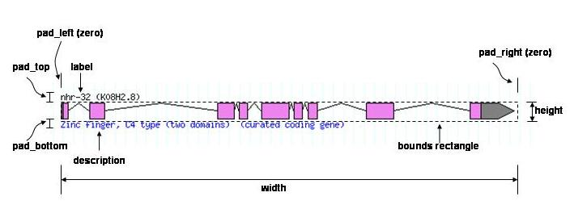
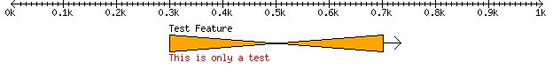
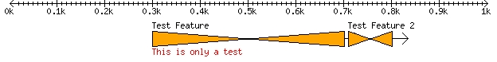
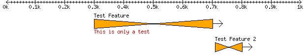
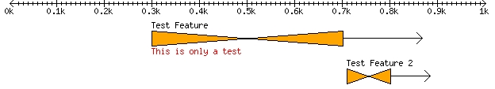
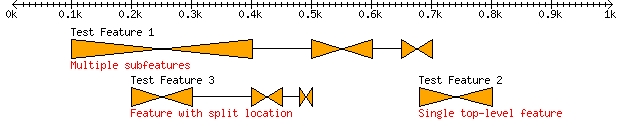
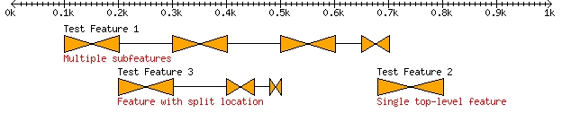
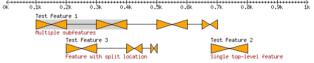

Note, this is a '''Work in Progress'''  

Author
------

Lincoln Stein <[mailto:lstein@cshl.edu lstein@cshl.edu]>

Cold Spring Harbor Laboratory

Copyright
---------

This document is copyright [Lincoln Stein](Lincoln_Stein "wikilink"), 2007. It can be copied and distributed under the terms of the [Perl Artistic License](Perl_Artistic_License "wikilink").

Revision History
----------------

|                                                                   |                  |
|-------------------------------------------------------------------|------------------|
| 2007-01-15                                                        | Revision History |
| Revision 0.1 [Lincoln Stein](Lincoln_Stein "wikilink") 2007-05-15 | Created document |

Abstract
--------

This [HOWTO](HOWTO "wikilink") describes how to extend the module with custom glyphs. Custom glyphs can be used to display sequence features that have special display needs, including quantitative data, images, and spectrographs. For background information, please see <HOWTO:Graphics>.

Introduction
------------

The module provides you with a large number of well-tested glyphs for displaying a variety of feature types. However, you may find that one of the built-in glyphs does not meet your specialized needs, in which case you can relatively easily create a custom glyph. This HOWTO leads you through the steps of designing, writing and installing a custom glyph.

In order to follow this tutorial, you will need to be familiar with the following software modules:

-   (naturally)

-   The Perl GD graphics module, available from CPAN.

You will also need to have some familiarity with the structure of an object oriented module.

The Anatomy of a Glyph
----------------------

Before we begin, we need to go over some glyph jargon, starting with the anatomy of a glyph. Figure 1 shows the major parts of a glyph.

'''Figure 1. Major parts of a glyph''' 

A glyph consists of several parts:

<dl>
<dt>
The main part, also called the body.

<dd>
The body starts at the nucleotide indicated by the start of the associated feature, and ends at the nucleotide indicated by the end of the associated feature. The body is ''width'' pixels wide and ''height'' pixels high. The width is ordinarily calculated automatically by . The height is set by the '''-height''' option. The ''bounds rectangle'' completely surrounds the body and does not include the label, description, or other parts. The body may consist of several subparts, and each of these may contain sub-subparts.

<dt>
The label

<dd>
This is an optional label containing the name of the feature and printed above the body. It is ordinarily set by the '''-label''' option.

<dt>
The description

<dd>
This is an optional description printed below the body of the glyph. It is ordinarily set by the '''-description''' option.

</dl>
Because the label and description occupy space outside the bounds rectangle, glyphs require extra space above and/or below. This extra space is called ''pad_top'' and ''pad_bottom.'' The glyph has to allocate this space explicitly. In addition, if the glyph wants to draw something beyond the left or right borders of the bounds rectangle, then it must allocate some ''pad_left'' and/or ''pad_right.''

Glyph Class Hierarchy
---------------------

Glyphs follow a simple class hierarchy:

<dl>
<dt>
Bio::Graphics::Glyph

<dd>
This is the base class for all glyphs. It provides methods for reading options passed to it by the caller, laying glyphs out with collision control, setting up fonts and colors correctly, transforming from nucleotide coordinates to pixel coordinates, and generating imagemaps. It also provides some utility methods for drawing filled and unfilled rectangles, arrows, and other fundamental elements (these are convenience methods built on top of GD).

<dt>
Bio::Graphics::Glyph::generic

<dd>
The generic glyph inherits from Glyph and adds methods to draw the label and description. When given a complex feature (i.e. a feature that contains subfeatures), it draws each of the subfeatures separately and does not connect them visually.

<dt>
Bio::Graphics::Glyph::box

<dd>
The box glyph inherits from Glyph. It is optimized for "simple" features, in other words those that have no subfeatures. When drawing simple one-part features, this is the glyph you should inherit from for performance reasons.

<dt>
Bio::Graphics::Glyph::segments

<dd>
This is a subclass of generic, which enables the ability to draw the internal structure of the feature. It draws each part of the feature and then connects them visually with various types of lines. You should inherit from this class to draw multi-part features.

<dt>
Bio::Graphics::Glyph::fixedwidth

<dd>
This is a subclass of generic specialized for drawing fixed width features. It draws a horizontal line showing the extent of the feature on the sequence, and reserves a rectangle of specified fixed width and height for its subclasses to draw into. It is useful for images, scatterplots and other visual representations that should not be stretched or shrunk.

</dl>
A Simple Glyph
--------------

To get an idea of how glyph writing works, we'll create a simple custom glyph. This glyph is an hourglass that is high at its left and right edges and tapers to zero at its midpoint. Figure 2 shows what it will look like.

'''Figure 2. The example hourglass glyph''' 

In preparation for creating the module for this glyph, you will need a private library directory in which to place Perl code. Please create the directory `~/lib/Bio/Graphics/Glyph` in your home directory (or another convenient place). On Linux systems, the following command will do the trick:

>     % mkdir -p ~/lib/Bio/Graphics/Glyph

Within this directory, create the file `hourglass.pm` with the following contents:

'''Example 1. The hourglass glyph (first version)'''

```perl

package Bio::Graphics::Glyph::hourglass;

use strict; use base 'Bio::Graphics::Glyph::box';

sub draw_component {

` my $self = shift;`
` my ($gd,$dx,$dy) = @_;`
` my ($left,$top,$right,$bottom) = $self->bounds($dx,$dy);`

` # draw the hourglass as a polygon`
` my $poly = GD::Polygon->new;`
` $poly->addPt($left,$top);`
` $poly->addPt($right,$bottom);`
` $poly->addPt($right,$top);`
` $poly->addPt($left,$bottom);`
` $poly->addPt($left,$top);`
` $gd->filledPolygon($poly,$self->bgcolor);`
` $gd->polygon($poly,$self->fgcolor);`

}

1;

```

This module begins by declaring its package name. All glyphs must begin with "Bio::Graphics::Glyph::" followed by their lowercase name.

It then turns on strict type checking, and declares that it is inheriting from "Bio::Graphics::Glyph::box" with `use base.`

The module then overrides the single method ''draw_component()''. This method is responsible for drawing each of the parts of a feature (e.g. the exons of a gene). For simple single-part features, it draws the entire body of the glyph. `draw_component()` begins by reading its first argument, which is the object itself. This gets stored into `$self`. It then reads three arguments passed to it by Bio::Graphics:

-   The GD object to draw into, which we store into `$gd`
-   The left coordinate of our bounds box, which we store into `$dx`
-   The top coordinate of our bounds box, which we store into `$dy`

The topleft coordinate is passed by Bio::Graphics as a convenience for relative layout of complex objects. You can do all your layout based on a topleft coordinate of (0,0) and then add $dx and $dy to all your coordinates in order to position them correctly on the screen. In this case, we aren't doing anything fancy, so we just pass ($dx,$dy) to `$self->bounds()`, which returns our bounds box as the four-element list ($left,$top,$right,$bottom).

Now we create a polygon to draw the hourglass. We invoke `GD::Polygon->new()` to create a polygon, and then call the polygon's ''add_pt()'' method five times to trace out the vertices of the hourglass. Polygons must be closed, so the last vertex added is the same as the first one.

Having finished the polygon, we invoke the GD object's ''filledPolygon()'' method to draw a polygon filled with a solid color. To behave like other glyphs, we will use the user's selected background color by calling our inherited ''bgcolor()'' method: `$self->bgcolor`. We would also like to draw the outline of the hourglass, so we invoke GD's ''polygon()'' method to draw its boundaries. This time around we pass `$gd->polygon()` the color returned by our inherited ''fgcolor'' (foreground color) method.

That's all there is to it! We end the module with `1;` so that Perl knows it compiled correctly.

To view the glyph, we need to write a small script that exercises it. Example 2 shows a suitable one:

'''Example 2. A script to exercise the hourglass glyph'''

```perl

#!/usr/bin/perl

use strict; use lib "$ENV{HOME}/lib";

use Bio::Graphics; use Bio::SeqFeature::Generic; my $bsg = 'Bio::SeqFeature::Generic';

my $span = $bsg->new(-start=>1,-end=>1000); my $test_feature = $bsg->new(-start=>300,-end=>700,

`                            -display_name=>\'Test Feature\',`
`                            -source_tag=>\'This is only a test\');`

my $panel = Bio::Graphics::Panel->new(-width=>600,-length=>$span->length,

`                                            -pad_left=>12,-pad_right=>12);`

$panel->add_track($span,-glyph=>'arrow',-double=>1,-tick=>2);

$panel->add_track($test_feature,

`                 -glyph   => \'hourglass\',`
`                 -bgcolor => \'orange\',`
`                 -font2color => \'red\',`
`                 -height  => 20,`
`                 -label   => 1,`
`                 -description => 1);`

print $panel->png;

```

We won't walk through this script in detail, because if you are already familiar with Bio::Graphics there's nothing new here. The only important detail is that this script leads off with the line:

```perl

use lib "$ENV{HOME}/lib";

```

This tells Perl to search in the "lib" subdirectory under your home directory before it searches the standard search path. This allows Bio::Graphics to locate the hourglass.pm module when called. Otherwise you will get a "glyph not found" error. Be sure to modify this line if you stored hourglass.pm in a different location.

The other thing to notice is that when we add the hourglass glyph, we can use any of the options recognized by the generic glyph, including height, the label and description flags, and the various color options.

Quick Reference
---------------

We'll take a quick break from glyph building in order to list a few methods that come in handy when writing glyphs. These fall into two categories, utility methods that are commonly used within glyph subclass methods, and key drawing & formatting methods that subclasses typically redefine. For full reference material, use perldoc to read the manual page for

### Methods Commonly Used within Glyph Subclasses

Here are the most common methods that can be called by glyphs to get information that is useful during setup and drawing. Most of these methods are defined in Bio::Graphics::Glyph; a few are added by Bio::Graphics::Glyph::generic.

$feature = $self->feature  
Get the feature associated with this glyph. For nested glyphs (subglyphs within a complex multipart feature), this returns the corresponding subfeature.

<!-- -->

$value = $self->option('option_name')  
Get the value associated with '''-option_name'''. This is the main way of retrieving options passed to add_track().

<!-- -->

$color = $self->bgcolor  
Return the background color of the glyph as a GD color index.

<!-- -->

$color = $self->fgcolor  
Return the foreground color of the glyph as a GD color index.

<!-- -->

$color = $self->color('option_name')  
Transform the value of option ''option_name'' into a GD color index.

<!-- -->

($left,$top,$right,$bottom) = $self->bounds($dx,$dy)  
Return the bounding box of the glyph.

<!-- -->

$height = $self->height  
Return the height of the glyph contents

<!-- -->

$width = $self->width  
Return the width of the glyph contents

<!-- -->

$font = $self->font  
Return the requested font for the glyph in a form that can be passed to GD string-drawing routines.

<!-- -->

$scale = $self->scale  
Return the scale for the glyph, in pixels per base pair

<!-- -->

$label = $self->label  
Return the label for the glyph as a string. (method added by ''generic'')

<!-- -->

$description = $self->description  
Return the description for the glyph as a string. (method added by ''generic'')

<!-- -->

$self->filled_box($gd,$left,$top,$right,$bottom \[,$fg,$bg,$width\])  
Draw a filled rectangle at the indicated coordinates. The foreground,background and line widths are all calculated from standard options, but you can override them if you provide values.

<!-- -->

$self->unfilled_box($gd,$left,$top,$right,$bottom \[,$fg,$bg,$width\])  
Draw a unfilled (hollow) rectangle at the indicated coordinates. The foreground,background and line widths are all calculated from standard options, but you can override them if you provide values.

<!-- -->

$self->filled_oval($gd,$left,$top,$right,$bottom \[,$fg,$bg,$width\])  
Draw a filled oval inscribed by the indicated rectangle. The foreground,background and line widths are all calculated from standard options, but you can override them if you provide values.

<!-- -->

$self->unfilled_oval($gd,$left,$top,$right,$bottom \[,$fg,$bg,$width\])  
Draw a unfilled (hollow) oval inscribed by the indicated rectangle. The foreground,background and line widths are all calculated from standard options, but you can override them if you provide values.

<!-- -->

$self->filled_arrow($gd,$left,$top,$right,$bottom \[,$fg,$bg\])  
Draw a rectangle tapering to an arrow. The arrow direction depends on the strandedness of the underlying feature.

<!-- -->

$self->arrow($gd,$x1,$x2,$y)  
Draw a simple (line) arrow extending from horizontal position $x1 to position $x2 along vertical position $y. If $x2>$x1 then it draws a right-pointing arrow, otherwise a left-pointing arrow. (method added by ''generic'').

<!-- -->

@parts = $self->parts  
For glyphs that contain complex features, each subfeature is represented as a subglyph. parts() returns the subglyphs. You can invoke this method when you need to find out how many parts the glyph has.

<!-- -->

$level = $self->level  
When a glyph has subparts, it is important to distinguish the top level glyph from its subparts. level() allows you to do this. It returns 0 for the top level glyph, 1 for it subparts, 2 for the subparts of the subparts, and so forth.

### Methods Commonly Overridden by Glyphs

Here are the methods most commonly redefined by glyph subclasses.

$self->draw_component($gd,$dx,$dy,$partno,$total_parts)  
Draw part of a glyph. For simple glyphs descended from Bio::Graphics::Glyph::box, this method will be called only once. For multipart glyphs descended from Bio::Graphics::Glyph::segments or Bio::Graphics::Glyph::generic, this method will be called once for each subpart of the glyph. $gd is the GD object, and ($dx,$dy) are offsets from the topleft corner of the track. Ordinarily you will pass ($dx,$dy) to `$self->bounds()` to get the bounds box of the content. For multipart glyphs, $partno and $total_parts indicate which number part this is (counting from the left, starting with part number 0) and how many parts total there are. Usually you can ignore this information.

<!-- -->

$self->pad_left, $self->pad_right, $self->pad_top,$self->pad_bottom  
Some glyphs will want to draw decoration outside the bounds box. If they do so, they will need to let Bio::Graphics know how much extra padding they need so that glyphs do not collide.

<!-- -->

$self->maxdepth  
The maxdepth() method provides Bio::Graphics with information about how deeply to step into subfeatures. Returning 0 tells Bio::Graphics that this glyph doesn't want to step into subfeatures. Returning 1 tells Bio::Graphics to step into one level of glyphs and so forth. This is a big performance win. generic steps into 1 level of subparts, box steps into 0 level of subparts, and segments steps into multiple levels. Each of these base classes respects the -maxdepth option, and lets it overrides their default.

<!-- -->

$self->draw($gd,$dx,$dy)  
When Bio::Graphics invokes a glyph to draw itself, it actually calls Bio::Graphics::Glyph's `draw()` method. `draw()` invokes `draw_component()` on each subglyph, and then draws extra stuff, such as the label, description, and lines connecting the parts. You can override this method if you wish to change this process in some fundamental way.

Adding an Arrow to the Hourglass Glyph
--------------------------------------

Some glyphs will want to add decoration to the region outside their bounds box. Examples of existing glyphs that do this are the generic glyph, which draws label and description lines above and below the bounds box, and the gene glyph, which draws a little arrow at the right or left of the gene to indicate its directionality. To demonstrate how to do this, we will add a right-pointing arrow to the hourglass glyph, creating a new glyph called ''hourglass_arrow''.

### First Pass

Our first pass will add the arrow, but won't let Bio::Graphics know we need the additional space. This is intended to show why this is necessary. Create a file in `~/lib/Bio/Graphics/Glyph` named `hourglass_arrow.pm`. Its contents should be as follows:

'''Example 3. The hourglass glyph (second version)'''

```perl

package Bio::Graphics::Glyph::hourglass_arrow;

use strict; use base 'Bio::Graphics::Glyph::hourglass';

use constant ARROW_LENGTH => 20;

sub draw_component {

` my $self = shift;`
` $self->SUPER::draw_component(@_);`

` my ($gd,$dx,$dy) = @_;`
` my ($left,$top,$right,$bottom) = $self->bounds($dx,$dy);`
` $self->arrow($gd,$right,$right+ARROW_LENGTH,($bottom+$top)/2);`

}

1;

```

This class inherits from Bio::Graphics::Glyph::hourglass, allowing us to build on the previous drawing code without duplicating it. We define a constant ''ARROW_LENGTH'' corresponding to the length of the arrow to draw to the right.

We now override the draw_component() method. The first thing we want to do is to invoke the old hourglass drawing code, which we do by calling $self->SUPER::draw_component() with our argument list. The SUPER:: notation tells Perl that we intend to call our inherited (superclass's) method. This will draw the old hourglass.

We next proceed to draw the arrow. We calculate our bounds box using the bounds() method, and then invoke the inherited arrow() utility method. This takes the GD object, and draws a horizontal arrow from a start position to an end position at the indicated y coordinate. In this case, we want the arrow to start at horizontal position $right (the right side of our bounds box), go to position $right+ARROW_LENGTH, and position the arrow vertically at our vertical center, which is simply the average of $bottom and $top.

To view the new glyph, save test_hourglass.pl under the filename test_hourglass_arrow.pl, and modify it to read as follows:

'''Example 4. A script to exercise the hourglass_arrow glyph'''

```perl

#!/usr/bin/perl

use strict; use lib "$ENV{HOME}/lib";

use Bio::Graphics; use Bio::SeqFeature::Generic; my $bsg = 'Bio::SeqFeature::Generic';

my $span = $bsg->new(-start=>1,-end=>1000); my $test_feature = $bsg->new(-start=>300,-end=>700,

`                            -display_name=>\'Test Feature\',`
`                            -source_tag=>\'This is only a test\');`

my $panel = Bio::Graphics::Panel->new(-width=>600,-length=>$span->length,

`                                            -pad_left=>12,-pad_right=>12);`

$panel->add_track($span,-glyph=>'arrow',-double=>1,-tick=>2);

$panel->add_track($test_feature,

`                 -glyph   => \'hourglass_arrow\',`
`                 -bgcolor => \'orange\',`
`                 -font2color => \'red\',`
`                 -height  => 20,`
`                 -label   => 1,`
`                 -description => 1,`
`  );`

print $panel->png;

```

After sending the output of this script to a suitable display program, you will get the following:

'''Figure 3. The example hourglass_arrow glyph''' 

### Second Pass

Everything looks fine, but there's something wrong with the glyph. To see the problem, look at what happens when we modify the testing script to draw two adjacent features:

'''Example 5. A script that shows problems in the hourglass_arrow glyph'''

```perl

#!/usr/bin/perl

use strict; use lib "$ENV{HOME}/lib";

use Bio::Graphics; use Bio::SeqFeature::Generic; my $bsg = 'Bio::SeqFeature::Generic';

my $span = $bsg->new(-start=>1,-end=>1000); my $test_feature = $bsg->new(-start=>300,-end=>700,

`                            -display_name=>\'Test Feature\',`
`                            -source_tag=>\'This is only a test\');`

my $test2_feature = $bsg->new(-start=>710,-end=>800,

`        -display_name=>\'Test Feature 2\');`

my $panel = Bio::Graphics::Panel->new(-width=>600,-length=>$span->length,

`                                            -pad_left=>12,-pad_right=>12);`

$panel->add_track($span,-glyph=>'arrow',-double=>1,-tick=>2);

$panel->add_track(\[$test_feature,$test2_feature\],

`                 -glyph   => \'hourglass_arrow\',`
`                 -bgcolor => \'orange\',`
`                 -font2color => \'red\',`
`                 -height  => 20,`
`                 -label   => 1,`
`                 -description => 1,`
`  );`

print $panel->png;

```

When we run this, we do not get what we expect:

'''Figure 4. The hourglass_arrow glyph does not bump correctly''' 

The issue is that the second feature overlaps the arrow of the first. This is because the hourglass_arrow didn't tell Bio::Graphics that the glyph needs extra padding on the right in order to draw the arrow. Fortunately, this is easy to do:

'''Example 6. Revised hourglass_arrow Glyph'''

```perl

package Bio::Graphics::Glyph::hourglass_arrow;

use strict; use base 'Bio::Graphics::Glyph::hourglass';

use constant ARROW_LENGTH => 20;

sub pad_right { return ARROW_LENGTH }

sub draw_component {

` my $self = shift;`
` my ($gd,$dx,$dy) = @_;`
` $self->SUPER::draw_component(@_);`
` my ($left,$top,$right,$bottom) = $self->bounds($dx,$dy);`
` $self->arrow($gd,$right,$right+ARROW_LENGTH,($bottom+$top)/2);`

}

1;

```

We add a pad_right() method that simply returns the constant value ARROW_LENGTH. During layout, Bio::Graphics calls pad_right() (as well as all the other pad_\* methods) to find out whether each glyph requires extra space.

When we rerun the test script, we get the desired output:

'''Figure 5. The revised hourglass_arrow glyph''' 

We will see later how to add top and bottom padding.

### Third Pass

What if we want to give the user the option of changing the length of the arrow? It is very easy to define new '''-option_name''' options for custom glyphs. In this case we want to add support for a runtime option named '''-arrow_length'''. Open up the current hourglass_arrow.pm and modify it to look like the following:

'''Example 7. The hourglass_arrow Glyph Enhanced with Support for -arrow_length'''

```perl

package Bio::Graphics::Glyph::hourglass_arrow;

use strict; use base 'Bio::Graphics::Glyph::hourglass';

use constant ARROW_LENGTH => 20;

sub pad_right {

` my $self = shift;`
` return $self->arrow_length;`

}

sub arrow_length {

` my $self = shift;`
` my $requested_len = $self->option(\'arrow_length\');`
` if (defined $requested_len) {`
`   return $requested_len;`
` }`
` else {`
`   return ARROW_LENGTH;`
` }`

} sub draw_component {

` my $self = shift;`
` my ($gd,$dx,$dy) = @_;`
` $self->SUPER::draw_component(@_);`
` my ($left,$top,$right,$bottom) = $self->bounds($dx,$dy);`
` $self->arrow($gd,$right,$right+$self->arrow_length,($bottom+$top)/2);`

}

1;

```

What we do here is to define a new method named arrow_length(). It is responsible for returning the desired length of the arrow. It first looks for the existence of an option named ''arrow_length'' using the inherited option() method. If this is defined, it returns it. Otherwise it defaults to the previously defined ARROW_LENGTH constant.

We make two other changes. pad_right() now calls $self->arrow_length() in order to return the currently configured arrow length as the padding size. Meanwhile, draw_component() also calls $self->arrow_length() when calculating the extent of the arrow.

To test whether this new feature works, modify the test script's second add_track() to look like this:

```perl

$panel->add_track(\[$test_feature,$test2_feature\],

`                 -glyph   => \'hourglass_arrow\',`
`                 -bgcolor => \'orange\',`
`                 -font2color => \'red\',`
`                 -height  => 20,`
`                 -label   => 1,`
`                 -description => 1,`
`                 -arrow_length => 100,`
`  );`

```

When we redraw, we get:

'''Figure 6. The hourglass_arrow glyph with a long tail''' 

The nice thing about this is that you can pass a callback (subroutine coderef) to -arrow_length, and it will work just like all the other callback options. To see this, modify add_track() once again so that -arrow_length corresponds to an anonymous subroutine that returns different arrow lengths depending on whether it was called for $test_feature or $test2_feature:

```perl

$panel->add_track(\[$test_feature,$test2_feature\],

`                 -glyph   => \'hourglass_arrow\',`
`                 -bgcolor => \'orange\',`
`                 -font2color => \'red\',`
`                 -height  => 20,`
`                 -label   => 1,`
`                 -description => 1,`
`                 -arrow_length => suHandling Multi-Part Featuresb {`
`                          my $feature = shift;`
`                          return 100 if $feature eq $test_feature;`
`                          return  50 if $feature eq $test2_feature;`
`               }`
`   );`

```

The result looks like this:

'''Figure 7. The hourglass_arrow glyph with a callback-controlled tail''' 

### Allocating Top and Bottom Padding

Allocating top and bottom padding is slightly more difficult than left and right padding because our superclass, Bio::Graphics::Glyph::box, already uses some padding to draw the label and description. Fortunately it's not all that difficult to finesse this. You merely need to add the amount of padding your custom glyph needs to the padding needed by the parent. Example 8 illustrates this:

'''Example 8: Adjusting top and bottom padding'''

```perl

package Bio::Graphics::Glyph::hourglass_up;

use strict; use base 'Bio::Graphics::Glyph::hourglass';

use constant T_LENGTH => 30; use constant T_WIDE => 7;

sub t_length {

` shift->option(\'tee_length\') || T_LENGTH;`

}

sub pad_top {

` my $self = shift;`
` my $parent_pad = $self->SUPER::pad_top;`
` my $height     = $self->height/2;`
` my $extra      = $self->t_length - $height;`
` return $parent_pad if $extra `<= 0;
  return $parent_pad + $extra;
}

sub pad_bottom {
  my $self = shift;
  my $parent_pad = $self->`SUPER::pad_bottom;`
` my $height     = $self->height/2;`
` my $extra      = $self->t_length - $height;`
` return $parent_pad if $extra `<= 0;
  return $parent_pad + $extra;
}

sub draw_component {
  my $self = shift;
  $self->`SUPER::draw_component(@_);`

` my $gd  = shift;`
` my ($left,$top,$right,$bottom) = $self->bounds(@_);`

` my $tee_x       = ($left + $right)/2;`
` my $tee_top     = ($top + $bottom)/2 - $self->t_length;`
` my $tee_bottom  = ($top + $bottom)/2 + $self->t_length;`

` $gd->line($tee_x,$tee_top,$tee_x,$tee_bottom,$self->fgcolor);`

` $gd->line($tee_x - T_WIDE/2, $tee_top,   $tee_x + T_WIDE/2, $tee_top,    $self->fgcolor);`
` $gd->line($tee_x - T_WIDE/2, $tee_bottom,$tee_x + T_WIDE/2, $tee_bottom, $self->fgcolor);`

}

1;

```

Multipart Glyphs
----------------

Some features contain subfeatures. Common examples include a transcript that contains multiple exons. Similarly, some features are split across multiple locations, for example alignments. Bio::Graphics deals with both of these situations in the same way: by creating a series of subglyphs for each of the subfeatures or locations. Each subglyph is given the same class as the parent glyph. When the time comes to draw the glyph, Bio::Graphics invokes ''draw_component()'' on each of the subglyphs.

The superclass for all multipart glyphs is Bio::Graphics::Glyph::segments. To create a new multipart glyph, simply inherit from Bio::Graphics::Glyph::segments and override the ''draw_component()'' method. ''draw_component()'' will be called for each subpart of the feature. This also works recursively, allowing you to deal with features that contain three or more levels of subfeatures.

To see how this works, let's look at a version of the hourglass glyph that will accept multipart features:

'''Example 9. The hourglass glyph with support for multipart features'''

```perl

package Bio::Graphics::Glyph::multihourglass;

use strict; use base 'Bio::Graphics::Glyph::segments';

sub draw_component {

` my $self = shift;`
` my ($gd,$dx,$dy) = @_;`
` my ($left,$top,$right,$bottom) = $self->bounds($dx,$dy);`

` # draw the hourglass as a polygon`
` my $poly = GD::Polygon->new;`
` $poly->addPt($left,$top);`
` $poly->addPt($right,$bottom);`
` $poly->addPt($right,$top);`
` $poly->addPt($left,$bottom);`
` $poly->addPt($left,$top);`
` $gd->filledPolygon($poly,$self->bgcolor);`
` $gd->polygon($poly,$self->fgcolor);`

}

1;

```

The new glyph is named "multihourglass". Its definition is '''exactly''' the same as the original hourglass glyph, with one critical change: Instead of inheriting from Bio::Graphics::Glyph::box, it inherits from Bio::Graphics::Glyph::segments.

To exercise the new glyph, we can use the script shown in Example 10.

'''Example 10. A script to exercise the multihourglass glyph'''

```perl

#!/usr/bin/perl

use strict; use lib "$ENV{HOME}/lib";

use Bio::Graphics; use Bio::SeqFeature::Generic; use Bio::Location::Split; use Bio::Location::Simple; my $bsg = 'Bio::SeqFeature::Generic'; my $bls = 'Bio::Location::Simple';

my $span = $bsg->new(-start=>1,-end=>1000); my $test_feature = $bsg->new(-start=>100,-end=>700,

`                            -display_name=>\'Test Feature 1\',`
`                            -source_tag=>\'Multiple subfeatures\');`

$test_feature->add_SeqFeature($bsg->new(-start=>100,-end=>400)); $test_feature->add_SeqFeature($bsg->new(-start=>500,-end=>600)); $test_feature->add_SeqFeature($bsg->new(-start=>650,-end=>700));

my $test2_feature = $bsg->new(-start=>680,-end=>800, ttt -display_name=>'Test Feature 2', ttt -source_tag => 'Single top-level feature');

my $test3_feature = $bsg->new(-display_name => 'Test Feature 3', ttt -source_tag => 'Feature with split location'); my $location = Bio::Location::Split->new(); $location->add_sub_Location($bls->new(-start=>200,-end=>300)); $location->add_sub_Location($bls->new(-start=>400,-end=>450)); $location->add_sub_Location($bls->new(-start=>480,-end=>500)); $test3_feature->location($location);

my $panel = Bio::Graphics::Panel->new(-width=>600,-length=>$span->length,

`                                            -pad_left=>12,-pad_right=>12);`

$panel->add_track($span,-glyph=>'arrow',-double=>1,-tick=>2);

$panel->add_track(\[$test_feature,$test2_feature,$test3_feature\],

`                 -glyph   => \'multihourglass\',`
`                 -bgcolor => \'orange\',`
`                 -font2color => \'red\',`
`                 -height  => 20,`
`                 -label   => 1,`
`                 -description => 1,`

tt );

print $panel->png;

```

This script creates three features:

# '''Test feature 1''' is a complex feature containing three sub seqfeatures.
2.  '''Test feature 2''', which is a simple feature with no subparts.
3.  '''Test feature 3''', a simple feature with a three-part split location.

The result is shown in Figure 8. As you can see, the glyph handles all three cases in the way that you'd expect.

'''Figure 8. The multihourglass glyph with a variety of features''' .

### Sub-subfeatures and the maxdepth() method

For performance reasons, the segments glyph assumes that each feature has at most one level of subfeatures, which is the case for the vast majority of multipart features. In the rare case that you need to represent a feature that has more than one sublevel, you will need to override the maxdepth() method.

To test this option, we will modify the Example 10 script so that $test_feature contains three levels of subfeatures:

```perl

my $test_feature = $bsg->new(-start=>100,-end=>700,

`                            -display_name=>\'Test Feature 1\',`
`                            -source_tag=>\'Multiple subfeatures\');`

my $subfeat = $bsg->new(-start=>100,-end=>400); $subfeat->add_SeqFeature($bsg->new(-start=>100,-end=>200)); $subfeat->add_SeqFeature($bsg->new(-start=>300,-end=>400)); $test_feature->add_SeqFeature($subfeat); $test_feature->add_SeqFeature($bsg->new(-start=>500,-end=>600)); $test_feature->add_SeqFeature($bsg->new(-start=>650,-end=>700));

```

(The full modified script is [here](glyph-howto-supplementary-script-1#supplement-1 "wikilink").)

The feature now contains three subfeatures. The second and third subfeatures still only contain one part, but the first subfeature contains two subfeatures of its own, one which spans the location 1..200 and the other which spans the location 300..400. However, when we run the script with this modification, we get the same image as Figure 8; the first subfeature is shown as a single part.

To fix this, we modify the multihourglass.pm module as follows:

'''Example 10. The multihourglass glyph with support for two levels of subfeatures'''

```perl

package Bio::Graphics::Glyph::multihourglass;

use strict; use base 'Bio::Graphics::Glyph::segments';

sub maxdepth { 2 }

sub draw_component {

` # as in example 9`

}

1;

```

The ''maxdepth()'' method returns the numeric value 2 to tell Bio::Graphics to step into at most two levels of features. This has exactly the same effect as passing `-maxdepth=>2` to the ''add_track()'' method, except that it is now hard-coded into the glyph. Now when we run the modified test script, the first subfeature of the leftmost feature is broken into its two parts as we want (Figure 9).

'''Figure 9. The multihourglass glyph with support for two levels of subfeature''' .

### Drawing at different nesting levels

An unsatisfactory feature of the image produced at the end of the previous section is that the extra nesting of the sub-subfeatures in feature \#1 is not shown. There is no way to distinguish between level 1 and level 2 features.

To fix this, we will make a small change to the ''draw()'' method. ''draw()'' is defined in Bio::Graphics::Glyph. It walks through each subglyph and calls its ''draw_component()'' method. It then draws a solid line to connect each of the subglyphs. We will change ''draw()'' so that there is a rectangle drawn around each level 1 subfeature if it contains subparts. The effect is shown in Figure 10.

'''Figure 10: Multihourglass glyph modified to show grouping of sub-subfeatures''' 

Example 10 shows the modifications to multihourglass.pm needed to achieve this effect.

'''Example 10: The multihourglass.pm module with subfeature grouping'''

```perl

package Bio::Graphics::Glyph::multihourglass;

use strict; use base 'Bio::Graphics::Glyph::segments';

sub maxdepth { 2 }

sub draw {

` my $self = shift;`

` if ($self->level == 1 && $self->parts) {`
`   my ($gd,$dx,$dy) = @_;`
`   my ($left,$top,$right,$bottom) = $self->bounds($dx,$dy);`
`   $gd->filledRectangle($left,$top,$right,$bottom,`

ttt $self->translate_color('lightgrey'));

` }`

` $self->SUPER::draw(@_);`

}

sub draw_component {

` #unchanged`

}

1;

```

The new code overrides the ''draw()'' method. The call signature of this method is identical to ''draw_component()''. It receives the GD object and the topleft coordinates of the glyph. What this code does is to ask whether the current level of the glyph is equal to 1, which is the first level of subglyph. If this is true, then it asks whether the current glyph has any subglyph by calling the method ''parts()''. ''parts()'' will return a list of the subglyphs, which will be true if there are subglyphs and false otherwise.

If both these criteria are true, then we retrieve the GD object and translate the topleft into the bounds rectangle. We then call the GD object's filledRectangle() method to draw a lightgrey background filling the entire bounds box. The call to our inherited ''translate_color()'' is a convenience method that will translate a symbolic color name (or a \#RRGGBB name) into the appropriate color index for GD.

We then call our inherited ''draw()'' method in order to iterate through the subglyphs, call their ''draw_component()'' methods, draw the label and description, and so forth.

If you are following along, try removing one or both of the conditions (e.g. remove the check for $self->level==1 or $self->parts) and see what happens.

An Embedded Table Using the fixedwidth Glyph
--------------------------------------------

''This is a scrap that will be incorporated into a later section''

```perl

package Bio::Graphics::Glyph::table;

use strict; use Bio::Graphics; use base 'Bio::Graphics::Glyph::fixedwidth';

sub column_count {

` return shift->option(\'columns\') || 2;`

}

sub row_count {

` return shift->option(\'rows\') || 2;`

}

sub cell_height {

` my $self = shift;`
` my $font = $self->font;`
` my $lineheight = $font->height;`
` return $lineheight + 2;`

}

sub cell_width {

` my $self = shift;`
` my @cell_data = $self->cell_data;`
` my $max_size = 0;`
` foreach (@cell_data) {`
`   $max_size = length($_) if $max_size `< length($_);
  }


  my $font = $self->`font;`
` return $max_size * $font->width + 3;`

}

sub cell_data {

` my $self = shift;`
` my $feature = $self->feature;`
` return unless $feature->has_tag(\'cell_data\');`
` my ($cell_data) = $feature->get_tag_values(\'cell_data\');`
` return split /s+/,$cell_data;`

}

sub width_needed {

` my $self = shift;`
` return $self->cell_width * $self->column_count;`

} sub height_needed {

` my $self = shift;`
` return ($self->cell_height+1) * $self->row_count;`

}

sub draw_contents {

` my $self = shift;`
` my ($gd,$left,$top,$right,$bottom) = @_;`
` $self->filled_box($gd,$left,$top,$right,$bottom);`

` my $width  = $right-$left;`
` my $height = $bottom-$top;`

` my $cell_width  = $self->cell_width;`
` my $cell_height = $self->cell_height;`

` my $row_count    = $self->row_count;`
` my $column_count = $self->column_count;`
` my $fontwidth    = $self->font->width;`

` for (my $i=0;$i`<$row_count-1;$i++) {
    my $y = $top + ($i+1) * $cell_height;
    $gd->`line($left,$y,$right,$y,$self->fgcolor);`
` }`

` for (my $i=0;$i`<$column_count-1;$i++) {
    my $x = $left + ($i+1) * $cell_width;
    $gd->`line($x,$top,$x,$bottom,$self->fgcolor);`
` }`

` my @cell_data = $self->cell_data;`

` for my $row (0..$row_count-1) {`
`   for my $col (0..$column_count-1) {`
`     my $cell_data = $cell_data[$row*$column_count + $col];`
`     my $x = $left + ($col+1) * $cell_width - length($cell_data) * $fontwidth - 1;`
`     my $y = $top  + $row * $cell_height + 1;`
`     $gd->string($self->font,$x,$y,$cell_data,$self->fontcolor);`
`   }`
` }`

}

1;

```

Test script:

```perl

#!/usr/bin/perl

use strict; use warnings;

use lib "$ENV{HOME}/lib"; use Bio::Graphics; use Bio::Graphics::Feature; use Bio::SeqFeature::Generic;

my $segment = Bio::Graphics::Feature->new(-start=>1,-end=>700); my $snp1 = Bio::SeqFeature::Generic ->new (-start => 100,

`           -end=>400,`
`           -display_name =>\'bioseqfeature\',`
`           -source => \'foo bar\',`
`           -display_name =>\'bar foo\',`
`           -tag => {`
`      cell_data => \'1 2 3 4 5 6\',`
`            },`
`           );`

my $snp2 = Bio::SeqFeature::Generic->new(-start => 500,

`         -end       => 501,`
`         -display_name      => \'rs12345\',`
`         -tag => {`
`           cell_data => \'one two three four five six\',`
`          },`
`        );`

my $panel = Bio::Graphics::Panel->new(-segment=>$segment,-width=>800);

$panel->add_track($segment,-glyph=>'arrow',-double=>1,-tick=>2); $panel->add_track(\[$snp1,$snp2\],

`   -label       => 1,`
`   -font        => \'gdLargeFont\',`
`   -glyph       => \'table\',`
`   -description => 1,`
`   -bgcolor     => \'lightyellow\',`
`   -fixed_gap   => 20,`
`   -cell_size   => 50,`
`   -rows        => 2,`
`   -columns     => 3,`
`  );`

my $gd = $panel->gd;

print $gd->png;

```

Output: '

<Category:HOWTOs>
