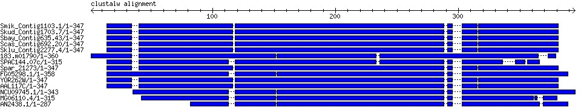

Many of us are good at reusing code beyond a certain complexity, but when it comes to writing [a "quick" string randomizer](#A_quick_string_randomizer), or [finding a hash key that corresponds to a maximum value](#Hash_key_at_the_max_value), or [traversing a hash structure](#Traversing_a_hash_structure), etc., we constantly reinvent the wheel. It's worth doing, to keep computationally fit, but some days we could use that extra half an hour.

Next time you rewrite that algorithm, log it here in the scrapbook, and give the gift of time. Post your favorite solutions to common tasks, elegant algorithms worthy of admiration, or truly frightening code to pique the morbid curiosity of the BioPerl community.

If you're looking for an answer and don't see it here, try the [HOWTOs](/howtos/index.html), search the [BioPerl Archives](http://lists.open-bio.org/pipermail/bioperl-l/), or post your question to the listserv (sign up [here](http://lists.open-bio.org/mailman/listinfo/bioperl-l)).

**Note:** These are donated scraps from various contributors.  Please recognize that programming styles may vary widely.  If a particular scrap has a bug, feel free to fix the issue by modifying the wiki, but refrain from imposing one's own programming style upon others, with the singular exception that it doesn't follow a Best Practice and may lead to problems down the road (we do have Talk pages for those purposes).

---

# A

## Analysis_and_Phylogenetics

### Finding_all_clades_represented_in_a_tree<a name="Finding_all_clades_represented_in_a_tree"></a>

-   Here is a scrap that will return all clades (i.e., maximal sets of leaf/tip taxa descended from a given single node) in a tree, inspired by a question on [Evoldir](http://evol.mcmaster.ca/evoldir.html). Other approaches? --[*Ed.*](User:Majensen "wikilink")

```perl

# get $tree somehow, e.g. from $treeio->next_tree (see Bio::TreeIO)

my @nodes = $tree->get_nodes;
my %clades;
foreach my $n (@nodes) {

   my @desc = $n->get_all_Descendents;
   if ($n->is_Leaf) {
       # degenerate clades...
   $clades{$n->id}++;
   }
   else {
   my @lvs = grep { $_->is_Leaf } @desc;
   $clades{ join(',',sort map {$_->id} @lvs) }++;
   }

} return keys %clades;

```

------------------------------------------------------------------------

-   Another approach, using [Bio::Tree::Compatible](https://metacpan.org/pod/Bio::Tree::Compatible) of [G. Valiente](User:Valiente "wikilink"). If the internal intervening nodes are labeled (have a non-empty `id()` property), they will also appear in the output.

```perl

use Bio::TreeIO;
use Bio::Tree::Compatible;

my $tio = Bio::TreeIO->new(-format=>'newick',-fh=>\*DATA);
while (my $t = $tio->next_tree) {

 map {
     print "(",join(',',@{$_}),")\n"
     } values %{Bio::Tree::Compatible::cluster_representation( $t ) };
}

__DATA__
(((A:5,B:5):2,(C:4,D:4):1):3,E:10);
(((A:5,B:5)x:2,(C:4,D:4)y:1)z:3,E:10)r;

```

--[*MAJ*](User:Majensen "wikilink")


### Poor_man%27s_bootstrap<a name="Poor_man%27s_bootstrap"></a>

(*see the bioperl-l thread [here](http://lists.open-bio.org/pipermail/bioperl-l/2009-June/030247.html)*)

-   *As [Russell](User:Russell_Smithies "wikilink") often says, sometimes Perl can do the job by itself. However, if you want to bootstrap sequences from an alignment, have a look at [Bio::Align::Utilities](https://metacpan.org/pod/Bio::Align::Utilities)... --[Ed.](User:Majensen "wikilink")*

***Shalabh Sharma*** asks

*I was just wondering, is there any module is bioperl that does subsampling?*

------------------------------------------------------------------------

from ***[Mark Jensen](User:Majensen "wikilink")***:

-   To subsample lines from a file with replacement:

*If you trust `rand()`...*

```perl
# open your file into $my_infile, then
@lines = <$my_infile>;

my $num_samps = 10;
my $sample_size_pc = 0.25;
my @samples;

for (1..$num_samps) {
   push @samples = [map { int( @lines * rand ) } ( 0..int($sample_size_pc * @lines) ) ];
}

# now, do something, fr'instance
my @sample_pc;
foreach (@samples) {
   my $pct=0;
   foreach my $line (@lines[ @$_ ]) {
       @a = split(/\s+/,$line);
       $pct += $a[2];
   }
   $pct /= @$_;
   push @sample_pc, $pct;
}

# etc...
```


### Site_entropy_in_an_alignment<a name="Site_entropy_in_an_alignment"></a>

(see bioperl-l discussion [here](http://lists.open-bio.org/pipermail/bioperl-l/2008-November/028517.html), and see also [Site frequencies in an alignment](#Site_frequencies_in_an_alignment))

***Cláudio Sampaio*** asks

*How to get the entropy of each nucleotide of an alignment?*

from ***[Mark Jensen](User:Majensen "wikilink")***:

*If you have a [Bio::SimpleAlign](https://metacpan.org/pod/Bio::SimpleAlign) object prepared -- maybe from*

```perl
$alnio = new Bio::AlignIO(-format=>'fasta', -file=>'your.fas');
$aln = $alnio->next_aln;
```

*try the following function, as*

```perl
$entropies = entropy_by_column( $aln )

=head2 entropy_by_column
Title   : entropy_by_column
Usage   : entropy_by_column( $aln )
Function: returns the Shannon entropy for each column in an alignment
Example :
Returns : hashref of the form { $column_number => $entropy, ... }
Args    : a Bio::SimpleAlign object
=cut

sub entropy_by_column {
   my ($aln) = @_;
   my (%ent);
   foreach my $col (1..$aln->length) {
     my %res;
     foreach my $seq ($aln->each_seq) {
         my $loc = $seq->location_from_column($col);
         next if (!defined($loc) || $loc->location_type eq 'IN-BETWEEN');
         $res{$seq->subseq($loc)}++;
     }
     $ent{$col} = entropy(values %res);
   }
  return [%ent];
}

=head2 entropy
Title   : entropy
Usage   : entropy( @numbers )
Function: returns the Shannon entropy of an array of numbers,
          each number represents the count of a unique category
          in a collection of items
Example : entropy ( 1, 1, 1 )  # returns 1.09861228866811 = log(1/3)
Returns : Shannon entropy or undef if entropy undefined;
Args    : an array
=cut

use List::Util qw(sum);
sub entropy {
   @a = grep {$_} @_;
   return undef unless grep {$_>0} @a;
   return undef if grep {$_<0} @a;
   my $t = sum(@a);
   $_ /= $t foreach @a;
   return sum(map { -$_*log($_) } grep {$_} @a);
}
```


### Site_frequencies_in_an_alignment<a name="Site_frequencies_in_an_alignment"></a>

-   *So, here's one reason for the Scrapbook. You say, "why write something I already sort of wrote?" So today I came to the Scrapbook to cannibalize [Site entropy in an alignment](#Site_entropy_in_an_alignment), to get it to squirt out the actual frequencies of each nucleotide at each site. The key here is the round-trip: a new scrap for you, based on the mods. --[Ed.](User:Majensen "wikilink")*

*To get an array of hashes of hashes containing the frequencies of each residue at each site of an alignment:*

```perl
$freqs = freqs_by_column($aln);
```

```perl

=head2 freqs_by_column
Title   : freqs_by_column
Usage   : freqs_by_column( $aln )
Function: returns the freqs for each column in an alignment
Example :
Returns : hashref of the form { $column_number => {'A'=>$afreq,...}, ... }
Args    : a Bio::SimpleAlign object
=cut

sub freqs_by_column {
   my ($aln) = @_;
   my (%freqs);
   foreach my $col (1..$aln->length) {
     my %res;
     foreach my $seq ($aln->each_seq) {
         my $loc = $seq->location_from_column($col);
         next if (!defined($loc) || $loc->location_type eq 'IN-BETWEEN');
         $res{$seq->subseq($loc)}++;
     }
     $freqs{$col} = freqs(\%res);
   }
   return { %freqs};
}

=head2 freqs
Title   : freqs
Usage   : freqs( \%ntct )
Function: returns the site frequencies of nts in an aligment
Returns : hashref of freqs: { A => 0.5, G => 0.5 }
Args    : hashref of nt counts { A => 100, G => 100 }
=cut

sub freqs {
   my $ntct = shift;
   my $t = eval join('+', values %$ntct);
   my @a = qw( A T G C );
   my @f = map {$_ /= $t} @{$ntct}{@a};
   $t = eval join('+', @f);
   map { $_ /= $t } @f;
   my %ret;
   @ret{@a} = @f;
   return { %ret}
}
```

*but don't expect to set any speed records.*


# D

## Databasing

### Accessing_GB_flat_files_by_GI<a name="Accessing_GB_flat_files_by_GI"></a>

*(see bioperl-l thread [here](http://lists.open-bio.org/pipermail/bioperl-l/2009-January/028982.html).)*

***Jarod Pardon (云 何)*** asks:

*I have some sequence databases such as RefSeq in flat GenPept/GenBank format. There is a list of GI numbers and I want to extract the sequence from the database according to the GI number.*

------------------------------------------------------------------------

***[Mark Jensen](User:Majensen "wikilink") replies:***

'' is nicely generalized to allow different 'namespaces' for the different identifiers used on different sequences. You can choose the type of identifier you want (gi, in your case) by using *`get_Seq_by_acc()`* as follows (this actually works on my machine):''

```perl

$db = Bio::DB::Flat->new(-directory  => "$ENV{HOME}/scratch",
   -dbname     => 'mydb',
   -format     => 'genbank',
   -index      => 'bdb',
   -write_flag => 1);
$db->build_index("$ENV{HOME}/scratch/plastid1.rna.gbff");
$seq = $db->get_Seq_by_acc('GI' => 71025988);

```

''If you want to get by accession number, use *`get_Seq_by_acc('ACC' => $accno)`*, etc.''


### ACE_file_Q%26D_filtering<a name="ACE_file_Q%26D_filtering"></a>

(see the [thread](http://lists.open-bio.org/pipermail/bioperl-l/2009-January/028844.html) on bioperl-l)

from ***Abhi Pratap***:

*I am looking for some code to parse the ACE file format. I have big ACE files which I would like to trim based on the user defined Contig name and specific region and write out the output to another fresh ACE file.*

------------------------------------------------------------------------

***Russell Smithies*** responds:

*Here's how I've been doing it:*

```perl

my $infile = "454Contigs.ace";
my $parser = new Bio::Assembly::IO(-file   => $infile ,-format => "ace") or die $!;
my $assembly = $parser->next_assembly;
# to work with a named contig
my @wanted_id = ("Contig100");
my ($contig) = $assembly->select_contigs(@wanted_id) or die $!; 
#get the consensus
my $consensus = $contig->get_consensus_sequence(); 
#get the consensus qualities
my @quality_values  = @{$contig->get_consensus_quality()->qual()};

```

*[Eds.](User:Majensen "wikilink") note*: ACE file *writing* is another matter--but with solutions around the corner. See the rest of the [discussion](http://lists.open-bio.org/pipermail/bioperl-l/2009-January/028844.html).


### BioSQL<a name="BioSQL"></a>

[BioSQL](http://biosql.org) is a part of the [OBDA](OBDA "wikilink") standard and was developed as a common sequence database schema for the different language projects within the [Open Bioinformatics Foundation](Open_Bioinformatics_Foundation "wikilink").

The [BioPerl](BioPerl "wikilink") client implementation is [bioperl-db](BioPerl_db "wikilink"). It provides an [Object-Relational Mapping (ORM)](wp:Object-relational_mapping "wikilink") for various [BioPerl](BioPerl "wikilink") objects, such as [[Bio::SeqI](https://metacpan.org/pod/Bio::SeqI)](Module:[Bio::SeqI](https://metacpan.org/pod/Bio::SeqI) "wikilink"). Here is a simple example:

```perl

#!/usr/bin/perl
use strict;
use Bio::Seq;
use Bio::DB::BioDB;
# create a database adaptor, actual parameters depend on your local database installation, here postgresql
my $dbadp = Bio::DB::BioDB->new(-database => 'biosql',
                               -user => 'biosql',
                               -dbname => 'biosql',
                               -host => 'localhost',
                               -driver => 'Pg');
my $adp = $dbadp->get_object_adaptor("Bio::SeqI");
my $acc = "XP_000001"; # just a dummy
my $seq = Bio::Seq->new(-accession_number => $acc,
                        -namespace => 'swissprot',
                        -version   => $ver);
my $dbseq = $adp->find_by_unique_key($seq);
my $feat = Bio::SeqFeature::Generic->new(-primary_tag => $primary_tag,
                                        -strand => 1,
                                        -start => 100,
                                        -end => 10000,
                                        -source_tag => 'blat');                                                          
$dbseq->add_SeqFeature($feat);
$dbseq->store;

```


### Species_names_from_accession_numbers<a name="Species_names_from_accession_numbers"></a>

-   *A scrap, showing how you can profitably combine "elink" and "esummary" --[Ed.](User:Majensen "wikilink")*

**Bhakti Dwivedi** wonders:

*Does anyone know how to retrieve the "Source" or the "Species name" given the accession number?*

------------------------------------------------------------------------

The following scrap (with portions suspiciously reminiscent of <HOWTO:EUtilities>) demonstrates how you might do this:

```perl

use Bio::DB::EUtilities;

my (%taxa, @taxa);
my (%names, %idmap);

# these are protein ids;
nuc ids will work by changing -dbfrom =>
'nucleotide',
# (probably)

my @ids = qw(1621261 89318838 68536103 20807972 730439);

my $factory = Bio::DB::EUtilities->new(-eutil =>
'elink',

                                      -db => 'taxonomy',
                                      -dbfrom => 'protein',
                                      -correspondence => 1,
                                      -id => \@ids);

# iterate through the LinkSet objects

while (my $ds = $factory->next_LinkSet) {

   $taxa{($ds->get_submitted_ids)[0]} = ($ds->get_ids)[0]

}

@taxa = @taxa{@ids};

$factory = Bio::DB::EUtilities->new(-eutil =>
'esummary',

       -db    => 'taxonomy',
       -id    => \@taxa );

while (local $_ = $factory->next_DocSum) {

   $names{($_->get_contents_by_name('TaxId'))[0]} = 

($_->get_contents_by_name('ScientificName'))\[0\];
}

foreach (@ids) {

   $idmap{$_} = $names{$taxa{$_}};

}

# %idmap is
# 1621261 =>
'Mycobacterium tuberculosis H37Rv'
# 20807972 =>
'Thermoanaerobacter tengcongensis MB4'
# 68536103 =>
'Corynebacterium jeikeium K411'
# 730439 =>
'Bacillus caldolyticus'
# 89318838 =>
undef (this record has been removed from the db)

1;

```

*--[maj](User:Majensen "wikilink")*


# F

## Fetching

### HOWTO:EUtilities_Cookbook<a name="HOWTO:EUtilities_Cookbook"></a>

See [HOWTO:EUtilities_Cookbook](EUtilities_Cookbook.html)

### HOWTO:Getting_Genomic_Sequences<a name="HOWTO:Getting_Genomic_Sequences"></a>

See [HOWTO:Getting_Genomic_Sequences](Getting_Genomic_Sequences.html)

### Human_genomic_coordinates_and_sequence<a name="Human_genomic_coordinates_and_sequence"></a>

-   '' Note that the first script doesn't get it quite right, but it stays within BioPerl. Replace `get_genomic_sequence()` with the [second version](#DTRT "wikilink") to get the exact solution. This requires `[Bio::EnsEMBL](https://metacpan.org/pod/Bio::EnsEMBL)` tools;
see link below. --[Ed.](User:Majensen "wikilink")''

**[Emanuele Osimo](User:Emos "wikilink")**, after working hard with , says:

*The script works fine, but gives me the wrong coordinates...there are two different sets of coordinates. The first is called "NC_000001.10 Genome Reference Consortium Human Build 37 (GRCh37), Primary_Assembly", and is the one I need, and the second one is called just "NT_004610.19" and it's the one that the script prints. Do you know how to make the script print the "right" coordinates (at least,the ones I need)?*

After solving this, the follow-up question:

*Could you please tell me how to use the RefSeq coordinates in another script that fetches the sequence, for instance?*

Below is a script that fetches chromosomal coordinates based on a geneID, and uses those to obtain chromosomal nucleotide sequence. It's hacky, but (*sort of*) works today (23:12, 23 July 2009 (UTC)).

------------------------------------------------------------------------

```perl

use strict;
use Bio::DB::EntrezGene;
use Bio::WebAgent;
use Bio::DB::EUtilities;
use Bio::DB::GenBank;
use Bio::SeqIO;
use Bio::Root::IO;

my $ua = Bio::WebAgent->new();
my $db = new Bio::DB::EntrezGene;

my ($chr,$start, $end, $info);
my @geneids = (842, 843, 844);
for my $geneid ( @geneids ) {

   ($chr,$start, $end, $info) = genome_coords($geneid, $db, $ua); 
   my $seq_obj = get_genomic_sequence($chr, $start, $end);
   print $seq_obj->seq; # or whatever you want

}

sub genome_coords {

   my ($id, $db, $ua) = @_;
   my $seq = $db->get_Seq_by_id($id);
   my $ac = $seq->annotation;
    for my $ann ($ac->get_Annotations('dblink')) {
    if ($ann->database eq 'UCSC') 
    {
        my $resp = $ua->get($ann->url);
        my ($chr, $start, $end, $info) = $resp->content =~ m{position=chr([0-9]+):([0-9]+)-([0-9]+)
                                                                 \&.*\&refGene.*?\">(.*?)`</A>`}gx;

```

```perl

            # break above is a <perl ></ perl> wiki parser workaround...
        return unless $chr;
        return ($chr, $start, $end, $info);
    }
    }
   return; # parse error, no UCSC link on page 

}

sub get_genomic_sequence {

   my ($chr, $start, $end) = @_;
   my $fetcher = Bio::DB::EUtilities->new(-eutil => 'efetch',
                      -db    => 'nucleotide',
                      -rettype => 'gb');
   
   my $strand = $start > $end ? 2 : 1;
   my $acc = sprintf("NC_%06d", $chr); # standard locations for current hum genome build
                                       # NC_000022 is X, NC_000023 is Y. NCC_1701 is the Enterprise.
   $fetcher->set_parameters(-id => $acc,
                -seq_start => $start,
                -seq_stop  => $end,
                -strand    => $strand);
   my $seq = $fetcher->get_Response->content;
   # there must be a better way than below, but oh well...
   if ($seq) {
   my ($fh, $fn) = Bio::Root::IO::tempfile();
   print $fh $seq;
   close $fh;
   my $seqio = Bio::SeqIO->new(-file=>$fn, -format=>'genbank');
   return $seqio->next_seq;
   }
   return;

}

```

*--[Ed.](User:Majensen "wikilink")*

<span id='DTRT'></span> **[Emanuele](User:Emos "wikilink")** submits:

*I discovered that the coupling of the two subs that Mark posted doesn't get the right results. I think this is because one gets the coordinates with RefSeq build 36.3, the other with build 37. I found that coupling the first sub, genome_coords, with the [Bio::EnsEMBL::Registry](https://metacpan.org/pod/Bio::EnsEMBL::Registry) fetch by region API is a lot better, and it actually generates sequences that contain the genes.*

Here is a modified `get_genomic_sequence`, based on EO's script. This requires `[Bio::EnsEMBL::](https://metacpan.org/pod/Bio::EnsEMBL::)*`;
get it [here](http://www.ensembl.org/info/docs/api/api_installation.html), and see the core API docs [here](http://www.ensembl.org/info/docs/Pdoc/ensembl/index.html):

```perl

use Bio::EnsEMBL::Slice;
use Bio::EnsEMBL::Registry;

# returns a Bio::EnsEMBL::Gene

sub get_genomic_sequence {

 my ($chr, $start, $end) = @_;

 my $registry = 'Bio::EnsEMBL::Registry';
 $registry->load_registry_from_db(
     -host => 'ensembldb.ensembl.org',
     -user => 'anonymous'
 );
 my $slice_adaptor = $registry->get_adaptor( 'Human', 'Core', 'Slice' );

 my $slice = $slice_adaptor->fetch_by_region( 'chromosome', $chr, $start, $end );
 return $slice;

}

```


### Species_names_from_accession_numbers<a name="Species_names_from_accession_numbers"></a>

See [Species_names_from_accession_numbers](#Species_names_from_accession_numbers)


# G

## Graphics

### Adding_a_DNA_track<a name="Adding_a_DNA_track"></a>

The hack
--------

I thought this was helpful, since the only DNA track example documentation I could find was in the POD of bioperl-live (not on search.cpan.org yet). Thoughts? --[Jhannah](User:Jhannah "wikilink") 02:48, 13 May 2008 (UTC)

The script
----------

```perl

use strict;
use Bio::Graphics;
use Bio::SeqFeature::Generic;

# 

    ------------------------------------------------------------------------

# Configure these... ( name start end )

my @stuff = qw(

  thing1  2  6
  thing2 14 10
  thing3 12 16
  thing4 18 22

);
my $seq = 'ACGGTCGATCGATCGATCGATCGTACGATCG';

# 

    ------------------------------------------------------------------------

my $panel = Bio::Graphics::Panel->new(

  -length => length($seq),         # bp
  -width  => length($seq) * 7,     # pixels

);

# Add the arrow at the top.

my $full_length = Bio::SeqFeature::Generic->new(

  -start => 1,
  -end   => length($seq),

);
$panel->add_track($full_length,

  -glyph     => 'arrow',
  -tick      => 2,
  -fgcolor   => 'black',
  -northeast => 1,

);

# Data track...

my $track = $panel->add_track(

  -glyph    => 'generic',
  -stranded => 1,
  -label    => 1,

);

# Add each feature to the data track.

while (@stuff) {

  my ($name, $start, $end) = splice @stuff, 0, 3;
  my $feature = Bio::SeqFeature::Generic->new(
     -strand       => $start < $end ? 1 : -1,
     -display_name => $name,
     -start        => $start,
     -end          => $end,
  );
  $track->add_feature($feature);

}

# Add the DNA track to the bottom.

my $dna = Bio::PrimarySeq->new( -seq =>
$seq );
my $feature = Bio::SeqFeature::Generic->new( -start =>
1, -end =>
length($seq) );
$feature->attach_seq($dna);
$panel->add_track( $feature, -glyph =>
'dna' );

# Send to a .png file.

print $panel->png;

```

Output:


### Drawing_with_multiple_glyphs_in_a_single_track<a name="Drawing_with_multiple_glyphs_in_a_single_track"></a>

*(see the bioperl-l thread starting [here](http://lists.open-bio.org/pipermail/bioperl-l/2008-August/028096.html))*

-   Don't neglect your anonymous functions. --[*Ed.*](User:Majensen "wikilink")

***Matthew Betts*** asks:

*Has any one tried to draw secondary structure with , i.e. two different types of glyph with different colours on the same track?*

------------------------------------------------------------------------

***Scott Cain*** replies:

*If you want to put more than one glyph and/or more than one color in a track, it is fairly easy. You just need to provide a callback for each option when you create the track, like this:*

```perl

$panel->add_track($features_array_ref,

                 -glyph       => sub { #code to set the glyph according the attributes of the feature  },
                 -bgcolor     => sub { #code to set the color },
                 -fgcolor     => 'black',
               ...etc...

);

```

*For more information, see the *

Matthew implements:

```perl

$panel->add_track(

          '-bgcolor' => sub {
           my($feature) = @_;
               $feature->display_name eq 'strand' ? 'cyan' : 'magenta';
          },
          '-strand_arrow' => sub {
               my($feature) = @_;
               $feature->display_name eq 'strand' ? 1 : 0;
          },

);

```


### Simple_graphical_alignment_overview<a name="Simple_graphical_alignment_overview"></a>

The hack
--------

**From [Christopher Fields](Christopher_Fields "wikilink")**

A simple alignment overview plotter (requires , , and bioperl-live). This takes alignment data and prints out the sequences in blocks with dotted lines indicating gaps.

To change to PNG output, delete/comment the `-image_class` parameter passed to the instance and change the last line to `print $panel->png`.

The script
----------

```perl

#!/usr/bin/perl

use strict;
use Bio::Graphics;
use Bio::AlignIO;
use Bio::SeqFeature::Generic;

my $file = shift or die "Usage: render_alignment.pl <clustalw file> ";

my $aio = Bio::AlignIO->new(-file =>
$file,

                           -format => 'clustalw') or die "parse failed";

my $aln = $aio->next_aln() or die "no alignment";

my $panel = Bio::Graphics::Panel->new(

   -image_class => 'SVG',
   -length    => $aln->length,
   -width     => 800,
   -pad_left  => 150,
   -pad_right => 10,

);

my $full_length = Bio::SeqFeature::Generic->new(

   -start        => 1,
   -end          => $aln->length,
   -display_name => 'clustalw alignment',

);
$panel->add_track($full_length,

                 -glyph   => 'arrow',
                 -tick    => 2,
                 -fgcolor => 'black',
                 -double  => 1,
                 -label   => 1,
                );

my $track = $panel->add_track(

                             -glyph       => 'segments',
                             -label       => 1,
                             -connector   => 'dashed',
                             -bgcolor     => 'blue',
                             -label_position   => 'alignment_left',
                             -font2color  => 'red'
                            );

for my $seqobj ($aln->each_seq) {

   my $seq = $seqobj->seq;
   my @seqs;
   # get alignment positions for seqs
   my $feature = Bio::SeqFeature::Generic->new(
       -display_name => $seqobj->get_nse,
   );
   while ($seq =~ m{([^-]+)}g) {
       # zero-based coords, must adjust accordingly
       $feature->add_sub_SeqFeature(
       Bio::SeqFeature::Generic->new(-start => pos($seq)-length($1)+1,
                                     -end => pos($seq),
                                     -sequence => $1), 'EXPAND');
                                                                  
   }
   $track->add_feature($feature);

}

print $panel->svg;

```

**Fig. 1: Graphical alignment output**




# H

## Hugeness_Issues

### Counting_k-mers_in_large_sets_of_large_sequences<a name="Counting_k-mers_in_large_sets_of_large_sequences"></a>

(This is the fruit of two scraps, [*Getting all k-mer combinations of residues*](Getting_all_k-mer_combinations_of_residues "wikilink") and [*Sharing large arrays among multiple threads*](Sharing_large_arrays_among_multiple_threads "wikilink"))

***[Marco Blanchette](User:Mblanche "wikilink")*** contributes the following scripts. [Script 1](#script1 "wikilink") (`countKmer.pl`) processes a (possibly very) large sequence file using multiple threads, to return the frequency distribution of <i>k</i>-mers of arbitrary length <i>k</i>. [Script 2](#script2 "wikilink") (`sampleAndCountKmer.pl`) does the same thing, if desired, or will randomly sample the sequences (with or without replacement) to return an empirical frequency distribution of <i>k</i>-mers. The user can also specify whether to count just presence/absence of a <i>k</i>-mer in a sequence, or to return a complete frequency distribution.

<span id='script1'></span>

Script 1 (`countKmer.pl`)
-------------------------

```perl

#!/usr/local/bin/perl
# countKmer.pl take a series of fasta files and count all the occurrence of all the
# possible kmers in each files. It's a multi-threaded scripts that treat multiple files 
# asynchronously

use strict;
use warnings;
use Getopt::Std;
use threads;
use Thread::Queue;
our ($opt_k,$opt_m,$opt_p);
our $SEP="\t";
MAIN:{
  init();
  
  my $q = Thread::Queue->new;
  $q->enqueue(@ARGV);
  my $num_workers = @ARGV < $opt_p ? @ARGV : $opt_p; # no need to be wasteful :)
  for (1 .. $num_workers) {
    threads->new(\&worker, $q);
  }
  $_->join for threads->list;
}
sub worker {
  my $queue = shift;
  while (my $filename = $queue->dequeue_nb) {
    processFile($filename);
  }
  return(0);
}
sub processFile {
  my $file = shift;
  #generate all possible word for a k-mer (define at run time by $opt_k)
  print STDERR "Generating all the posible sequences $opt_k long

";

  my $kmer_p = kmer_generator($opt_k);
  
  print STDERR "Counting the number of $opt_k nt long kmers in $file

";

  loadSeq($file,$kmer_p);
  ##print out the hits
  printHits($kmer_p,$file);
}
sub loadSeq {
  my $file = shift;
  my $kmer_p = shift;
  open FH, "$file" || die "Can't open file $file

";

  my $f=0;
  my $seq;
  while(`<FH>`){
    if(/^>/){
      countKmer(\$seq,$kmer_p) if $seq;
      $seq='';
      $f=1;
    }elsif($f==1){
      chomp;
      next if "";
      $seq = join("",$seq,$_);
    }
  }
  countKmer(\$seq,$kmer_p) if $seq; # do not forget the last sequence
  close FH;
  return(0);
}
sub countKmer {
  my $seq_p = shift;
  my $kmer_p = shift;
  my $k = $opt_k;
  my %beenThere;
  for (my $i=0;$i <= length(${$seq_p})-$k;$i++){
    my $w = substr(${$seq_p},$i,$k);
    unless ($opt_m){
      #Count only one occurrence of a kmer per sequence
      $kmer_p->{$w}++ if !exists $beenThere{$w} && exists $kmer_p->{$w};
      $beenThere{$w}=1;
    }else{
      #Count all instances of a kmer per sequence
      $kmer_p->{$w}++ if exists $kmer_p->{$w};
    }
  }
  return(0);
}
sub printHits {
  my $kmer_p=shift;
  my $file = shift;
  ##print out the hits
  my ($dir,$pre,$suf) = ($file =~ /(^.+\/|^)(.+)\.(.+$)/);
  open OUT, ">$pre.hits" || die "Can't create file $pre.hits

";

  print OUT join($SEP, $_, $kmer_p->{$_}), "

" for sort keys %{$kmer_p};

  close OUT;
  
  return(0);
}
sub kmer_generator {
  my $k = shift;
  my $kmer_p;
  my @bases = ('A','C','G','T');
  my @words = @bases;
  
  for (my $i=1;$i<$k;$i++){
    my @newwords;
    foreach my $w (@words){
      foreach my $b (@bases){
   push (@newwords,$w.$b);
      }
    }
    undef @words;
    @words = @newwords;
  }
  map{ $kmer_p->{$_}=0} @words;
  return($kmer_p);
}
sub init {
  getopts("p:k:m");
  unless (@ARGV){
    print("

Usage: countKmer.pl \[-k 6 -p 4 -m\] sequence_1.fa \[sequence_2.fa ...\] ",

     "\tFor each possible words in the kmer of lenght -k,

",

     "\tcount the number of time they are found in the fasta sequence file

",

     "\t-k\tsize of the kmer to analyze. Default 6

",

     "\t-m\twill count all possible kmer per sequences.

",

     "\t\tDefault: only one kmer is counted per sequence entries

",

     "\t-p\tThe number of jobs to process simultaneoulsy. Normally, the number of available processors

",

     "\t\tDefault: 4

",

     "

",

     );
    exit(1)
  }
  $opt_k=6 unless $opt_k;
  $opt_p=4 unless $opt_p;
  return(0);
}

```

<span id='script2'></span>

Script 2 (`sampleAndCountKmer.pl`)
----------------------------------

```perl

#!/usr/local/bin/perl
# sampleAndCountKmer.pl is a bootstrapping procedure that sample a list of sequences a 
# certain number of time and return the count of each kmer in each sampling. Again this 
# is a mutli-threaded scripts that will count multiple samples asynchronously
use strict;
use warnings;
use Getopt::Std;
use threads;
use threads::shared;
use Thread::Queue;
our ($opt_f,$opt_k,$opt_m,$opt_p,$opt_s,$opt_n,$opt_w,$opt_v);
our $SEP="\t";
MAIN:{
  init();
  my $file = $opt_f;
  my $seq_p = loadSeq($opt_f);
  
  #create the final result hash with shared arrays at each kmers.
  my $res = &share({});
  $res = kmer_generator($opt_k);
  $res->{$_} = &share([]) for keys %{$res};
  my $q = Thread::Queue->new;
  $q->enqueue(1..$opt_n);
  my $num_workers = $opt_p; # no need to be wasteful :)
  
  for (1 .. $num_workers) {
    threads->new(\&worker, $q, $seq_p, $res, $_);
  }
  for (threads->list){
    $_->join;
  }
  ##Now, need to deconvolute the arrays containing all the counts for all kmers
  ##and spit out a table of count for all the samples
  
  print(join ("$SEP",$_,@{$res->{$_}}),"

") for keys %$res;

  print STDERR "all done!

" if $opt_v;

}
sub worker {
  my $queue = shift;
  my $seq_p = shift;
  my $res = shift;
  my $t_id = shift;
  
  while (my $q_id = $queue->dequeue_nb) {
    processSeq($q_id,$seq_p,$res);
  }
  return(0);
}
sub processSeq {
  my $q_id = shift;
  my $seq_p = shift;
  my $res = shift;
  #generate all possible word for a k-mer (define at run time by $opt_k)
  print STDERR "Generating all the posible sequences $opt_k nucleotid long kmer for sample $q_id

" if $opt_v;

  my $kmer_p = kmer_generator($opt_k);
  
  #randomly sample the sequences
  my $sample = sampleSeq($seq_p,$q_id);
  #counting the number of kmers in the sample seq
  print STDERR "Counting the number of $opt_k nt long kmers in the $q_id sample

" if $opt_v;

  map{  countKmer($_,$kmer_p) } @{$sample};
  #put the hits in the final result kmer;
  map { push @{$res->{$_}}, $kmer_p->{$_} } keys %{$res};
  return(0);
}
sub sampleSeq {
  my $seq_p = shift;
  my $q_id = shift;
  my $sample_size = $opt_s;
  #create a list of $sample_size items of randomly selected position in @seqs 
  my @lines;
  unless ($opt_w){
    ##Sampling with replacement
    while (scalar(@lines) < $sample_size){
      push @lines, int(rand(@{$seq_p}));
    }
  }else{
    ##Sampling without replacement
    my %lines;
    while (scalar(keys %lines) < $sample_size){
      $lines{int(rand(@{$seq_p}))}='';
    }
    @lines = keys %lines;
  }
  
  print STDERR "Sampling $sample_size items for the sample $q_id

" if $opt_v;

  my @sample =  map { $seq_p->[$_] } @lines;
  return(\@sample);
}
sub loadSeq {
  my $file = shift;
  my $seq_p;
  
  open FH, "$file" || die "Can't open file $file

";

  my $f=0;
  my $seq;
  while(`<FH>`){
    if(/^>/){
      push @{$seq_p}, $seq if $seq;
      $seq='';
      $f=1;
    }elsif($f==1){
      chomp;
      next if "";
      $seq = join("",$seq,$_);
    }
  }
  close FH;
 return($seq_p);
}
sub countKmer {
  my $seq = shift;
  my $kmer_p = shift;
  my $k = $opt_k;
  
  my %beenThere;
  for (my $i=0;$i <= length($seq)-$k;$i++){
    my $w = substr($seq,$i,$k);
    unless ($opt_m){
      #Count only one occurrence of the kmer per sequence
      $kmer_p->{$w}++ if !exists $beenThere{$w} && exists $kmer_p->{$w};
      $beenThere{$w}=1;
    }else{
      #Count all instances of each kmers in a sequence
      $kmer_p->{$w}++ if exists $kmer_p->{$w};
    }
  }
  return(0);
}
sub printHits {
  my $kmer_p=shift;
  my $file = shift;
  ##print out the hits
  my ($dir,$pre,$suf) = ($file =~ /(^.+\/|^)(.+)\.(.+$)/);
  open OUT, ">$pre.hits" || die "Can't create file $pre.hits

";

  print OUT join($SEP, $_, $kmer_p->{$_}), "

" for keys %{$kmer_p};

  close OUT;
  
  return(0);
}
sub kmer_generator {
  my $k = shift;
  my $q_id=shift;
  my $kmer_p;
  my @bases = ('A','C','G','T');
  my @words = @bases;
  
  for (my $i=1;$i<$k;$i++){
    my @newwords;
    foreach my $w (@words){
      foreach my $b (@bases){
   push (@newwords,$w.$b);
      }
    }
    undef @words;
    @words = @newwords;
  }
  map{ $kmer_p->{$_}=0} @words;
  return($kmer_p);
}
sub init {
  getopts("f:p:k:s:n:mwv");
  unless ($opt_f){
   print("

Usage:tsampleAndCountKmer.pl \[-k 6 -p 4 -s 100000 -n 1000 -m -w\] -f sequence.fa ",

     "\twill return a table of counts for each k-mers of length -k

",

     "\t-f\tFasta database. Required

",

     "\t-k\tsize of the k-mer to analyze. Default 6

",

     "\t-m\twill count all possible k-mer per sequence.

",

     "\t\tDefault: only one k-mer is counted per sequence entries

",

     "\t-s number of sequences to sample. Default: 100,000 sequences

",

     "\t-n number of times to repeat the sampling/counting procedures. Default: 1000 times

",

     "\t-w Sample without replacment: Default: with replacement

",

     "\t-p\tThe number of jobs to process simultaneoulsy. Normally, the number of available processors

",

     "\t\tDefault: 4

",

     "\t-v Run in verbrose mode. Spits out a lot of infomation. Default: quiet

",

     "

",

     );
    exit(1)
  }
  $opt_k=6 unless $opt_k;
  $opt_p=4 unless $opt_p;
  $opt_s=100000 unless $opt_s;
  $opt_n=1000 unless $opt_n;
  return(0);
}

```


### Sharing_large_arrays_among_multiple_threads<a name="Sharing_large_arrays_among_multiple_threads"></a>

(See the bioperl-l discussion <http://lists.open-bio.org/pipermail/bioperl-l/2008-December/028777.html>. See also [*Counting k-mers in large sets of large sequences*](Counting_k-mers_in_large_sets_of_large_sequences "wikilink").)

***Marco Blanchette*** poses:

''I am using the Perl threads utility to successfully multi threads several of my computing jobs on my workstation. My current problem is that I need to perform multiple processes using the same humongous array (more than 2 × 10<sup>6</sup> items). My problem is that the computing time for each iteration is not very long but I have a lot of iterations to do and every time a thread is created I am passing the huge array to the function and a fresh copy of the array is created. Thus, there is a huge amount of wasted resources (time and memory) use to create these data structures that are used by each threads but not modified.

''The logical alternative is to use shared memory where all thread would have access to the same copy of the huge array. In principle Perl provide such a mechanism through the module *`[threads::shared](https://metacpan.org/pod/threads::shared)`* but I am unable to understand how to use the shared variables. Anyone has experience to share on [threads::shared](https://metacpan.org/pod/threads::shared)?''

------------------------------------------------------------------------

<span id="JC"></span>'**'Jonathan Crabtree** responds:

''Here is a short test program, which runs correctly on perl 5.8.8 and may help to illustrate how the Perl *`[threads::shared](https://metacpan.org/pod/threads::shared)`* module expects you to create and share nested data structures. You have to manually share any nested references and I think that the order in which the sharing calls are made may also be significant:''

```perl

#!/usr/bin/perl
use strict;
use warnings;
use threads;
use threads::shared;
# threads::shared test/demo program
# creates a shared 2-dimensional array and checks that it can be seen
in a thread
# tested in perl v5.8.8 built for i486-linux-gnu-thread-multi
## ----------------------------------------
## globals
## ----------------------------------------
# set the width and height of the 2d array to this value:
my $ARRAY_SIZE = 10;
## ----------------------------------------
## main program
## ----------------------------------------
# calls to &share take place in here, so a shared value is returned
my $array = &make_shared_array();
# print array contents before running thread
print "shared array before running thread:

";

&check_and_print_array($array);
# run thread
my $thr = threads->create(\&do_the_job, $array);
my $retval = $thr->join();
print "join() returned: $retval

";

# print array contents after running thread
print "shared array after running thread:

";

&check_and_print_array($array);
exit(0);
## ----------------------------------------
## subroutines
## ----------------------------------------
sub make_shared_array {
    # outermost array object must be made shared first
    my $a = &share([]);
    for (my $i = 0;$i < $ARRAY_SIZE;++$i) {
# each of the rows must be explicitly shared
my $row = &share([]);
# and then added to the containing array
$a->[$i] = $row;
# assign each cell a unique integer for verification purposes
my $base = $i * $ARRAY_SIZE;
for (my $j = 0;$j < $ARRAY_SIZE;++$j) {
    $row->[$j] = $base + $j;
}
    }
    return $a;
}
# print out the array, checking that its dimensions match what we expect
sub check_and_print_array {
    my $arr = shift;
    die "not an array" if ((ref $arr) ne 'ARRAY');
    my $nr = scalar(@$arr);
    die "wrong number of rows in array" if ($nr != $ARRAY_SIZE);
    for (my $i = 0;$i < $nr;++$i) {
my $row = $arr->[$i];
die "row $i not an array" if ((ref $row) ne 'ARRAY');
my $nc = scalar(@$row);
die "wrong number of columns in row $i" if ($nc != $ARRAY_SIZE);
for (my $j = 0;$j < $nc;++$j) {
    my $val = $row->[$j];
    printf("%10s", $val);
}
print "

";

    }
}
# work to execute in the thread
sub do_the_job {
    my $var = shift;
    # print the array once more in the thread
    print "shared array in thread:

";

    &check_and_print_array($var);
    return "do_the_job returned ok";
}

```

*When I run it (on Ubuntu) the output looks like this:*

**`shared` `array` `before` `running` `thread:`**
`        0         1         2         3         4         5         6`
`       7         8         9`
`       10        11        12        13        14        15        16`
`      17        18        19`
`       20        21        22        23        24        25        26`
`      27        28        29`
`       30        31        32        33        34        35        36`
`      37        38        39`
`       40        41        42        43        44        45        46`
`      47        48        49`
`       50        51        52        53        54        55        56`
`      57        58        59`
`       60        61        62        63        64        65        66`
`      67        68        69`
`       70        71        72        73        74        75        76`
`      77        78        79`
`       80        81        82        83        84        85        86`
`      87        88        89`
`       90        91        92        93        94        95        96`
`      97        98        99`
**`shared` `array` `in` `thread:`**
`        0         1         2         3         4         5         6`
`       7         8         9`
`       10        11        12        13        14        15        16`
`      17        18        19`
`       20        21        22        23        24        25        26`
`      27        28        29`
`       30        31        32        33        34        35        36`
`      37        38        39`
`       40        41        42        43        44        45        46`
`      47        48        49`
`       50        51        52        53        54        55        56`
`      57        58        59`
`       60        61        62        63        64        65        66`
`      67        68        69`
`       70        71        72        73        74        75        76`
`      77        78        79`
`       80        81        82        83        84        85        86`
`      87        88        89`
`       90        91        92        93        94        95        96`
`      97        98        99`
`join() returned: do_the_job returned ok`
**`shared` `array` `after` `running` `thread:`**
`        0         1         2         3         4         5         6`
`       7         8         9`
`       10        11        12        13        14        15        16`
`      17        18        19`
`       20        21        22        23        24        25        26`
`      27        28        29`
`       30        31        32        33        34        35        36`
`      37        38        39`
`       40        41        42        43        44        45        46`
`      47        48        49`
`       50        51        52        53        54        55        56`
`      57        58        59`
`       60        61        62        63        64        65        66`
`      67        68        69`
`       70        71        72        73        74        75        76`
`      77        78        79`
`       80        81        82        83        84        85        86`
`      87        88        89`
`       90        91        92        93        94        95        96`
`      97        98        99`

*I haven't verified that doing this actually yields the memory savings you're looking for, but I don't see why it shouldn't.*


# I

## IO

### Chromosomes_from_an_.agp_file_plus_contigs<a name="Chromosomes_from_an_.agp_file_plus_contigs"></a>

(see bioperl-l here http://lists.open-bio.org/pipermail/bioperl-l/2009-January/028884.html and here http://lists.open-bio.org/pipermail/bioperl-l/2009-January/028887.html)

*The sound of one man coding...*

*Russell Smithies* asks the rhetorical question:

*Does anyone have a script for building chromosomes from an .agp file and a directory full of contigs?*

---

and his answer:

```perl
use Bio::DB::Fasta;
use Bio::Seq;
use Bio::SeqIO;

open(AGP,"Mt2.0_pgp.agp") or die $!;
my @chr = ();

my $db = Bio::DB::Fasta->new("contigs.fa");

while(<AGP>){
  chomp;
  split /\s/;
  # extend temp string if it's too short
  do{$chr[$_[0]] .= ' ' x 1_000_000;}while length $chr[$_[0]] < $_[2];
  if($_[4] !~ m/N/){
    ($start,$stop) = $_[8] eq '+'?($_[6], $_[7]):($_[7], $_[6]);
    $s = substr $chr[$_[0]], $_[1], $_[9], $db->seq($_[5],$start,$stop);
  }else{
    $s = substr $chr[$_[0]], $_[1], $_[5], "N" x $_[5] ;
  }
}

#remove any trailing whitespace
@chr = map{s/\s+//g;$_}@chr;

#print the sequence. chromosomes are chr0 -> chr8
foreach(0..$#chr){
  my $seqobj = Bio::Seq->new( -display_id => "chr$_", -seq => $chr[$_]);
  my $seq_out = Bio::SeqIO->new('-file' => ">chr$_.fa",'-format' => 'fasta');
  $seq_out->write_seq($seqobj);
}
```

Russell adds: * Please excuse my hacky use of substrings but this .agp file had overlapping runs of 'N' and this was the easiest way to deal with it; e.g.*

```
0	1	50000	1	N	50000	clone	yes		
0	50001	167645	2	F	AC144644.3	1	117645	+	117645
0	167646	217645	3	N	50000	clone	yes		
0	217646	317645	4	N	100000	contig	no		
0	317646	367645	5	N	50000	clone	yes		
0	367646	411754	6	F	AC146805.17	1	44109	+	44109
```


### Converting_alignment_files<a name="Converting_alignment_files"></a>

This script will convert an alignment file to another alignment file format. I use it to convert Mauve xmfa output to a directory of fasta alignments, but it is useful for converting fasta to clw or other formats.

Sorry if someone already wrote this kind of script... I couldn't find one like it right away, so I made it and thought I should contribute. --[Lskatz](User:Lskatz "wikilink") 18:24, 21 February 2012 (UTC)

I updated my script. There are two major things in this that I think I updated over time which is error reporting and also the ability to concatenate an entire xmfa into a fasta alignment. Some people in my lab wanted to view a MAUVE alignment in MEGA, which prompted this. --[Lskatz](User:Lskatz "wikilink") 20:10, 3 August 2012 (UTC)

The newest version of the script will be at [my github page](https://github.com/lskatz/lskScripts) but I will leave this version here for posterity. --[Lskatz](User:Lskatz "wikilink") 14:39, 29 December 2014 (UTC)
`    https://github.com/lskatz/lskScripts`

```perl

#!/usr/bin/env perl

<!-- -->

# Converts an alignment to another alignment format
# Run with no arguments or with -h for help.
# author: Lee Katz <lkatz@cdc.gov>

use Bio::AlignIO;
use strict;
use warnings;
use Getopt::Long;
use <Data::Dumper>;
use List::Util qw/max/;

sub logmsg{print "@_ ";};
exit(main());

sub main{

 my $settings={};
 die usage() if(@ARGV<1);
 GetOptions($settings,qw(infile=s ginformat=s outfile=s format=s concatenateAlignment linker=s));
 die usage() if($$settings{help});

 my $infile=$$settings{infile} or die "Error: Need infile param:

".usage();

 my $outfile=$$settings{outfile} or die "Error: Need outfile param:

".usage();

 $$settings{outfileformat}=$$settings{format} || "fasta";
 $$settings{linker}||="";

 convertAln($infile,$outfile,$settings);
 
 logmsg "Output is now in $outfile";
 return 0;

}

sub convertAln{

 my($infile,$outfile,$settings)=@_;
 $$settings{infileFormat}=$$settings{ginformat}||guess_format($infile,$settings);
 my $numAlns;
 if($outfile=~/\/$/){
   $numAlns=convertAlnToDir($infile,$outfile,$settings);
 } else {
   $numAlns=convertAlnToFile($infile,$outfile,$settings);
 }
 logmsg "Finished converting $infile to $outfile ($numAlns alignments)";
 return $numAlns;

}

sub convertAlnToDir{

 my($infile,$outdir,$settings)=@_;
 $outdir=~s/\/+$//; # remove the trailing slash
 logmsg "Converting $infile ($$settings{infileFormat}) to a directory $outdir ($$settings{outfileformat})";
 mkdir($outdir) if(!-d $outdir);
 my $in=Bio::AlignIO->new(-file=>$infile,-format=>$$settings{infileFormat});
 my $alnCounter=0;
 my $outExtension=$$settings{outfileformat};
 while(my $aln=$in->next_aln){
   my $out=Bio::AlignIO->new(-file=>">$outdir/".++$alnCounter.$outExtension,-format=>$$settings{outfileformat},-flush=>0);
   $out->write_aln($aln);
 }
 return $alnCounter;

}

sub convertAlnToFile{

 my($infile,$outfile,$settings)=@_;
 logmsg "Converting $infile ($$settings{infileFormat}) to file $outfile";
 my $in=Bio::AlignIO->new(-file=>$infile,-format=>$$settings{infileFormat});
 my $out=Bio::AlignIO->new(-file=>">$outfile",-format=>$$settings{outfileformat},-flush=>0);
 my $alnCounter=0;
 if($$settings{concatenateAlignment}){
   my @expectedId=findAllUniqueIdsInAln($infile,$settings);
   my %alnSequence;
   while(my $aln=$in->next_aln){
     # concatenate sequences
     foreach my $seq($aln->each_seq){
       $alnSequence{$seq->id}.=$seq->seq.$$settings{linker};
     }

     # keep the alignment flush, even if I have to add gaps
     my $currentAlnLength=max(map(length($_),values(%alnSequence)));
     for(@expectedId){
       my $lackOfSequence=$currentAlnLength-length($alnSequence{$_});
       $alnSequence{$_}.='-'x$lackOfSequence;
     }
   }

   # write the complete alignment to a file
   my $concatAln=Bio::SimpleAlign->new();
   for(@expectedId){
     my $stringfh;
     open($stringfh, "<", \$alnSequence{$_}) or die "Could not open string for reading: $!";
     my $seq=new Bio::LocatableSeq(-seq=>$alnSequence{$_},-id=>$_); # must be locatableSeq to be added
     $concatAln->add_seq($seq);
   }
   $out->write_aln($concatAln);
 } else { # it's pretty simple to just do a conversion to a different file
   while(my $aln=$in->next_aln){
     $out->write_aln($aln);
     $alnCounter++;
   }
 }
 return $alnCounter;

}

sub findAllUniqueIdsInAln{

 my($infile,$settings)=@_;
 logmsg "Finding all expected sequence IDs";
 my %genome;
 my $alnin=Bio::AlignIO->new(-file=>$infile,-format=>$$settings{infileFormat});
 while(my $aln=$alnin->next_aln){
   foreach my $seq($aln->each_seq){
     $genome{$seq->id}++;
   }
 }
 return keys(%genome);

}

sub guess_format{

 my ($filename,$settings)=@_;
 for my $format (qw(pfam xmfa selex fasta stockholm prodom clustalw msf mase bl2seq nexus phylip)){
   eval{
     my $in=Bio::AlignIO->new(-file=>$filename,-format=>$format);
     my $aln=$in->next_aln;
     $aln->length;
   };
   if($@){
     my $error=$@;
     next;
   }
   return $format;
 }
 die "Could not guess the format of $filename

";
}

sub usage{

 "Converts an alignment to another alignment format.
 $0 -i alignmentfile -o outputPrefix [-f outputformat]
 -i the alignment file to input
 -o the output alignment file or directory
   Specify a directory by a trailing slash.
   If a directory, the output format will be determined by -f. Default: fasta.
 -f output format
   possible values are derived from bioperl.
   e.g. fasta, clustalw, phylip, xmfa
 -g input format to force the correct input format, but it's ok to let it guess
 -c to concatenate the alignment into one solid entry
 -l linkerSequence, to be used with -c, to separate entries.
   Default is no linker but a useful linker could be NNNNNNNNNN
 -h this helpful menu
 ";

}

```

<category:IO/Scrapbook>


### Converting_FASTQ_to_FASTA_QUAL_files<a name="Converting_FASTQ_to_FASTA_QUAL_files"></a>

I came up with a script to accompany Minimo, which is a nice assembler that can be fed by Illumina reads (but it doesn't read FASTQ). Therefore there needs to be a fast way to convert FASTQ to FASTA/QUAL. This script is multithreaded and works best as you approach the number of CPUs you have. It is untested on non-threaded installations of Perl.

There is a method to perform the opposite operation: <http://www.bioperl.org/wiki/Merging_separate_sequence_and_quality_files_to_FASTQ>

`   Usage: $0 -i inputFastqFile [-n numCpus -q outputQualfile -f outputFastaFile]`

```perl

#!/usr/bin/env perl
# Author: Lee Katz

<!-- -->

# Convert a fastq to a fasta/qual combo using BioPerl, with some Linux commands

use Bio::Perl;
use <Data::Dumper>;
use strict;
use warnings;
use threads;
use Thread::Queue;
use Getopt::Long;

my $settings={};

$|=1;
my %numSequences;
\# static for a subroutine

exit(main());

sub main{

 die("Usage: $0 -i inputFastqFile [-n numCpus -q outputQualfile -f outputFastaFile]") if(@ARGV<1);

 GetOptions($settings,('numCpus=s','input=s','qualOut=s','fastaOut=s'));

 my $file=$$settings{input}||die("input parameter missing");
 my $outfasta=$$settings{fastaOut}||"$file.fasta";
 my $outqual=$$settings{qualOut}||"$file.qual";
 my $numCpus=$$settings{numCpus}||1;

 my @subfile=splitFastq($file,$numCpus);
 for my $f(@subfile){
   threads->create(\&convert,$f,"$f.fasta","$f.qual");
 }
 $_->join for (threads->list);
 # join the sub files together
 joinFastqFiles(\@subfile,$file);

 return 0;

}

sub convert{

 my($file,$outfasta,$outqual)=@_;

 my $numSequences=numSequences($file);
 my $reportEvery=int($numSequences/100) || 1;
 print "$numSequences sequences to convert in $file

";

 my $in=Bio::SeqIO->new(-file=>$file,-format=>"fastq-illumina");
 my $seqOut=Bio::SeqIO->new(-file=>">$outfasta",-format=>"fasta");
 my $qualOut=Bio::SeqIO->new(-file=>">$outqual",-format=>"qual");
 my $seqCount=0;
 my $percentDone=0;
 while(my $seq=$in->next_seq){
   $seqOut->write_seq($seq);
   $qualOut->write_seq($seq);
   $seqCount++;
   if($seqCount%$reportEvery == 0){
     $percentDone++;
     print "$percentDone%..";
   }
 }
 print "Done with subfile $file.

";

 return 1;

}

sub joinFastqFiles{

 my($subfile,$outfileBasename)=@_;
 my($command,$subfasta,$subqual);
 
 # fasta
 $subfasta.="$_.fasta " for(@$subfile);
 $command="cat $subfasta > $outfileBasename.fasta";
 system($command);
 
 # qual
 $subqual.="$_.qual " for (@$subfile);
 $command="cat $subqual > $outfileBasename.qual";
 system($command);
 
 return 1;

}

sub splitFastq{

 my($file,$numCpus)=@_;
 my $prefix="FQ"; # for fastq
 my $numSequences=numSequences($file);
 my $numSequencesPerFile=int($numSequences/$numCpus);
 my $numSequencesPerFileRemainder=$numSequences % $numCpus;
 my $numLinesPerFile=$numSequencesPerFile*4; # four lines per read; this could become incorrect if there is a really long read (not currently likely)
 system("rm -r tmp;mkdir tmp;");
 system("split -l $numLinesPerFile $file 'tmp/FQ'");

 return glob("tmp/FQ*");

}

# use Linux to find the number of sequences quickly, but cache the value because it is still a slow process
# This should probably changed to \`wc -l\`/4 but I don't have time to test the change
# TODO for anyone reading this: please change this method to wc -l divided by 4.

sub numSequences{

 my $file=shift;
 return $numSequences{$file} if($numSequences{$file});
``  my $num=`grep -c '^\@' $file`;
``
 chomp($num);
 $numSequences{$file}=$num;
 return $num;

}

```

<category:IO/Scrapbook>


### Getting_Fasta_sequences_from_a_GFF<a name="Getting_Fasta_sequences_from_a_GFF"></a>

Some have whimpered, *"How do I get a fasta file of the features in this GFF?"*... Well, assuming your GFF file fits into memory (and assuming you have the appropriate fasta file to hand), here's how:

A script I like to call 'gff2fasta'
-----------------------------------

```perl

#!/usr/bin/perl -w

use strict;
use Bio::SeqIO;

my $verbose = 0;

# 1.  read in gff

warn "reading GFF ";

my %gff;

open GFF, '<', 'my.gff3'

 or die "fail

";

while(<GFF>){

 my ($seqid, undef, undef, $start, $end,
     undef, undef, undef, $attrs) = split;
 
 push @{$gff{$seqid}}, [$start, $end, $attrs];

}

warn "OK ";

# 1.  Do the fasta

my $seqio = Bio::SeqIO->

 new( -file => 'my.fa',
      -format => 'fasta' )
 or die "double fail

";

while(my $sobj = $seqio->next_seq){

 my $seqid = $sobj->id;
 
 unless(defined($gff{$seqid})){
   warn "no features for $seqid

";

   next;
 }
 
 my $seq = $sobj->seq;
 
 for(@{$gff{$seqid}}){
   my ($start, $end, $attrs) = @$_;
   
   warn join("\t", $start, $end, $attrs), "

"

     if $verbose > 0;
   
   my %attrs = split(/=|;/, $attrs);
   
   print ">$seqid-". $attrs{"ID"}.
     "/$start-$end (". ($end-$start+1). ")

";

   print substr($seq, $start, $end-$start+1), "

";

 }
 
 #exit;

}

warn "OK ";

```


### Merging_separate_sequence_and_quality_files_to_FASTQ<a name="Merging_separate_sequence_and_quality_files_to_FASTQ"></a>

*(see the bioperl-l thread starting [here](http://lists.open-bio.org/pipermail/bioperl-l/2009-April/029765.html) , and also look at [this](http://bioperl.org/pipermail/bioperl-l/2008-July/028013.html) for the hard way)*

***[Dan Bolser](User:DanBolser "wikilink")*** opines:

*I have a 'fasta quality file' and a fasta file, and I would like to output a fastq file...I get the feeling that this should be a one-liner.*

------------------------------------------------------------------------

-   *Almost, as Dan discovered, producing the following scrap (with a nod to **Phillip San Miguel**):*

```perl

#!/usr/bin/perl -w

use strict;

use Bio::SeqIO;
use Bio::Seq::Quality;

use Getopt::Long;

die "pass a fasta and a fasta-quality file "

 unless @ARGV;

my ($seq_infile,$qual_infile)

 = (scalar @ARGV == 1) ?($ARGV[0], "$ARGV[0].qual") : @ARGV;

# 1.  Create input objects for both a seq (fasta) and qual file

my $in_seq_obj =

 Bio::SeqIO->new( -file   => $seq_infile,
          -format => 'fasta',
        );

my $in_qual_obj =

 Bio::SeqIO->new( -file   => $qual_infile,
          -format => 'qual',
        );

my $out_fastq_obj =

 Bio::SeqIO->new( -format => 'fastq'
        );

while (1){

 ## create objects for both a seq and its associated qual
 my $seq_obj  = $in_seq_obj->next_seq || last;
 my $qual_obj = $in_qual_obj->next_seq;
 
 die "foo!

"

   unless
     $seq_obj->id eq
   $qual_obj->id;
 
 ## Here we use seq and qual object methods feed info for new BSQ
 ## object.
 my $bsq_obj =
   Bio::Seq::Quality->
   new( -id   => $seq_obj->id,
        -seq  => $seq_obj->seq,
        -qual => $qual_obj->qual,
      );
 
 ## and print it out.
 $out_fastq_obj->write_fastq($bsq_obj);

}

```

For more information, see .


### Parsing_BLAST_HSPs<a name="Parsing_BLAST_HSPs"></a>

(*see bioperl-l thread [here](http://lists.open-bio.org/pipermail/bioperl-l/2009-March/029550.html)*)

The key to parsing any external program report is knowing where (i.e., in what BioPerl object) the stuff you want lives. This info can be tricky to find, though walking through the code to find it is an excellent exercise for learning how BioPerl is structured.

[Below](#scrap "wikilink") is some code to get BLAST high-scoring pairs from a BLAST report. Here is the basic BP-object structure:

`$report (is-a ``, which contains`
` $result (is-a ``, which contains`
`   $hit (is-a ``, which contains`
`     $hsp (is-a ``)`

As a professor (David Wollkind) of mine once said (while teaching the chain rule), you have to peel away the players until you find the one with the ball.

Note there are many accessors on the object though which the interesting stuff can be obtained.

The scrap uses `blastn` to align two sequences. Get the standalone BLAST programs from [NCBI](ftp://ftp.ncbi.nih.gov/blast/executables/LATEST/) (they don't come with BioPerl!).

--[*MAJ*](User:Majensen "wikilink")

------------------------------------------------------------------------

<span id='scrap'></span>

```perl

#!/usr/bin/perl -w
use strict;
use Bio::SeqIO;
use Bio::Tools::Run::StandAloneBlast;
my $query1_in  = Bio::SeqIO->newFh ( -file   => "mus-betaglobin-bh0.fas",
                   -format => 'fasta' );
my $query1 = <$query1_in>; 
my $query2_in  = Bio::SeqIO->newFh ( -file   => "mus-betaglobin-bh3.fas", 
                     -format => 'fasta' );
my $query2 = <$query2_in>; 
$factory = Bio::Tools::Run::StandAloneBlast->new('program'  => 'blastn');
$report = $factory->bl2seq($query1, $query2);
while (my $result = $report->next_result) {
   print "Query: ".$result->query_name."

";

   while (my $hit = $result->next_hit) {
   while ($hsp = $hit->next_hsp) {
       print $hsp->algorithm, ": identity ", 100*$hsp->frac_identical, "\%, rank ", $hsp->rank, " (E:", $hsp->evalue, ")

";

       printf("%7s: %s

", "subj", $hsp->query_string);

       printf("%7s: %s

", "", $hsp->homology_string);

       printf("%7s: %s

", "hom", $hsp->hit_string);

       print "

";

   }
   print "

";

   }
}

```


### Parsing_BLAST_results_into_per-query_files<a name="Parsing_BLAST_results_into_per-query_files"></a>

-   *Remember that can write as well as read. --[Ed.](Mark_Jensen "wikilink")*

**Tim Kohler** asks:

''When I use to BLAST one fasta file including different sequences, I get a BLAST output with many queries, each having several hits / sbjcts. My problem is how to parse *all* hits of *one* query into a single new file. And this for all the queries I have in my BLAST output file.''

------------------------------------------------------------------------

If you have your multiple-query blast report file, you can sort and output separate files like so:

```perl

use Bio::Search::Result::BlastResult;
use Bio::SearchIO;

my $report = Bio::SearchIO->new( -file=>'full-report.bls', -format =>
blast);
my $result = $report->next_result;
my %hits_by_query;
while (my $hit = $result->next_hit) {

 push @{$hits_by_query{$hit->name}}, $hit;

}

foreach my $qid ( keys %hits_by_query ) {

 my $result = Bio::Search::Result::BlastResult->new();
 $result->add_hit($_) for ( @{$hits_by_query{$qid}} );
 my $blio = Bio::SearchIO->new( -file => ">$qid\.bls", -format=>'blast' );
 $blio->write_result($result);

}

```

*--[Ed.](Mark_Jensen "wikilink")*

------------------------------------------------------------------------

[Russell](User:Russell_Smithies "wikilink") also had a solution, but we'll let him pare it down for the scrapbook!


### Preparing_contigs_for_GenBank_submission<a name="Preparing_contigs_for_GenBank_submission"></a>

*(see bioperl-l thread starting [here](http://lists.open-bio.org/pipermail/bioperl-l/2008-September/028303.html))*

-   The key issue in this scrap is how creating a GenBank record for a persisted object is not quite as simple as reading from the DB and writing to SeqIO. Read on for the particulars (responses are from [Jason Stajich](#JS "wikilink") and [Don Gilbert](#DG "wikilink")). --[*Ed.*](User:Majensen "wikilink")

***Erich Schwarz*** discusses contig submissions sans Sequin:

*I have newly sequenced contigs, with CDS predictions, loaded loaded into a MySQL database via . I'd like to export each contig, with its annotated CDSes, into a single GenBank-formatted record for each contig.*

and notes the following:

*I came up with code that would let me export protein translations of the contigs' CDSes in GenBank format...*

```perl

use strict;
use warnings;
use Bio::Seq;
use Bio::SeqIO;
use Bio::DB::GFF;

my $query_database = $ARGV\[0\];
my $dna = q{};
my $db = Bio::DB::GFF->new( -dsn =>
$query_database);

my $gb_file = 'example.gb';
my $seq_out = Bio::SeqIO->new( -file =>
">$gb_file", -format =>
'genbank');

my @contigs = sort

             map { $_->display_id }
             $db->features( -types => 'contig:assembly' );

foreach my $contig (@contigs) {

   my $segment1 = $db->segment($contig);
   my @p_txs = $segment1->features('processed_transcript');
   foreach my $p_t (sort @p_txs) {
       $dna = q{};
       my @CDSes = $p_t->CDS;
       my $cds_name = $CDSes[0]->display_id();
       foreach my $cds (@CDSes) { 
           # $cds->seq == Bio::PrimarySeq, *not* plain nt seq.!
           $dna = $dna . $cds->seq->seq;
       }
       my $full_cds = Bio::Seq->new( -display_id => $cds_name, 
                                     -seq => $dna, );
       my $prot = $full_cds->translate;
       $seq_out->write_seq($prot);
   }

}

```

*Returning to this, I tried using `$db->get_Seq_by_id($contig)` to give me a [Bio::Seq](https://metacpan.org/pod/Bio::Seq) object for each contig (which I could then output into GenBank form), but that proved futile.*

------------------------------------------------------------------------

<span id='JS'></span> ***[Jason Stajich](User:Jason "wikilink")*** provides some details:

*If you want to get a specific segment you just do what you already have in your code:*

```perl

my $segment = $db->segment($contig_name);

```

*Or you can iterate through all the features - depends on how you named your segments/contigs/chromsomes, I named mine "contig:scaffold" for type:source:*

```perl

my $iterator = $dbh->get_seq_stream(-type=>'scaffold');
while (my $s = $iterator->next_seq) {

...

}

```

*Now you* should *be able to pass this segment object to*

```perl

$seqio->write_seq($segment);

```

*However, doesn't implement the whole API so you probably have to create your own sequence and move the features over:*

```perl

my $iterator = $dbh->get_seq_stream(-type=>'scaffold');
while (my $s = $iterator->next_seq) {

 my $seq = Bio::Seq->new();
 $seq->primary_seq($s->seq);
 for my $feature ( $s->features('processed_transcript') ) {
   my $f = Bio::SeqFeature::Generic->new(-location => $feature->location,
                                         -primary_tag => $feature->primary_tag,
                             -source_tag  => $feature->primary_tag,
                             -score => $feature->score,
                             -seq_id => $feature->seq_id);
   $f->add_tag_value('locus_tag',$feature->name);
   # might also add all other tag/value pairs from this feature like  
   # DBXREF, etc.
   # can derive a CDS feature from this feature as well.
   # or perhaps derive a gene feature that only has start/end for the feature
   # or might add a translation tag/value pair for CDS features
   $seq->add_SeqFeature($f);
 }
 $out->write_seq($seq);

}

```

*I suspect you'll have to edit the feature objects some to a) remove the ones you don't want to output, b) add additional info like translation frame..., c) add in other annotation information that may or may not be encoded as tag/values that \[NCBI requires\].*

------------------------------------------------------------------------

<span id='DG'></span> ***Don Gilbert*** suggests persisting in Chado rather than [Bio::DB::GFF:](https://metacpan.org/pod/Bio::DB::GFF:)

*If the database to Genbank submission route doesn't get you where you want, you can also look at storing your data in a GMOD Chado database, then using Bulkfiles to produce the Genbank Submission file set.*

*Find a GenBank Submit output from Chado dbs in this [tool release](http://eugenes.org/gmod/GMODTools/)*

      GMODTools-1.2b.zip      20-Jun-2008 

*adding (in progress) \[the\] Genbank Submission table writer, `bulkfiles -format=genbanktbl`, with output suited to submit to NCBI per [these specifications](http://www.ncbi.nlm.nih.gov/Genbank/eukaryotic_genome_submission.html)*

*See also [the GMODTools wiki](http://gmod.org/wiki/GMODTools) and [this test case](http://gmod.org/wiki/GMODTools_TestCase) with genbank-submit output.*

------------------------------------------------------------------------


# M

## Metadata

### Features_vs._Annotations<a name="Features_vs._Annotations"></a>

(*see bioperl-l thread [here][bioperl-l-029644]*)

- *This scrap tries to codify a discussion on the differences between SeqFeatures and Annotations in the BioPerl world. The brains behind it are those of Chris Fields and Hilmar Lapp. --Ed.*

#### The Issue

Govind Chandra raises the following issue, based on the code below (`$ac` is the [Bio::Annotation::Collection](https://metacpan.org/pod/Bio::Annotation::Collection) property of a [Bio::Seq](https://metacpan.org/pod/Bio::Seq) object obtained from a [Bio::SeqIO](https://metacpan.org/pod/Bio::SeqIO) stream). The reply is [here](#response):

`$ac` is-a [Bio::Annotation::Collection](https://metacpan.org/pod/Bio::Annotation::Collection) *but does not actually contain any annotation from the feature.* Is this how it should be? I cannot figure out what is wrong with the script. Earlier I used to use `has_tag()`, `get_tag_values()` etc. but the documentation says these are deprecated.

*Sample code:*

```perl
#use strict;
use Bio::SeqIO;

$infile='NC_000913.gbk';
my $seqio=Bio::SeqIO->new(-file => $infile);
my $seqobj=$seqio->next_seq();
my @features=$seqobj->all_SeqFeatures();
my $count=0;
foreach my $feature (@features) {
  unless($feature->primary_tag() eq 'CDS') {next;}
  print($feature->start(),"   ", $feature->end(), "   ",$feature->strand(),"\n");
  $ac=$feature->annotation();
  $temp1=$ac->get_Annotations("locus_tag");
  @temp2=$ac->get_Annotations();
  print("$temp1   $temp2[0] @temp2\n");
  if($count++ > 5) {last;}
}

print(ref($ac),"\n");
exit;
```

Output:
```
190   255   1
0
337   2799   1
0
2801   3733   1
0
3734   5020   1
0
5234   5530   1
0
5683   6459   -1
0
6529   7959   -1
0
Bio::Annotation::Collection
```

#### The Response<a name="response"></a>

- *This is a mash-up of the responses from Chris and Hilmar, with some expansion and elision by your humble scribe. Please follow the [thread][bioperl-l-029644] for the verbatim responses in context. Also, see the much more detailed [Feature-Annotation HOWTO](Feature-Annotation.html).*

**Features vs. Annotations**

In imprecise "user-centric" terms, a *feature* is metadata attached to a particular section or fragment of a sequence, while an *annotation* is metadata attached to the sequence object itself, and so describes something about the entire sequence.

In more precise, "implementor-centric" terms, an *annotation object* is something that you would like to attach to an *annotatable object*. The reason you want to attach it (and any semantics implied by that reason) is in the *tag*. The implementation principle that captures the "user-centric" idea is:

- *A feature is (and in the BioPerl-way of looking at the world, should be) locatable, whereas annotation is not.*

**Who accesses what, from where?**

The typical use case is as follows:

- Download a GenBank file
- Access the file as a stream using [Bio::SeqIO](https://metacpan.org/pod/Bio::SeqIO)
- Pull a [Bio::Seq](https://metacpan.org/pod/Bio::Seq) object from the stream using [Bio::SeqIO::next_seq](https://metacpan.org/pod/Bio::SeqIO::next_seq)
- Read GenBank features/annotations from the [Bio::Seq](https://metacpan.org/pod/Bio::Seq) object using object methods

For the user, the question arises, "*How do I get at these furshlugginer annotations??*" Perhaps it's better to ask "*How do I get at these furshlugginer **metadata**??* ", since separating features and annotations in the mind according to the ideas above will help the user look in the right place for the metadata desired. Expletives are optional.

The [Bio::SeqIO](https://metacpan.org/pod/Bio::SeqIO) object (call it `$seq`) contains an *annotation* property (a [Bio::Annotation::Collection](https://metacpan.org/pod/Bio::Annotation::Collection) object) accessed via `$seq->annotation()`. It also contains *feature* properties, accessed by methods such as `$seq->get_SeqFeatures`, which return [Bio::SeqFeatureI](https://metacpan.org/pod/Bio::SeqFeatureI) objects. These feature objects are generally instantiated in the [Bio::SeqFeature::Generic](https://metacpan.org/pod/Bio::SeqFeature::Generic) class, where most of the accessors the average user desires reside.

**The Short Answer**

A user often wants to parse the features: start and end coordinates, strand, locus name, source, etc. So the short answer to the user's question is often something like the following (lifted directly from the [Bio::Seq](https://metacpan.org/pod/Bio::Seq) POD):

```perl
# This block of code loops over sequence features in the sequence
# object, trying to find ones who have been tagged as 'exon'.
# Features have start and end attributes and can be outputted
# in Genbank Flat File format, GFF, a standarized format for sequence
# features.

foreach $feat ( $seqobj->get_SeqFeatures() ) {
    if( $feat->primary_tag eq 'exon' ) {
        print STDOUT "Location ",$feat->start,":",
          $feat->end," GFF[",$feat->gff_string,"]\n";
    }
}
```

Note that the *features* are obtained from the feature accessor of the sequence object, and the *tags* associated with each feature are obtained by using the tag accessors off the feature objects.

**The Details**

The key thing to notice here is that the *feature* objects and not the *annotation* objects are read. There was a time (see the [History](#history) below) when the tag accession methods could be called off the annotation object. This behavior is now deprecated, in part to get people used to making the distinctions being discussed here.

However, remember that in "implementor-centric" terms, an *annotation object* is something that you would like to attach to an *annotatable object*. So... `$feat->annotation()` is a legitimate method call, since [Bio::SeqFeatureI](https://metacpan.org/pod/Bio::SeqFeatureI) implements [Bio::AnnotatableI](https://metacpan.org/pod/Bio::AnnotatableI).

As Hilmar states:

  - *[SeqFeature::Generic](https://metacpan.org/pod/SeqFeature::Generic) has indeed two mechanisms to store annotation, the tag system and the annotation collection. This is because it inherits from `SeqFeatureI` (which brings in the tag/value annotation) and from `AnnotatableI` (which brings in `annotation()`).*

    *I agree this can be confusing from a user's perspective. As a rule of thumb, `SeqIO` parsers will almost universally populate only the tag/ value system, because typically they will (or should) assume not more than that the feature object they are dealing with is a `SeqFeatureI`*.

    *Once you have the feature objects in your hands, you can add to either tag/values or `annotation()` to your heart's content. Just be aware that nearly all `SeqIO` writers won't use the `annotation()` collection when you pass the sequence back to them since typically they won't really know what to do with feature annotation that isn't tag/value (unlike as for sequence annotation).*

    *If in your code you want to treat tag/value annotation in the same way as (i.e., as if it were part of) the annotation that's in the annotation collection then use [Bio::SeqFeature::AnnotationAdaptor](https://metacpan.org/pod/Bio::SeqFeature::AnnotationAdaptor). That's in fact what [BioPerl db](http://www.bioperl.org/wiki/BioPerl_db) does to ensure that all annotation gets serialized to the database no matter where it is.*

    ***[However,] unless expressly told otherwise in a parser documentation, a sequence you get back from one of the `SeqIO` parsers (which is where most people will get them from) will not have `$feat->annotation()` populated***.

**The Best of Both Worlds : [Bio::SeqFeature::AnnotationAdaptor](https://metacpan.org/pod/Bio::SeqFeature::AnnotationAdaptor)**

If you want to get all the metadata for a sequence object, and don't care (implementation-wise) where it comes from, use [Bio::SeqFeature::AnnotationAdaptor:](https://metacpan.org/pod/Bio::SeqFeature::AnnotationAdaptor:)

```perl
# (of hilmar)
my $anncoll = Bio::SeqFeature::AnnotationAdaptor->new();
foreach my $feat ($seq->get_all_SeqFeatures) {
$anncoll->feature($feat);
@vals = $anncoll->get_Annotations('locus_tag');
# do something with @vals
}
```

The description of [SeqFeature::AnnotationAdaptor](https://metacpan.org/pod/SeqFeature::AnnotationAdaptor) from its POD summarizes its `raison d'être`, and conveys another important distinction between [Bio::SeqFeatureI](https://metacpan.org/pod/Bio::SeqFeatureI) and [Bio::AnnotationCollectionI:](https://metacpan.org/pod/Bio::AnnotationCollectionI:)

  * [Bio::SeqFeatureI](https://metacpan.org/pod/Bio::SeqFeatureI) defines light-weight annotation of features through tag/value pairs. Conversely, [Bio::AnnotationCollectionI](https://metacpan.org/pod/Bio::AnnotationCollectionI) together with [Bio::AnnotationI](https://metacpan.org/pod/Bio::AnnotationI) defines an annotation bag, which is better typed, but more heavy-weight because it contains every single piece of annotation as objects. The frequently used base implementation of [Bio::SeqFeatureI](https://metacpan.org/pod/Bio::SeqFeatureI), [Bio::SeqFeature::Generic](https://metacpan.org/pod/Bio::SeqFeature::Generic), defines an additional slot for AnnotationCollectionI-compliant annotation.

    This adaptor provides a [Bio::AnnotationCollectionI](https://metacpan.org/pod/Bio::AnnotationCollectionI) compliant, unified, and integrated view on the annotation of [Bio::SeqFeatureI](https://metacpan.org/pod/Bio::SeqFeatureI) objects, including tag/value pairs, and annotation through the `annotation()` method, if the object supports it. Code using this adaptor does not need to worry about the different ways of possibly annotating a SeqFeatureI object, but can instead assume that it strictly follows the AnnotationCollectionI scheme. The price to pay is that retrieving and adding annotation will always use objects instead of light-weight tag/value pairs.

    In other words, this adaptor allows us to keep the best of both worlds. If you create tens of thousands of feature objects, and your only annotation is tag/value pairs, you are best off using the features' native tag/value system. If you create a smaller number of features, but with rich and typed annotation mixed with tag/value pairs, this adaptor may be for you. Since its implementation is by double- composition, you only need to create one instance of the adaptor. In order to transparently annotate a feature object, set the feature using the `feature()` method. Every annotation you add will be added to the feature object, and hence will not be lost when you set `feature()` to the next object.

See the [thread][bioperl-l-029644] for a nice extended metaphor involving [Reese's Peanut Butter Cups](http://en.wikipedia.org/wiki/Reese%27s_peanut_butter_cups). This shouldn't, of course, be construed as an endorsement for them. (Extended metaphors, that is.)

**A History of BioPerl Annotation (Chris Fields)**<a name="history"></a>

To go over why things were set up this way (and then reverted), is a bit of a history lesson. I believe prior to 1.5.0, [Bio::SeqFeature::Generic](https://metacpan.org/pod/Bio::SeqFeature::Generic) stored most second-class data (dbxrefs, simple secondary tags, etc) as simple untyped text via tags but also allowed a [Bio::Annotation::Collection](https://metacpan.org/pod/Bio::Annotation::Collection). Therefore one effectively gets a mixed bag of first-class untyped data like `display_id` and `primary_tag`, untyped tagged text, and 'typed' [Bio::AnnotationI](https://metacpan.org/pod/Bio::AnnotationI) objects.

Some of this was an attempt to somewhat 'correct' this for those who wanted a cohesive collection of typed data out-of-the-box. Essentially, everything becomes a [Bio::AnnotationI](https://metacpan.org/pod/Bio::AnnotationI). I believe [Bio::SeqFeature::Annotated](https://metacpan.org/pod/Bio::SeqFeature::Annotated) went a step further and made almost everything [Bio::AnnotationI](https://metacpan.org/pod/Bio::AnnotationI) (including `score`, `primary_tag`, etc.) and type-checked tag data against SOFA.

As there were collisions between SeqFeature-like 'tag' methods and CollectionI-like methods, the design thought was to store all tag data as [Bio::Annotation](https://metacpan.org/pod/Bio::Annotation) in a [Bio::Annotation::Collection](https://metacpan.org/pod/Bio::Annotation::Collection), then eventually deprecate the tag methods in favor of those available via the CollectionI. These deprecations were placed in [Bio::AnnotatableI](https://metacpan.org/pod/Bio::AnnotatableI), so any future [Bio::SeqFeatureI](https://metacpan.org/pod/Bio::SeqFeatureI) implementations would also get the deprecation. As noted, [Bio::SeqFeature::Generic](https://metacpan.org/pod/Bio::SeqFeature::Generic) implements these methods so isn't affected.

Now, layer in the fact that many of these (very dramatic) code changes were literally introduced just prior to the 1.5.0 release, AFAIK w/o much code review, and contained additional unwanted changes such as operator overloading and so on. Very little discussion about this occurred on list until after the changes were introduced (a good argument for small commits). Some very good arguments against this were made, including other lightweight implementations. Lots of angry devs!

Though the intentions were noble we ended up with a mess. I yanked these out a couple of years ago frankly out of frustration with the overloading issues: see [Feature Annotation rollback](http://www.bioperl.org/wiki/Feature_Annotation_rollback).

[bioperl-l-029644]: http://lists.open-bio.org/pipermail/bioperl-l/2009-March/029644.html


# N

## Nextgen_Sequencing

### Lee_Katz_detectPeReads<a name="Lee_Katz_detectPeReads"></a>

Detecting Paired End reads. This doesn't really use BioPerl but I had a hard time finding a subroutine for this and wanted to share with the community. Any additions are welcome. --[Lskatz](User:Lskatz "wikilink") 19:45, 19 June 2014 (UTC)

Updated to streamline it and also because it was pointed out that in Casava1.8 there can be alternatives to the 1/2 pairing, e.g., 1/3, which would indicate that the multiplex tags are present somewhere (but not in the query fastq file) --[Lskatz](User:Lskatz "wikilink") 18:05, 8 July 2014 (UTC)

```perl

# See whether a fastq file is paired end or not. It must be in a velvet-style shuffled format.
# In other words, the left and right sides of a pair follow each other in the file.
# params: fastq file and settings
# fastq file can be gzip'd
# settings: checkFirst is an integer to check the first X deflines
# TODO just extract IDs and send them to the other _sub()

sub is_fastqPE($;$){

 my($fastq,$settings)=@_;

 # if checkFirst is undef or 0, this will cause it to check at least the first 20 entries.
 # 20 reads is probably enough to make sure that it's shuffled (1/2^10 chance I'm wrong)
 $$settings{checkFirst}||=20;
 $$settings{checkFirst}=20 if($$settings{checkFirst}<2);

 # get the deflines
 my @defline;
 my $numEntries=0;
 my $i=0;
 my $fp;
 if($fastq=~/\.gz$/){
   open($fp,"gunzip -c '$fastq' |") or die "Could not open $fastq for reading: $!";
 }else{
   open($fp,"<",$fastq) or die "Could not open $fastq for reading: $!";
 }
 my $discard;
 while(my $defline=<$fp>){
   next if($i++ % 4 != 0);
   chomp($defline);
   $defline=~s/^@//;
   push(@defline,$defline);
   $numEntries++;
   last if($numEntries > $$settings{checkFirst});
 }
 close $fp;

 # it is paired end if it validates with any naming system
 my $is_pairedEnd=_is_fastqPESra(\@defline,$settings) || _is_fastqPECasava18(\@defline,$settings) || _is_fastqPECasava17(\@defline,$settings);

 return $is_pairedEnd;

} sub _is_fastqPESra{

 my($defline,$settings)=@_;
 my @defline=@$defline; # don't overwrite $defline by mistake

 for(my $i=0;$i<@defline-1;$i++){
   my($genome,$info1,$info2)=split(/\s+/,$defline[$i]);
   if(!$info2){
     return 0;
   }
   my($instrument,$flowcellid,$lane,$x,$y,$X,$Y)=split(/:/,$info1);
   my($genome2,$info3,$info4)=split(/\s+/,$defline[$i+1]);
   my($instrument2,$flowcellid2,$lane2,$x2,$y2,$X2,$Y2)=split(/:/,$info3);
   $_||="" for($X,$Y,$X2,$Y2); # these variables might not be present
   if($instrument ne $instrument2 || $flowcellid ne $flowcellid2 || $lane ne $lane2 || $x ne $x2 || $y ne $y2 || $X ne $X2 || $Y ne $Y2){
     return 0;
   }
 }
 return 1;

}

sub _is_fastqPECasava18{

 my($defline,$settings)=@_;
 my @defline=@$defline;

 for(my $i=0;$i<@defline-1;$i++){
   my($instrument,$runid,$flowcellid,$lane,$tile,$x,$yandmember,$is_failedRead,$controlBits,$indexSequence)=split(/:/,$defline[$i]);
   my($y,$member)=split(/\s+/,$yandmember);

   my($inst2,$runid2,$fcid2,$lane2,$tile2,$x2,$yandmember2,$is_failedRead2,$controlBits2,$indexSequence2)=split(/:/,$defline[$i+1]);
   my($y2,$member2)=split(/\s+/,$yandmember2);

   # Instrument, etc must be the same.
   # The member should be different, usually "1" and "2"
   if($instrument ne $inst2 || $runid ne $runid2 || $flowcellid ne $fcid2 || $tile ne $tile2 || $member>=$member2){
     return 0;
   }
 }
 return 1;

}

# This format is basically whether the ends of the defline alternate 1 and 2.

sub _is_fastqPECasava17{

 my($defline,$settings)=@_;
 my @defline=@$defline;
 for(my $i=0;$i<@defline-1;$i++){
   # Get each member number but return false if it doesn't even exist.
   my ($member1,$member2);
   if($defline[$i] =~ m/(\d+)$/){
     $member1=$1;
   } else {
     return 0;
   }
   if($defline[$i+1] =~ /(\d+)$/){
     $member2=$1;
   } else {
     return 0;
   }

   # The test is whether member1 is less than member2.
   # They can't be equal either.
   if($member1 >= $member2){
     return 0;
   }
 }

 return 1;

}

```


### Removing_sequencing_adapters<a name="Removing_sequencing_adapters"></a>

*(See the bioperl-l threads [here](http://lists.open-bio.org/pipermail/bioperl-l/2009-June/030265.html) and [here](http://lists.open-bio.org/pipermail/bioperl-l/2009-July/030404.html) for discussion on next-gen modules)*

This is some example code for the removal of sequencing adapters from next generation sequence reads. This is useful for cleaning up sequence from Solexa/Illumina GA machines, and may also be relevant for the removal of adapter/primer sequence from other types of sequence machine.

These code excerpts are from a prototype sequence pre-processing pipeline, and the approach described may soon become obsolete. *This example code is functional, but not optimal.* The first stage of the pipeline is to parse the sequence (with quality) and extract the good quality sequence. This must be done prior to using this method for adapter removal.

------------------------------------------------------------------------

Before we start with the Bioperl, we align all of the good quality sequence (some.fasta) with the sequencing adapter (adapter.fasta) and output the alignments. <bash> needle -gapopen 100 -gapextend 10 -auto -asequence adapter.fasta -bsequence stdin -outfile stdout <
some.fasta >
lots_of.aln </bash> We don't want any gaps, and Needle doesn't support ungapped alignments, so we set the gap penalties as high as possible. Note that we don't use Water, because we want to extract the sequence before the adapter, and so need the full sequences in the alignment output.

Now we have our alignments we can pipe them into our adapter removal script.

```perl

use Bio::AlignIO;

my $aln_in = Bio::AlignIO->new(-fh =>
\*STDIN, -format =>
'emboss');
\# clustalw format is a handy alternative for readability

while ( my $aln = $aln_in->next_aln ) {

   # Get the coordinates of the start and end of the sequence and adapter in the alignment
   my $r1 = Bio::Range->new(   -start=>    $aln->column_from_residue_number( $aln->get_seq_by_pos(1)->display_id, "1" ),
                   -end=>      $aln->column_from_residue_number( $aln->get_seq_by_pos(1)->display_id, $aln->select(1,1)->no_residues ),
                   -strand=>   +1);
   my $r2 = Bio::Range->new(   -start=>    $aln->column_from_residue_number( $aln->get_seq_by_pos(2)->display_id, "1" ),
                   -end=>      $aln->column_from_residue_number( $aln->get_seq_by_pos(2)->display_id, $aln->select(2,2)->no_residues ),
                   -strand=>   +1);
   my ($start, $end, $strand) = $r1->intersection($r2);            # Coordinates where the sequence and adapter align
   my $aln2 = $aln->slice($start, $end);                   # Get the alignment slice
   
   # Neither Emboss nor Bio::Align::PairwiseStatistics offer a suitable scoring method for adapter removal, so here is one I made earlier
   my @seq1 = split ("", $aln2->get_seq_by_pos(1)->seq);
   my @seq2 = split ("", $aln2->get_seq_by_pos(2)->seq);
   my ($score, $mismatches, $gaps) = qw (0 0 0);
   for (my $pos = 0; $pos < $aln2->length; $pos++)
   {
       if ($seq1[$pos] eq $seq2[$pos]) { $score ++; }          # Matches
       elsif ($seq1[$pos] ne "N" && $seq2[$pos] ne "N")        # Mismatches
       {
           $score --;
           $mismatches ++;
       }
       if ($seq1[$pos] eq "-" || $seq2[$pos] eq "-") { $gaps ++; } # Gaps
   }
   my $mismatch_rate = $mismatches / $aln2->length;
   
   # Now we have some alignment stats we can do something with the sequence
   if ($score >= 4 && $mismatch_rate <= 0.1 && $gaps <= 1 && $start >= 2)  # If the adapter sequence match is good enough...
   {
       process_seq($aln->get_seq_by_pos(2)->trunc(1,($start -1))); # Extract the sequence before the adapter and do something with it
   }
   else                                    # Or
   {
       process_seq($aln->get_seq_by_pos(2));               # Just do something with the sequence
   }

}

```

Once we have trimmed the adapter from our sequences we can pass them on to the next stage of the processing pipeline.

------------------------------------------------------------------------

The main issues with this approach are:

-   Needle may produce gapped alignments (bad) and is presumably slower than an ungapped matching algorithm would be.
-   The alignment scores reported by Emboss and by [Bio::Align::PairwiseStatistics](https://metacpan.org/pod/Bio::Align::PairwiseStatistics) aren't useful for identifying true sequence adapter matches.
-   Adapter removal cannot be done in conjunction with quality trimming, which might be preferable.

Issues aside, this approach does seem to work, and performance is adequate.

--[Giles.weaver](User:Giles.weaver "wikilink") 13:23, 8 July 2009 (UTC)


### Splitting_MiSeq_lane<a name="Splitting_MiSeq_lane"></a>

This is a script for splitting a full lane from a multiplexed MiSeq run into individual tags.

```perl

#!/usr/bin/env perl
# Author: Lee Katz <lkatz@cdc.gov>
# Enteric Diseases Laboratory Branch, CDC

use LKUtils qw/logmsg/;
use strict;
use warnings;
use <Data::Dumper>;
use Getopt::Long;

my $settings={};
exit(main());

sub main{

 die usage() if(@ARGV<1);
 GetOptions($settings,qw(infile=s outdir=s));
 my $infile=$$settings{infile} or die "Error: need input Illumina file

".usage();

 my $outdir=$$settings{outdir} or die "Error: need output directory 

".usage();

 splitFastqFile($infile,$outdir,$settings);

 return 0;

}

sub splitFastqFile{

 my($infile,$outdir,$settings)=@_;

 # open files
 mkdir($outdir) or die "Could not mkdir $outdir because $!" if(!-d $outdir);
 my %fh;
 open($fh{$_}, '>', "$outdir/$_.fastq") or die "Cannot open a file in $outdir: $!" for(0..8);

 my $currId;
 my $i=0;
 open(IN,'<',$infile) or die "Could not open fastq file $infile because $!";
 while(my $fastqEntry=`<IN>`){
   $fastqEntry.=`<IN>` for(1..3); # each entry is 4 lines total
   my($currId,$seq,undef,$qlt)=split(/

/,$fastqEntry);

   my($part1,$part2)=split(/\s+/,$currId);
   my($instrument,$runId,$flowCellId,$lane,$tile,$x,$y)=split(/:/,$part1);
   my($ReadNum,$FilterFlag,undef,$SampleNumber)=split(/:/,$part2);
   my $fh=$fh{$SampleNumber};
   print $fh "$fastqEntry";
   $i++;
   logmsg "Finished with $i reads" if($i%100000==0);
 }
 close IN;

 close($fh{$_}) for(keys(%fh));

}

sub usage{

 "Given a fastq file of reads, split the fastq file into files.
 Usage: perl $0 -i illumina.fastq -o outputdir
 -i illumina.fastq
   e.g. from a miseq
 "

}

```


# P

## PCR_Primers

### Calculating_primer_melting_temperatures<a name="Calculating_primer_melting_temperatures"></a>

These code snippets demonstrate a way to calculate the melting temperature (Tm) of PCR primers (or other DNA). *This code is designed to be called from an external package.*

To calculate the Tm of degenerate primers, you can use this code in conjunction with the [degenerate primers code](http://www.bioperl.org/wiki/Degenerate_primers). First get the constituent sequences of the degenerate primer, the pass them through these subroutines and take the mean of the returned temperatures.

The first subroutine takes a sequence string and passes it to the second or third subroutines as appropriate, depending on the length of the sequence.

The second subroutine calculates the Tm of short sequences by running the oligotm program, which is part of the Primer 3 package. This subroutine relies on [IPC::Open3](https://metacpan.org/pod/IPC::Open3) so it isn't Windows friendly.

The third subroutine calculates the Tm of longer sequences using a method derived from one of the test scripts in the Primer 3 package.

```perl

package Primer;
use IPC::Open3;

sub calc_oligo_tm {

   my ($class, $sequence) = @_;

   my ($tm, $errors);
   if (length($sequence) >= 32) { ($tm, $errors) = $class->_calc_long_oligo_tm ($sequence); }
   else { ($tm, $errors) = $class->_run_oligotm ($sequence); }
   return ($tm, $errors);

}

sub _run_oligotm {

   my ($class, $sequence) = @_;

   my $command = "oligotm -tp 1 -sc 1 $sequence";
   my $pid = open3(\*WTRFH, \*RDRFH, \*ERRFH, $command);
   close (WTRFH);

   my ($tm, $errors);
   while (`<RDRFH>`) { $tm .= $_;}
   while (`<ERRFH>`) { $errors .= $_;}
   chomp $tm;
   return ($tm, $errors);

}

sub _calc_long_oligo_tm {

   my ($class, $sequence) = @_;
   # This code based on Test script from primer3

   my $GC_count = $sequence =~ tr/gGcC/gGcC/;
   my $len = length $sequence;

   my $salt=50;
   my $divalent=0;
   my $dntp=0;

   $salt = $salt + 120*sqrt(($divalent-$dntp));
   my $r = log($salt/1000.0)/log(10);
   my $tm = 81.5 + 16.6*$r + 41*$GC_count/$len - 600./$len;
   my $errors = "hopefully none";

   return ($tm, $errors);

}

```

Primer 3 can be obtained [here](http://primer3.sourceforge.net/). If you are running a Debian based Linux distribution such as Ubuntu you can install it by typing: <bash> sudo apt-get install primer3 </bash>

--[Giles.weaver](User:Giles.weaver "wikilink") 19:14, 14 April 2010 (UTC)


### Degenerate_primers<a name="Degenerate_primers"></a>

*These code snippets were designed to be called from an external package.*

This subroutine demonstrates how to return each of the oligomers present in a degenerate primer. It takes the sequence string of the degenerate primer and returns the oligomers that match the sequence string in an array. This can be used in conjunction with the snippets [here](http://www.bioperl.org/wiki/Calculating_primer_melting_temperatures) to calculate the Tm (melting temperature) mean and Tm range of degenerate primers.

```perl

package Primer;
use Bio::Tools::IUPAC;

sub find_degenerates {

   my ($class, $sequence) = @_;
   my $seq_obj = Bio::Seq->new(-seq => $sequence, -alphabet => 'dna');
   my $stream  = Bio::Tools::IUPAC->new(-seq => $seq_obj);

   my @oligomers;
   while (my $uniqueseq = $stream->next_seq()) { push @oligomers, $uniqueseq->seq; }
   return @oligomers;

}

```

This subroutine produces pattern strings that can be used to search within files or a database (such as [BioSQL](http://www.biosql.org)) for sequences that match a degenerate primer. It takes the primer as a sequence object and returns two patterns, one for each strand.

```perl

package Primer;
use Bio::Tools::SeqPattern;

sub generate_primer_search_patterns {

   my ($class, $seqobj) = @_;
   my $pattern = Bio::Tools::SeqPattern->new(-SEQ =>$seqobj->seq, -TYPE =>'Dna');
   return ($pattern->expand, $pattern->revcom(1)->expand);

}

```

--[Giles.weaver](User:Giles.weaver "wikilink") 19:36, 14 April 2010 (UTC)


# S

## Sequence_Manipulations

### Adding_duplicate_sequences_to_an_alignment_object<a name="Adding_duplicate_sequences_to_an_alignment_object"></a>

*(see bioperl-l thread [here](http://lists.open-bio.org/pipermail/bioperl-l/2009-February/029248.html))*

***manni122*** asks:

*I am trying to read in a file with multiple pairwise alignments. Some IDs appear frequently. So if I am using this code below I get the error message:*

`--- MSG: Replacing one sequence xxx ---`

*Is there a way to read the data even with those similar names?*

------------------------------------------------------------------------

***[Chris Fields](User:cjfields "wikilink")*** suggests (with [comment](#comment "wikilink")):

*The NSE (Name.version/start-end) is used to distinguish the sequences from one another, so if each sequence has one or more unique accession/version/start/end there should be no replacement (and no warning).*

```perl

use Bio::LocatableSeq;
use Bio::SimpleAlign;
use Bio::AlignIO;

my $aln = Bio::SimpleAlign->new();
my $out = Bio::AlignIO->new(-format =>
'clustalw');

for my $v (1..10) {

    my $ls = Bio::LocatableSeq->new(-id => 'ABCD1234',
                                    -version => $v,
                                    -alphabet => 'dna',
                                    -seq => '--atg---gta--');
    $aln->add_seq($ls);

} $out->write_aln($aln);

```

with output...

`CLUSTAL W(1.81) multiple sequence alignment`
`ABCD1234.1/1-6         --atg---gta--`
`ABCD1234.2/1-6         --atg---gta--`
`ABCD1234.3/1-6         --atg---gta--`
`ABCD1234.4/1-6         --atg---gta--`
`ABCD1234.5/1-6         --atg---gta--`
`ABCD1234.6/1-6         --atg---gta--`
`ABCD1234.7/1-6         --atg---gta--`
`ABCD1234.8/1-6         --atg---gta--`
`ABCD1234.9/1-6         --atg---gta--`
`ABCD1234.10/1-6        --atg---gta--`
`                         ***   ***`

and <span id='comment'></span> comments:

*If you think about it that's a feature. Any single sequence that appears in an alignment more than once is either (1) matching multiple regions (i.e. repeats, motifs, etc) so the location varies, or (2) the sequence was modified so the version changes (the last one is fairly new). Beyond that one has to question the logic of including multiple copies of exactly the same sequence record in a multiple alignment, so unless additional information distinguishing the potential duplicates is provided we assume unintentional (and erroneous) duplication and punt.*

*Weighing the options I would rather have the warning indicating a problem than nothing at all.*


### Extracting_sequence_in_the_neighborhood_of_a_feature<a name="Extracting_sequence_in_the_neighborhood_of_a_feature"></a>

*(see the bioperl-l thread starting [here](http://lists.open-bio.org/pipermail/bioperl-l/2008-July/027885.html))*

***Rich Green*** asks:

*I am looking for a command that would extract 2000 base pairs upstream of the sequence. Is there a way to extract just the gene promoter region from genbank?*

------------------------------------------------------------------------

***Kevin Brown*** responds:

*Get the start point for a Sequence Feature and request a subseq of the main object that starts 2000 above that.*

-   [Jason Stajich](User:Jason "wikilink") made a technical change and kibbitzed in consideration of strandedness. The hybrid scrap is below --[*Ed.*](User:Majensen "wikilink")

```perl

my $gb = new Bio::DB::GenBank;
$entry = $gb->get_Seq_by_id($id);
my $promotor;
foreach my $f ($entry->all_SeqFeatures()) {

   if ($f->primary_tag eq 'CDS') {
      if( $f->strand < 0 ) {
          $promotor = $entry->trunc($f->end+1, $f->end + 2000)->revcom;
      } 
      else {   
          $promotor = $entry->trunc($f->start - 2000, $f->start -1);
      }
   $out->write_seq($promotor);
   }

}

```


### Lee_Katz_detectPeReads<a name="Lee_Katz_detectPeReads"></a>

See [Lee_Katz_detectPeReads](#Lee_Katz_detectPeReads)

### Merge_gapped_sequences_across_a_common_region<a name="Merge_gapped_sequences_across_a_common_region"></a>

'''[Albert Vilella](User:Avilella "wikilink") ''' sez: *I basically want to start with something like this:*

`seq1.123     QWERTYUIOPASDFGHJKLZXCVBNM`
`seq2.234     QWERTYU-------------------`
`seq2.345     ----------ASDFGH----------`
`seq2.456     -------------------ZXCVBNM`

*and end with something like this:*

`seq1.123     QWERTYUIOPASDFGHJKLZXCVBNM`
`seq2.mrg     QWERTYU---ASDFGH---ZXCVBNM`

------------------------------------------------------------------------

Here's one of my favorite tricks for this: XOR mask on gap symbol. Fast! --*[ed.](User:Majensen "wikilink")*

```perl

use Bio::SeqIO;
use Bio::Seq;
use strict;

my $seqio = Bio::SeqIO->new( -fh =>
\*DATA );

my $acc = $seqio->next_seq->seq ^ '-';
while ($_ = $seqio->next_seq ) {

   $acc ^= ($_->seq ^ '-');

} my $mrg = Bio::Seq->new( -id =>
'merged',

   -seq => $acc ^ '-' );

1;

__END__ >seq2.234 QWERTYU------------------- >seq2.345 ----------ASDFGH---------- >seq2.456 -------------------ZXCVBNM

```


### Removing_sequencing_adapters<a name="Removing_sequencing_adapters"></a>

See [Removing_sequencing_adapters](#Removing_sequencing_adapters)

### Splitting_MiSeq_lane<a name="Splitting_MiSeq_lane"></a>

See [Splitting_MiSeq_lane](#Splitting_MiSeq_lane)


## Simulation

### Poor_man%27s_bootstrap<a name="Poor_man%27s_bootstrap"></a>

See [Poor_man%27s_bootstrap](#Poor_man%27s_bootstrap)

### Random_sequence_generation<a name="Random_sequence_generation"></a>

-   *...or "Sequence Surprise" --[Ed.](User:Majensen "wikilink")*

**Roger Hall** asks:

*Is there a random generator for creating nucleotides (of length l with composition frequencies a, c, g, and t) in there somewhere?*

------------------------------------------------------------------------

**[Bruno Vecchi](User:brunov "wikilink")** actually supplies some code (with a little cheat from `[List::Utils](https://metacpan.org/pod/List::Utils)`) :

```perl

#!perl

use List::Util qw(shuffle);
use Bio::SeqIO;

my ($seqfile, $number) = @ARGV;

my $in = Bio::SeqIO->new(-file =>
$seqfile);
my $fh = Bio::SeqIO->newFh(-format =>
'fasta');

my $seq = $in->next_seq;
my @chars = split '', $seq->seq;

for my $i (1 .. $number) {

   @chars = shuffle @chars;
   my $new_seq = Bio::Seq->new(-id => $i, -seq => join '', @chars);
   print $fh $new_seq;

}

```

*You can use it like this from the command line (assuming you want 20 output sequences):*

`$ shuffle.pl input_sequence.fasta 20 > random_sequences.fasta`

------------------------------------------------------------------------

*And a couple of -*shudder*- non-BioPerl (or at least, impure-BioPerl) solutions:*

from **Aidan Budd**:

-   *Use something external like seq-gen or similar - tools designed for outputing "random" sequences simulated over a tree - one could simply sample a single simulated sequence at random from the output alignment.*

from **["Big Dave" Messina](User:Dave_Messina "wikilink")**:

-   *The Bioperl solution piggybacks on EMBOSS. See [Chris Fields](User:Cjfields "wikilink")' [comment](http://nsaunders.wordpress.com/2007/07/25/howto-generate-random-sequences-using-emboss-and-perl/#comment-11972) on [this post](http://nsaunders.wordpress.com/2007/07/25/howto-generate-random-sequences-using-emboss-and-perl/) from Neil Saunders' blog. You can also do this outside of BioPerl using shuffle from Sean Eddy's SQUID package, available [here](ftp://selab.janelia.org/pub/software/squid/).*


## Strings_and_RegExps

### Counting_k-mers_in_large_sets_of_large_sequences<a name="Counting_k-mers_in_large_sets_of_large_sequences"></a>

See [Counting_k-mers_in_large_sets_of_large_sequences](#Counting_k-mers_in_large_sets_of_large_sequences)

### Finding_homopolymer_stretches_in_contigs<a name="Finding_homopolymer_stretches_in_contigs"></a>

*(see bioperl-l thread [here](http://lists.open-bio.org/pipermail/bioperl-l/2009-January/028895.html), and the scrap [Regular expressions and Repeats](Regular_expressions_and_Repeats "wikilink"))*

***Abhi Pratap*** asks:

*Is there a quick way to find the homopolymer stretches in the contigs and also report their base start and end positions?*

------------------------------------------------------------------------

from ***[Hekki Levaslaiho](User:heikki "wikilink")***:

*If you can load the sequence strings into memory, I'd use a regular expression to detect the homopolymers and the use the pos function to find the location of hits:*

```perl

$s = "AGGGGGGGAAAAACGATCGGGGGGGTGTGGGGGCCCCCGTG";
$min = 4;
while ( $s =~ /(A{$min,}|T{$min,}|G{$min,}|C{$min,})/g) {
   $end = pos($s);
   $start = $end - length($1) + 1;
   print "$start, $end, $1 

";

}

```

------------------------------------------------------------------------

one-liner from ***Russell Smithies***:

*You can also use the built-in regex variables and back-references to get the positions of the matches:*

```perl print join(", ", $-\[0\], $+\[0\], $&)," " while ( $s =~ /(\[ACGT\])1{$min,}/g);
```


### Getting_all_k-mer_combinations_of_residues<a name="Getting_all_k-mer_combinations_of_residues"></a>

(See the bioperl-l thread beginning [here](http://lists.open-bio.org/pipermail/bioperl-l/2008-December/028762.html). See also [*Counting k-mers in large sets of large sequences*](Counting_k-mers_in_large_sets_of_large_sequences "wikilink").)

Question
========

***Marco Blanchette*** asks:

''Does anyone have a little function that I could use to generate all possible k-mer DNA sequences? For instance all possible 3-mer (AAA, AAT, AAC, AAG, etc...). I need something that I could input the value of k and get all possible sequences... ''

...and receives replies from [Michael Eisen](#ME "wikilink"), [Jamie Estill](#JE "wikilink"), [Dave Messina](#DM "wikilink"), [Mark Jensen](#MAJ "wikilink"), Chris Fields ([\#CF1](#CF1 "wikilink"), [\#CF2](#CF2 "wikilink")), [Diego Riaño-Pachón](#DRP "wikilink"), [Malcolm Cook](#MEC "wikilink"), [Russell Smithies](#RS "wikilink"), [Heikki](#HL "wikilink"), and [Jay Hannah](#JH "wikilink"):

  

version 1 (***Michael Eisen***)
-------------------------------

<span id='ME'></span>

```perl

#!/usr/bin/perl
#
$k = shift;
@bases = ('A','C','G','T');
@words = @bases;
for $i (1..$k-1)
{
   undef @newwords;
   foreach $w (@words)
   {
        foreach $b (@bases)
        {
            push (@newwords,$w.$b);
        }
   }
   undef @words;
   @words = @newwords;
}
foreach $w (@words)
{
    print "$w

";

}

```

version 2 (***Jamie Estill***)
------------------------------

<span id='JE'></span>

*SeqIO works great for this. I've used something like the following. This is part of a larger program, so some of this not relevant to what you need ...*

```perl

$fasta_in = "your_file.fasta";
$k = 3; 
my $in_seq_num = 0;
my $inseq = Bio::SeqIO->new( -file => "<$fasta_in",
                -format => 'fasta');
  while (my $seq = $inseq->next_seq) {
   $in_seq_num++;
   if ($in_seq_num == 2) {
       print "\a";
       die "Input file should be a single sequence record

";

   }
   # Calculate base cooridate data
   my $seq_len = $seq->length();
   my $max_start = $seq->length() - $k;
   # Print some summary data
   print STDERR "

============================== " if $verbose;

   print STDERR "SEQ LEN: $seq_len

" if $verbose;

   print STDERR "MAX START: $max_start

" if $verbose;

   print STDERR "==============================

" if $verbose;

   # CREATE FASTA FILE OF ALL K LENGTH OLIGOS
   # IN THE INPUT SEQUENCE
   print STDERR "Creating oligo fasta file

" if $verbose;

   open (FASTAOUT, ">$temp_fasta") ||
       die "Can not open temp fasta file:
$temp_fasta

";

   for $i (0..$max_start) {
       $start_pos = $i + 1;
       $end_pos = $start_pos + $k - 1;
       my $oligo = $seq->subseq($start_pos, $end_pos);
       # Set counts array to zero
       $counts[$i] = 0;       
       print FASTAOUT ">$start_pos

";

       print FASTAOUT "$oligo

";

   }
   close (FASTAOUT);
}

```

version 3 (***Dave Messina***)
------------------------------

<span id='DM'></span>

***[Dave Messina](User:Dave_Messina "wikilink")*** writes:

*Here's some code to generate and print all possible nmers. I'm really just using the module* [Math::Combinatorics](https://metacpan.org/pod/Math::Combinatorics) *to do all the dirty work here, so probably won't be as fast as if you wrote a custom recursive function as you suggest.*

```perl

#!/usr/local/bin/perl
use strict;
use warnings;
use Math::Combinatorics;
# do all codons (3-mers) as an example
generate_possible_kmers(3);
=head2 generate_possible_kmers
  Title   : generate_possible_kmers
  Usage   : generate_possible_kmers(n)
  Function: create and print the list of possible DNA kmers
  Returns : none
  Args    : n - the length of the desired 'mer'
=cut
sub generate_possible_kmers {
  my ($n) = @_;
  my $alphabet = [ qw( A C G T ) ];
  my $words_per_row = 10;
  my $i=0;
  my $o = Math::Combinatorics->new( count=>$n, data=>$alphabet,
  frequency=>[$n,$n,$n,$n] );
  while ( my @x = $o->next_multiset ) {
    my $p = Math::Combinatorics->new( data=>\@x , frequency=>[map{1} @x] );
       while ( my @y = $p->next_string ) {
         print join('', @y), ' ';
         $i++;
         if (($i % $words_per_row) == 0) { print "

";
}

       }
  }
}

```

version 4 (***Mark Jensen***)
-----------------------------

<span id='MAJ'></span> ***[Mark Jensen](User:Majensen "wikilink")*** fires off: *A little sloppy, but it recurses and is general---*

```perl

# ex...
@combs = doit(3, [ qw( A T G C ) ]);
1;
# code
sub doit {
    my ($n, $sym) = @_;
    my $a = [];
    doit_guts($n, $sym, $a, '');
    return map {$_ || ()} @$a;
}
sub doit_guts {
    my ($n, $sym, $store, $str)  = @_;
    if (!$n) {
        return $str;
    }
    else {
        foreach my $s (@$sym) {
            push @$store, doit_guts($n-1, $sym, $store, $str.$s);
        }
    }
}

```

version 5 (***Chris Fields***)
------------------------------

<span id='CF1'></span>***[Chris Fields](User:Cjfields "wikilink")*** comments:

*To add to the pile:* 'Mark Jason Dominus (mjd) tackles this problem in Higher-Order Perl using iterators, which also allows other nifty bits like 'give variants of A(CTG)T(TGA)', where anything in parentheses are wild-cards. The nice advantage of the iterator approach is you don't tank memory for long strings. Furthermore, as a bonus, you can now download the book for free:'' [1](http://hop.perl.plover.com/book/) *The relevant chapter is here (p. 135):* [2](http://hop.perl.plover.com/book/pdf/04Iterators.pdf)

Here is the example code:

```perl

#!/usr/bin/perl -w

use strict;
use warnings;
use 5.010;

my $string = 'A(CT)G(AC)';

my $it = make_genes($string);

while (my $new = NEXTVAL($it) ) {

   say $new;

}

sub make_genes {

   my $pat = shift;
   my @tokens = split /[()]/, $pat;
   for (my $i = 1; $i < @tokens; $i += 2) {
       $tokens[$i] = [0, split(//, $tokens[$i])];
   }
   my $FINISHED = 0;
   return sub {
       return if $FINISHED;
       my $finished_incrementing = 0;
       my $result = "";
       for my $token (@tokens) {
           if (ref $token eq "") { # plain string
               $result .= $token;
           } else { # wildcard
               my ($n, @c) = @$token;
               $result .= $c[$n];
               unless ($finished_incrementing) {
                   if ($n == $#c) { $token->[0] = 0 }
                   else { $token->[0]++; $finished_incrementing = 1 }
               }
           }
       }
       $FINISHED = 1 unless $finished_incrementing;
       return $result;
   }

}

sub NEXTVAL { $_\[0\]->() }

```

version 6 (***Diego Riaño-Pachón***)
------------------------------------

<span id='DRP'></span>***Diego Riaño-Pachón*** offers:

*Just another option: why not just counting? Any DNA sequence is a number in base four (4),isn't it? So you have to count from zero to the number (in base 4) that you want.*

```perl

############################################################################################
##DNA word can be represented as base 4 numbers, 
##this is an idea from Ingo Dreyer, I just implemented it in Perl
##The following hashes help in doing the transcoding from and to base 4
############################################################################################
use Math::BigInt;
use Math::BaseArith;
my %transcoded_nt;
$transcoded_nt{'A'}=0;
$transcoded_nt{'C'}=1;
$transcoded_nt{'G'}=2;
$transcoded_nt{'T'}=3;
my %transcode_base4;
$transcode_base4{0}='A';
$transcode_base4{1}='C';
$transcode_base4{2}='G';
$transcode_base4{3}='T';
my @alphabet=sort keys %transcoded_nt;
my $lengthalph=scalar(@alphabet);
my $x= Math::BigInt->new($lengthalph);
my $number_of_words=$x->bpow(scalar(keys %matrix));
foreach my $i (0..$number_of_words-1){
 my @base_four_word= encode($i,[4,4,4,4,4,4,4,4,4,4,4]);
 my $transcoded_word=join('',@base_four_word);
 while (my ($position,$val) = each %transcode_base4){
  $transcoded_word=~s/$position/$val/g;
 }
}

```

version 7 (***Malcolm Cook***)
------------------------------

<span id='MEC'></span>***[Malcolm Cook](User:malcook "wikilink")*** gives it a bash:

*just to round things out.... here's a quick bash script that does the same...*

<bash>

#!/bin/bash

k=$1 s=$( printf "%${k}s" );
\# a string with $k blanks s=${s// /{A,T,G,C}};
\# substitute '{A,T,G,C}' for each of the k blanks echo 'kmers using bash to expand:' $s >
/dev/stderr bash -c "echo $s";
\# let brace expanion of inferior bash compute the cross product </bash>

oh... and... if you need the results in a perl array, and you're running under some unix, try the even terser:

```perl

#!/usr/bin/env perl

my $k = shift;
my @kmer = split / /, \`echo @{\['{A,T,G,C}' x $k\]}\`;

```

finally (?|!), here's a perl one-liner that outputs one kmer per line, with switches for the length, $k, and the alphabet, $a: <bash> perl -se '$,=" ";
print split / /, qx/echo @{\["{$a}" x $k\]}/;' -- -k=4 -a='A,T,G,C' </bash>

version 8 (***Russell Smithies***)
----------------------------------

<span id='RS'></span>***Russell Smithies*** parries with an elegant:

*recursive use of map:*

`print "[", join(", ", @$_), "]`

" for

`permute([ qw( A T G C ) ],[ qw( A T G C ) ],[ qw( A T G C ) ],[ qw( A T G C ) ]); `
`sub permute {`
`  my $last = pop @_;`
`  unless (@_) {`
`    return map [$_], @$last;`
`  }`
`  return map { my $left = $_; map [@$left, $_], @$last } permute(@_);`
`} `

version 9 (***Chris Fields***)
------------------------------

<span id='CF2'></span>***[Chris Fields](User:Cjfields "wikilink")*** delivers this coup de grâce :

*Perl 6 (20 random 20-mers):*

`use v6;`
`say [~] `<A T G C>`.pick(20, :repl) for 1..20;`

By the way, this works with the latest [Rakudo](http://www.perlfoundation.org/perl6/index.cgi?rakudo). --[Chris Fields](User:Cjfields "wikilink") 01:29, 6 January 2009 (UTC)

Heikki's favorites
------------------

<span id='HL'></span>from ***[Heikki Lehvaslaiho](User:heikki "wikilink")***: *Thank you for everyone for these entertaining entries. In my books, Michel Eisen's version wins with sheer clarity. Recursion is always recommendable, too. Below are cleaned versions of these two. Feel free to improve them further.*

```perl

#!/usr/bin/env perl
use warnings;
use strict;
sub kmers ($;$) {
    my $k = shift;
    my $alphabet = shift || [ qw( A T G C ) ];
    my @bases = @$alphabet;
    my @words = @bases;
    for ( 1 .. --$k ) {
        my @newwords;
        foreach my $w (@words) {
            foreach my $b (@bases) {
                push (@newwords, $w.$b);
            }
        }
        @words = @newwords;
    }
    return @words;
}
my $k = shift;
die "positive integer needed as the argument!"
    unless $k > 0 and $k =~ /^\d$/;
map {print "$_

"} kmers($k);

```

```perl

#!/usr/bin/env perl
use warnings;
use strict;
sub kmers ($;$) {
    my $n = shift;
    my $sym = shift || [ qw( A T G C ) ];
    sub kmers_guts {
        my ($n, $sym, $store, $str)  = @_;
        if ($n) {
            foreach my $s (@$sym) {
                push @$store, kmers_guts($n-1, $sym, $store, $str.$s);
            }
        } else {
            return $str;
        }
    }
    my $a = [];
    kmers_guts($n, $sym, $a, '');
    return map {$_ || ()} @$a;
}
my $k = shift;
die "positive integer needed as the argument!"
     unless $k =~ /^\d$/;
map {print "$_

"} kmers($k);

```

version 10 (***Jay Hannah***)
-----------------------------

<span id="JH"></span>Here's an alternate to version 5. I think versions 5 and 10 are the only ones that use iterators, which is mandatory for extremely large sets so you don't waste / run out of memory. Using arrays "every possible DNA strand of lengths 1 to 14 would require 5GB of memory"! In contrast, iterators consume only a trivial amount of memory. --[Jhannah](User:Jhannah "wikilink") 13:56, 20 February 2009 (UTC)

```perl

=head2 gen_permutate

An iterator for all possible DNA sequences between lengths $min and $max.

 my @DNA = qw/A C T G/;
 my $seq = gen_permutate(3, 4, @DNA);
 while ( my $strand = $seq->() ) {
    print "$strand

";

 }

` # `[`http://www.perl.com/pub/a/2005/06/16/iterators.html`](http://www.perl.com/pub/a/2005/06/16/iterators.html)
 # Modified by jhannah

=cut

sub gen_permutate {

  my ($min, $max, @list) = @_;
  my @curr = ($#list) x ($min - 1);

  return sub {
      if ( (join '', map { $list[ $_ ] } @curr) eq $list[ -1 ] x @curr ) {
          @curr = (0) x (@curr + 1);
      }
      else {
          for ( my $pos = $#curr; $pos >= 0; $pos-- ) {
              ++$curr[ $pos ], last if $curr[ $pos ] < $#list;
              $curr[ $pos ] = 0;
          }
      }
      return undef if @curr > $max;
      return join '', map { $list[ $_ ] } @curr;
  };

}

```

version 11 ***( Ian Korf)***
----------------------------

*(from an email to [Russell Smithies](User:Russell_Smithies "wikilink"))*
This isn't the prettiest way, but it might be the most efficient. The strategy is based on the idea that you can't get much faster than a hard-coded loop.

```perl

foreach $c1 (@alphabet) {

    foreach $c2 (@alphabet) {
         foreach $c3 (@alphabet) {
             $h{"$c1$c2$c3"} = 1;
         }
    }

} ```

The `kmer()` function below simply builds up the same code for any k and any alphabet, executes it, and returns a reference to a hash. I don't use this method myself because when I work with k-mers, I tend to work in C, and then I use an iterative numeric method.

```perl

@alphabet = qw(A C G T);
$kmers = kmer(3, @alphabet);

sub kmer {

   ($k, $a) = @_;
   for (1..$k) {$w .= "\$c$_"}
   for (1..$k) {$code .= "for \$c$_ (\@\$a) {"}
   eval $code . "\$h{\"$w\"} = 1" . "}" x $k;
   \%h;

} ```


### Merge_gapped_sequences_across_a_common_region<a name="Merge_gapped_sequences_across_a_common_region"></a>

See [Merge_gapped_sequences_across_a_common_region](#Merge_gapped_sequences_across_a_common_region)

### Regular_expressions_and_Repeats<a name="Regular_expressions_and_Repeats"></a>

*By [Brian](User:Brian "wikilink") --[Ed.](User:Majensen "wikilink")*

How do I find an iteration of any sequence of a specific length?
----------------------------------------------------------------

So `/(QA)+/` will match one or more iterations of QA but what if you want to match any repeat of length 2?

Try ```perl /(..)1+/ ```

Then `$1` will tell you what the repeat was, `length($&)/2` will tell you the number of repeats.

How do I find some sequence flanked by homopolymers of a given length?
----------------------------------------------------------------------

For example, to find **FAFCRCFCFAFAFCRF** flanked by *n* number of Q, e.g.:

  AGTWRWDFDQQQQQQQQFAFCRCFCFAFAFCRFQQQQQQQQQQQQQ

The regular expression would be something like ```perl /(Q{$n,})(\[^Q\]{$x,})(Q{$n,})/ ```

Example:

`perl -e '$n=5; $x=9; $_= "AGTWRWDFDQQQQQQQQFAFCRCFCFAFAFCRFQQQQQQQQQQQQQ"; print "$1|$2|$3`

" if /(Q{$n,})(\[^Q\]{$x,})(Q{$n,})/;'

`QQQQQQQQ|FAFCRCFCFAFAFCRF|QQQQQQQQQQQQQ|`

How do I find any homopolymer flanked on both sides by the same amino acid?
---------------------------------------------------------------------------

For example, **HTTTTTTTTTTH** or **TGGGGGGGGGGGT**.

```perl /(.)\[^1\]+1/ ```

In action:

perl -e '$_ = "HTTH"; print "|$1|

" if /((.)\[^2\]+2)/;'

Note that the "homopolymer" could have a length of **1**!


### Suffix_trees_from_thin_air<a name="Suffix_trees_from_thin_air"></a>

-   *[Russell](User:Russell_Smithies "wikilink") sent me this very cool hack. He found the original version by [Ian Korf](User:Iankorf "wikilink") [here](http://homepage.mac.com/iankorf/unboggle-2004-01-13.tar.gz);
I couldn't resist hacking it further. --[Ed.](User:Majensen "wikilink")*

Here's a beautiful use of the `eval ''string''` flavor of `eval`: creating a [suffix tree](wp:suffix_tree "wikilink") from a dictionary of words. The tree lookup seems like falling off a log as well;
but there's a hidden danger, read on.

I took the original routine and BioPerled it up a little:

-   *My little "improvement" getting rid of the original `END` value was too clever by half, as pointed out by [Aaron](Aaron_Mackey "wikilink"). That leads to hammering of complete words by later suffixes, or of suffixes by later short words. So, I revert to Ian's original... --[Ed.](User:Majensen "wikilink")*

```perl

package Suftree;
use strict;

sub new {

   my $class = shift;
   my @words = @_;
   my $self = {};
   bless($self, $class);
   $self->readDictionary(@words);
   return $self;

}

sub readDictionary {

   my $self = shift;
   my @words = @_;
   my %D;
   my $i = 0;
   for (@words) {
   chomp;
   my $a = $_;
   my $string = join(`*`,` `map` `{` `"\{'${_}'\}"` `}` `split(`*`,$a)).'{END}';
   eval "\$D$string = 1";  # <<===  cool way to make a suffix tree!
   }
   $self->dict(\%D);

}

sub dict {

   my $self = shift;
   return $self->{_dict} = shift if (@_);
   return $self->{_dict};

}

# more to come...

```

-   *[Aaron](Aaron_Mackey "wikilink") also notes that there ain't no suffixes in this suffix tree, but that `$i=0` looks suspicious. Hmm. So could replace `readDictionary` above with the following*

```perl

sub readDictionary {

   my $self = shift;
   my @words = @_;
   my %D;
   for (@words) {
   chomp;
   my @a = '*'.split('');
       while ( shift @a ) {
       my $string = join('', map { "\{'${_}'\}" } @a).'{END}';
       eval "\$D$string = 1";  # <<===  cool way to make a suffix tree!
       }
   }
   $self->dict(\%D);

}

```

-   *Now all the recursive search business below is moot, which I suppose is the point of a suffix tree anyway. --[Ed.](User:Majensen "wikilink")*

### Left-end search

Observe the method `readDictionary` for the trick. Here, Ian builds a hash of hash of ... assignments as a string[\*\*](#fn "wikilink"), then `eval`s it. He is really leveraging Perl's automatic reference creation to cause Perl to build the entire data structure internally. Brilliant! But in that very thing lies dormant the seed of cruft...

Here are two search methods off the `Suftree` object:

```perl

package Suftree;
use strict;

# return -1 if $str DNE in dict;
0 if substring exists;
# 1 if whole word is present

sub search {

   my $self = shift;
   my $str = shift;
   my $l = join(`*`,` `map` `{` `"\{'${_}'\}"` `}` `split(`*`,$str));
   if (eval "exists \$self->dict->$l") {
   return 1 if eval "exists \$self->dict->$l->\{END\}";
   return 0;
   }
   return -1;

}

sub search2 {

   my $self = shift;
   my $str = shift;
   my $d = $self->dict;
   for (split('',$str)) {
   last if !defined($d = $$d{$_});
   }
   for ($d) {
   !defined && do {return -1};
       grep(/END/,keys %$d) && do {return 1};
   return 1;
   }

}

```

Both return the right thing. `search()` is cool, it uses an `eval ''string''` trick too, while `search2()` looks like somebody's `C` homework. But suppose we do

```perl

use Suftree;
use strict;

my $D = Suftree->new(<DATA>);

print $D->search('AGGA');
\#returns 0 print $D->search('AAGGAGGGTAAAAATGA');
\#returns 1 print $D->search('CGGA');
\#returns -1, but look out!

print $D->search2('AGGA');
\#returns 0 print $D->search2('AAGGAGGGTAAAAATGA');
\#returns 1 print $D->search2('CGGA');
\#returns -1

__DATA__ AAGGAGGTAAAAATGA AAGGAGGTAAAATGA AGGAGGTAAAAATGA ATGGAGGTAAAAATGA AAGGAGGGTAAAAATGA

```

In the failed search, ` $D->search('CGGA') `, the `eval`ed string in the lookup is

`$D->dict->{C}{G}{G}{A}`

What does Perl do? It creates

`$D->dict->{C}`
`$D->dict->{C}->{G}`

and

`$D->dict->{C}->{G}->{G}`

before it finds out that

`$D->dict->{C}->{G}->{G}->{A}`

does not exist. These extra refs are unfortunately now stored in the dictionary, and, e.g., `$D->search('CG')` will be successful, but not reflect the data. `search2()` avoids this by explicitly checking the existence of each branch, and jumping from the loop when the branch DNE.

### Unconstrained search

-   *Can use the second form of `readDictionary` above, and use `search2()`, or...*

<!-- -->

-   *Courtesy of [Russell](User:Russell_Smithies "wikilink") --[Ed.](User:Majensen "wikilink")*

Using a recursive approach, we can check for the presence of any substring in the dictionary.

`$D->recurse_search('C');     # returns -1`
`$D->recurse_search('GGTA');  # returns 0`
`$D->recurse_search('ATGA');  # returns 1`

```perl

package Suftree;
use strict

# returns -1: not found;
0: internal substring;
1: right-end anchored substring

sub recurse_search{ my $self = shift;
my $str = shift;
_recurse_hash($self,$self->dict,0,$str);
}

sub _recurse_hash {

   my ($self, $hash, $depth, $str) = @_;
   my $ret;
   $ret = $self->search2_hash($str, $hash);
   return $ret unless $ret < 0;
   for my $k (keys %$hash) {
   $ret = _recurse_hash($self,$$hash{$k},$depth+1,$str);
   return $ret unless $ret < 0;
   }
   return -1;

}

sub search2_hash {

   my $self = shift;
   my $str = shift;
   my $d = shift;
   for (split('',$str)) {
   last if !defined($d = $$d{$_});
   }
   for ($d) {
   !defined && do {return -1};
   ref($d) && do { return 0 };
   return 1;
   }

}

```

### Footnote

<span id=fn></span>

-   *\*\*I compacted the original code using `join` and `map`.*


### Tricking_the_perl_regex_engine_to_get_suboptimal_matches<a name="Tricking_the_perl_regex_engine_to_get_suboptimal_matches"></a>

The Hack
--------

This trick is discussed more extensively in [Mastering Regular Expressions](http://oreilly.com/catalog/9780596528126/index.html) by Jeffrey Friedl. This is something I raised on the mail list at one point;
we can probably wrap this up into a method somewhere (probably something curried).

Essentially you have to embed code into the regex and trick the parser into backtracking using a negative lookahead. The match itself fails (i.e. no match is returned), but the embedded code is executed for each match attempt, so in essence you will get all matches, including suboptimal ones.

The following demo script is a slight modification of one I used which checks the consensus string from the input alignment (in aligned FASTA format here), extracts the alignment slice using that match, then spits the alignment out to STDOUT in clustalw format. This should work for perl 5.8 and up, but it's only been tested on perl 5.10. You should be able to use this to fit what you want.

How it works
------------

The beginning regex match actually succeeds (matches the first 18-21 characters) thus setting `$1`. This gets passed to the code block that follows to be evaluated, passing the string out to the subroutine to be tested and returned if a match is present. Successful matches are then passed to the array with relevant information to be iterated over later. The last `(?!)` is the part that fails, causing the engine to backtrack and attempt the match again.

Note that we never use the full match, we only attempt matching once per iteration in the `while` loop.

The script
----------

```perl

use strict;
use warnings;
use Bio::AlignIO;

my $file = shift;
\# or $ARGV\[0\]

# there is a bug, likely in Bio::Root::IO, where passing the filename directly
# to AlignIO causes parsing issues and (with some AlignIO formats) segfaults

my $in = Bio::AlignIO->new(-file =>
$file,

                           -format => 'fasta');

my $out = Bio::AlignIO->new(-fh =>
\*STDOUT,

                           -format => 'clustalw');

while (my $aln = $in->next_aln) {

   my $c = $aln->consensus_string(100);
   my @matches;
   # note this match actually fails
   $c =~ m/
       (.{18,21})
       (?{
          my $match = check_match($1);
          push @matches, [$match, pos(), length($match)] if $match;
          })
       (?!)
       /xig;
   for my $match (@matches) {
       my ($hit, $st, $end) = ($match->[0],
                               $match->[1] - $match->[2] + 1,
                               $match->[1]);
       my $newaln = $aln->slice($st, $end);
       $out->write_aln($newaln);
   }

}

sub check_match {

    my $match = shift;
    return unless $match;
    my $ct = $match =~ tr/?/?/;
    return $match if $ct <= 4;

}

```


# U

## Utilities_and_Doodads

### A_quick_string_randomizer<a name="A_quick_string_randomizer"></a>

***[NigelD](User:NigelD "wikilink")*** destroys the competition with the clever use of `splice` to kick out a random member of the ever-shortening original index array, along with a judicious copy and reverse of the index array -[*Ed.*](User:Majensen "wikilink")

------------------------------------------------------------------------

```perl

sub perm2 {

   my @a = split('',shift);
   my @i = (0..$#a);
   my @j = @i;
   my @r;
   map {
       push @r, splice(@i, rand($_+1),1);
   } reverse @j;
   return join('',@a[@r]);

}

```


### Handy_progress_monitor<a name="Handy_progress_monitor"></a>

__TOC__

Mark's monitor
--------------

Here's a useful little device for monitoring progess as a large number of things (sequences, e.g.) are being stepped through. It's written as a configurator that returns an iterator. Call the iterator on every pass through the loop, it will know when to do the right thing. The callback allows you to get fancy if desired. --[*MAJ*](User:Majensen "wikilink")

```perl

# dodot() args --
# $every : hashref of { $modulus =>
$symbol, ... }
# (i.e., "every $modulus things, print $symbol...")
# $title : print (or whatever) this on the first call
# $callback : do this every $modulus things:
# $callback->($current_symbol, $current_modulus, $current_count_of_things
# 

sub dodot {

   my ($every, $title, $callback) = @_;
   my $i=0;
   my @every = sort {$b<=>$a} keys %$every;
   $callback||= sub { print STDERR shift() };
   return sub {
   $i++;
   $callback->("$title

") if ($title && ($i==1));

   for (@every) {
       unless ($i % $_) {
       $callback->($every->{$_},$_,$i);
       last;
       }
   };
   };

}

```

Use it like so:

```perl

my $dot = dodot( { 10 =>
'.',

            100   => '|',
            1000  => '@' },
        'Enormo' );

while (my $seq = $seqio->next_seq) {

   # doing doing doing...
   $dot->();

}

```

to produce something like:

`Enormo`
`.........|.........|.........|.........|.........|.........|.........|.........|.........|....`
`.....@.........|.........|.........|.........|.........|.........|.........|.........|........`
`.|.........@.........|.........|.........|.........|.........|`

For nice linebreaks, try

```perl

my $dot = dodot( { 10 =>
'.',

            100   => '|',
            701   => "

",

            1000  => '@' },
        'Enormo');

```

to get

`Enormo`
`.........|.........|.........|.........|.........|.........|.........|`
`.........|.........|.........@.........|.........|.........|.........|`
`.........|.........|.........|.........|.........|.........@.........|`
`.........|.........|.........|.........|`

To start over for a new routine, just create a new iterator:

```perl

sub validate {

   my @seqs = @_;
   my $vdot = dodot( { 500 => '.' }, 'validating' );
   while ($_ = $seqio->next_seq) {
      $vdot->();
      # validate validate validate
   }
   return @valid;

}

sub preprocess {

   my @seqs = @_;
   my $pdot = dodot( { 500 => '.' }, 'preprocessing');
   while ($_ = $seqio->next_seq) {
      $pdot->();
      # preprocess preprocess preprocess
   }
   return @processed;

}

# 1.  main

... my $aln = $alnio->next_aln;
my @valid_processed = preprocess( validate($aln->each_seq) );
...

```

Russell's monitor
-----------------

Here's the monitor I use. Gives a "wget"-like progress display with percentage of the job remaining.

```perl sub progress_bar {

   my ( $got, $total, $width, $char ) = @_;
   $width ||= 25; $char ||= '=';
   my $num_width = length $total;
   sprintf "|%-${width}s| Processed %${num_width}s rows of %s (%.2f%%)\r",
       $char x (($width-1)*$got/$total). '>',
       $got + 1, $total, 100*$got/+$total;

}

# as an example of how it's used,
# here's what I did when I was processing
# a very large amount of mass-spec data

$mass_count = keys (%mass_data);
$mass_num = 0;
foreach $mass (sort {$a <=>
$b} (keys %mass_data)){

   # do stuff with your data
   $t2mdata .= pack("f",$mass);

   # show progress
   print progress_bar( $mass_num++, $mass_count, 25, '=' );

}

```

[Term::ProgressBar](https://metacpan.org/pod/Term::ProgressBar)
-----------------

Or use a cpan module that you can use as simple or as complex as you want.

```perl

use Term::ProgressBar;
my $max = 10;
my $progressBar = Term::ProgressBar->new(

     {
         name            => 'Running Test',
         count           => $max,
         ETA             => 'linear',
         max_update_rate => 1,
         remove          => 1,
      }
   );

for my $i (1..$max){

   $progressBar->update ($i);
   sleep 1;

}

```

[CPAN](http://search.cpan.org/~fluffy/Term-ProgressBar-2.09/lib/Term/ProgressBar.pm)


### Hash_key_at_the_max_value<a name="Hash_key_at_the_max_value"></a>

```perl

(sort {$h{$b} <=>
$h{$a} keys %h)\[0\]

```

*or*

```perl

use List::Util;
$h{ max values %h };

```

*All keys having max value:*

```perl

my $max = \[sort {$b<=>$a} values %h\]->\[0\];
map { ($h{$_} == $max) ? $_ : () } keys %h;

```

--[*MAJ*](User:Majensen "wikilink")


### Poor_man%27s_bootstrap<a name="Poor_man%27s_bootstrap"></a>

See [Poor_man%27s_bootstrap](#Poor_man%27s_bootstrap)

### Suffix_trees_from_thin_air<a name="Suffix_trees_from_thin_air"></a>

See [Suffix_trees_from_thin_air](#Suffix_trees_from_thin_air)

### Traversing_a_hash_structure<a name="Traversing_a_hash_structure"></a>

Recursively:

```perl

dohash( %h, sub { print "$_\[0\] " } );

sub dohash { my ($h, $callback) = @_;
map { ref $$h{$_} ? dohash($$h{$_},$callback) : $callback->($$h{$_}) } keys %$h ;
return;
}

```

A depth-first iterator:

```perl

$it_d = make_depth_iterator( %h, sub { print "$_\[0\] " } );
while ($it_d->()) {1;}

sub make_depth_iterator {

   my ($h, $callback) = @_;
   my @stack = shift;
   return sub {
   while (@stack) {
       my $v = pop @stack;
       while (ref($v)) {
       push @stack, values %$v;
       $v = pop @stack;
       }
       return undef unless $v;
       return $callback->($v);
   }
   return;
   }

}

```

A breadth-first iterator:

```perl

$it_b = make_breadth_iterator( %h, sub { print "$_\[0\] " } );
while ($it_b->()) {1};

sub make_breadth_iterator {

   my ($h, $callback) = @_;
   my @queue = shift;
   return sub {
   while (@queue) {
       my $v = shift @queue;
       while (ref($v)) {
       push @queue, values %$v;
       $v = shift @queue;
       }
       return undef unless $v;
       return $callback->($v);
   }
   return;
   }

}

```

--[*MAJ*](User:Majensen "wikilink")


