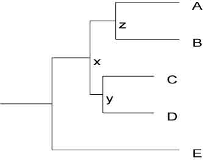

Author
------

[Jason Stajich], Dept. [Molecular Genetics and Microbiology](http://mgm.duke.edu), [Institute for Genome Sciences and Policy](http://www.genome.duke.edu), [Duke University](http://www.duke.edu). <jason-at-bioperl.org>

Copyright
---------

This document is copyright [Jason Stajich]. It can be copied and distributed under the terms of the [Perl Artistic License].

Revision History
----------------

|                                                                              |                           |
|------------------------------------------------------------------------------|---------------------------|
| Revision 0.1 2003-12-01 JES                                                  | First version             |
| Revision 0.2 2004-11-05 BIO                                                  | Add SVG section and links |
| Revision 0.3 2005-07-11 JES                                                  | Explore Node objects more |
| Revision 0.4 [Torst] 05:49, 22 December 2005 (EST) | Wiki version              |

Abstract
--------

This [HOWTO] intends to show how to use the [BioPerl] Tree objects to manipulate phylogenetic trees. It shows how to read and write trees, query them for information about specific nodes or overall statistics, and create pictures of trees. Advanced topics include discussion of generating random trees and extensions of the basic structure for integration with other modules in [BioPerl].

Introduction
------------

Generating and manipulating phylogenetic trees is an important part of modern systematics and molecular evolution research. The construction of trees is the subject of a rich literature and active research. This [HOWTO] and the modules described within are focused on querying and manipulating trees once they have been created.

The data we intend to capture with these objects concerns the notion of Trees and their Nodes. A Tree is made up of Nodes and the relationships which connect these nodes. The basic representation of parent and child nodes is intended to represent the directionality of evolution. This is to capture the idea that some ancestral species gave rise, through speciation events, to a number of child species. So, it means that object is rooted tree. If you work with unrooted trees, do not forget to root them before loading to object. The data in the trees need not be a strictly bifurcating tree (or binary trees to the [computer science] types), and a parent node can give rise to 1 or many child nodes.

In practice there are just a few main objects, or modules, you need to know about. There is the main Tree object which is the main entry point to the data represented by a tree. A Node is represented generically by , however there are subclasses of this object to handle particular cases where we need a richer object (see for more information). The connections between Nodes are described using a few simple concepts. There is the concept of pointers or references where a particular Node keeps track of who its parent is and who its children are. A Node can only have 1 parent and it can have 1 or many children. In fact all of the information in a tree pertaining to the relationships between Nodes and specific data, like bootstrap values and labels, are all stored in the Node objects while the object is just a container for some summary information about the tree and a description of the tree's root node.

Reading and Writing Trees
-------------------------

Trees are used to represent the ancestry of a collection of taxa, sequences, or populations.

Using one can read trees from files or datastreams and create objects. This is analogous to how we read sequences from sequence files with to create [BioPerl] sequence objects which can be queried and manipulated. Similarly we can write objects out to string representations like the [Newick] or [New Hampshire tree formats] which can be printed to a file, a datastream, stored in database, etc.

The main module for reading and writing trees is the factory module which has several driver modules which plug into it. These drivers include for [New Hampshire] or [Newick tree format], for the [New Hampshire extended tree format] from [Sean Eddy](http://selab.janelia.org) and [Christian Zmasek](http://www.phylogenomics.us/people/zmasek/) as part of their [RIO, Forrester and ATV](http://www.phylosoft.org/forester/) system <cite>RIO,ATV,SDI</cite>, and for the [phyloxml tree format]. The driver supports parsing tree data from PAUP's Nexus format. However this driver currently only supports parsing, not writing, of [Nexus tree format] tree files. There are also modules for [lintree tree format] and [Pagel tree format] for writing these formats out.

A newly added capability (after [1.5.2]) allows you to specify that the internal nodes id encode bootstrap values instead of IDs. Provide the ```perl -internal_node_id => 'bootstrap' ```

`to `` and it will automatically move the ids over to the bootstrap slot.  This is only valid for the `[`Nexus`]` and `[`Newick` `tree` `formats`]`.  `

An additional function was written to do this work in called `move_id_to_bootstrap` which will do this work for you as well. Call it on a object.

| Format   | Description                                         | File extension | Module |
|----------|-----------------------------------------------------|----------------|--------|
| cluster  | Algorithm::Cluster::treecluster() output            |                |        |
| lintree  | lintree output                                      | lin,lintree    |        |
| newick   | Newick/New Hampshire/PHYLIP                         | dnd,newick,nh  |        |
| nexml    | NeXML                                               |                |        |
| nexus    | Nexus tree output from PAUP (''read only'') |                |        |
| nhx      | Newick/New Hampshire eXtendend (NHX)                | nhx            |        |
| pag      | Pagel                                               |                |        |
| phyloxml | PhyloXML                                            | xml            |        |
| svggraph | converts a Tree object to an SVG output             | svg            |        |
| tabtree  | format which displays a tree as an ASCII drawing    |                |        |

### Example Code

Here is some code which will read in a Tree from a file called "tree.tre" and produce a object which is stored in the variable `$tree`.

Like most modules which do input/output you can also specify the argument `-fh` in place of `-file` to provide a glob or filehandle in place of the filename.

```perl

use Bio::TreeIO;

# parse in newick/new hampshire format

my $input = new Bio::TreeIO(-file => "tree.tre",

`                           -format => "newick");`

my $tree = $input->next_tree;

```

Once you have a Tree object you can do a number of things with it. These are all methods required in .

For example try these two difference example scripts that read in a tree data and prints out the the node ids and bootstrap values. The first example is just the default behavior that assumes that internal node ids are Ids and not bootstrap values.

```perl

use Bio::TreeIO;

my $treeio = Bio::TreeIO->new(-format => 'newick', ttt -fh => \*DATA); while( my $tree = $treeio->next_tree ) {

`for my $node ( $tree->get_nodes ) {`
` printf "id: %s bootstrap: %s\`

", $node->id || '', $node->bootstrap || '', " ";

`}`

} __DATA__ (((A:5,B:5)90:2,C:4)25:3,D:10);

```

In the second example we have told the TreeIO parser to automatically move the bootstrap values over from the internal node Ids.

```perl

use Bio::TreeIO;

my $treeio = Bio::TreeIO->new(-format => 'newick', ttt -fh => \*DATA, ttt -internal_node_id => 'bootstrap');

while( $tree = $treeio->next_tree ) {

`for my $node ( $tree->get_nodes ) {`
` printf "id: %s bootstrap: %s\`

", $node->id || '', $node->bootstrap || '', " ";

`}`

} __DATA__ (((A:5,B:5)90:2,C:4)25:3,D:10);

```

One can also explictly invoke this by calling just calling the `move_id_to_bootstrap` method on a tree.

```perl

use Bio::TreeIO;

my $treeio = Bio::TreeIO->new(-format => 'newick', ttt -fh => \*DATA); while( $tree = $treeio->next_tree ) {

`$tree->move_id_to_bootstrap;`
`for my $node ( $tree->get_nodes ) {`
` printf "id: %s bootstrap: %s\`

", $node->id || '', $node->bootstrap || '', " ";

`}`

} __DATA__ (((A:5,B:5)90:2,C:4)25:3,D:10);

```

Read from a string instead of file using

```perl

use warnings; use strict; use Bio::TreeIO; use IO::String;

my $string = "(A,(B,C));"; my $io = IO::String->new($string); my $treeio = Bio::TreeIO->new(-fh => $io,

`                             -format => \'newick\');`

while( my $tree = $treeio->next_tree ) {

`# get a tree`
`print "node count is ", scalar $tree->get_nodes, "\`

"; }

```

Operations on Trees
-------------------

### Bio::Tree::TreeI methods

Request the taxa (leaves of the tree).

```perl my @taxa = $tree->get_leaf_nodes; ```

Get the root node.

```perl my $root = $tree->get_root_node; ```

Get the total length of the tree (sum of all the branch lengths), which is only useful if the nodes actually have the branch length stored, of course.

```perl my $total_length = $tree->total_branch_length; ```

### Bio::Tree::TreeFunctionsI

An additional interface was written which implements utility functions which are useful for manipulating a Tree.

Find a particular node, either by name or by some other field that is stored in a Node. The field type should be the function name we can call on all of the Nodes in the Tree.

```perl

# find all the nodes named 'node1' (there should be only one)

my @nodes = $tree->find_node(-id => 'node1');

# find all the nodes which have description 'BMP'

my @nodes = $tree->find_node(-description => 'BMP');

# find all the nodes with bootstrap value of 70

my @nodes = $tree->find_node(-bootstrap => 70);

```

If you would like to do more sophisticated searches, like "find all the nodes with bootstrap values better than 70", you can easily implement this yourself.

```perl

` my @nodes = grep { $_->bootstrap > 70 } $tree->get_nodes;`

```

Remove a Node from the Tree and update the children/ancestor links where the Node is an intervening one. This function does not preserve branch lengths.

```perl

# provide the node object to remove from the Tree

$tree->remove_Node($node);

# or specify the node Name to remove

$tree->remove_Node('Node12');

```

To preserve the branch lengths between the children and ancestor of the removed Node, you can use [splice](http://search.cpan.org/~cjfields/BioPerl-1.6.901/Bio/Tree/TreeFunctionsI.pm#splice) with '-preserve_lengths=>1'.

```perl

# provide the node objects to remove from the Tree

$tree->splice(-remove_id => $node->id, -preserve_lengths => 1);

# or specify the Names of nodes to keep and/or remove
2.  this will remove all nodes with an id() of '1'.

$tree->splice(-remove_id => \[1, 2\], -keep_id => \[2\])

```

Get the lowest common ancestor for a set of Nodes. This method is used to find an internal Node of the Tree which can be traced, through its children, to the requested set of Nodes. It is used in the calculations of monophyly and paraphyly and in determining the distance between two nodes.

```perl

# Provide a list of Nodes (strictly, they don't have to be in this tree)

my $lca = $tree->get_lca(-nodes => @nodes);

```

The above works for 2 or more nodes.

Get the distance between two nodes by adding up the branch lengths of all the connecting edges between two nodes.

```perl my $distances = $tree->distance(-nodes => \[$node1,$node2\]); ```

Perform a test of [monophyly] for a set of nodes and a given outgroup node. This means the common ancestor for the members of the internal_nodes group is more recent than the common ancestor that any of them share with the outgroup node. Please notice that a test of [monophyly] is applicable for rooted trees only.

```perl

if( $tree->is_monophyletic(-nodes => @internal_nodes,

`                          -outgroup => $outgroup) ) {`

print "these nodes are monophyletic: ",

`      join(",",map { $_->id } @internal_nodes ), "\`

"; }

```

Perform a test of [paraphyly] for a set of nodes and a given outgroup node. This means that a common ancestor 'A' for the members of the ingroup is more recent than a common ancestor 'B' that they share with the outgroup node and that there are no other nodes in the tree which have 'A' as a common ancestor before 'B'. Please notice that a test of [paraphyly] is applicable for rooted trees only.

```perl

if( $tree->is_paraphyletic(-nodes => @internal_nodes,

`                          -outgroup => $outgroup) > 0 ) {`
` print "these nodes are monophyletic: ",`
`       join(",",map { $_->id } @internal_nodes ), "\`

"; }

```

Re-root a tree, specifying a different node as the root (and a different node as the outgroup).

```perl

# node can either be a Leaf node in which case it becomes the
2.  outgroup and its ancestor is the new root of the tree
3.  or it can be an internal node which will become the new
4.  root of the Tree

$tree->reroot($node);

```

Operations on Nodes
-------------------

### Node state

-   `ancestor` - pointer to the Nodes' ancestor
-   `branch_length` - length of the branch leading from ancestor to this node
-   `is_Leaf` - boolean as to whether or not this Node is a Leaf or tip of the tree.

### Node connectivity methods

-   `add_Descendent` - add a Descendent  are allowed)
-   `each_Descendent` - retrieve all immediete children from a node.
-   `get_all_Descendents` - retrieve all sub Nodes from this node



```perl

use Bio::TreeIO;

my $treeio = Bio::TreeIO->new(-format => 'newick', ttt -fh => \*DATA); if( my $tree = $treeio->next_tree ) {

`my $node = $tree->find_node(-id => \'x\');`
`print $node->id, " each_Descendent\`

";

`for my $child ( $node->each_Descendent ) {`
` print $child->id, "\`

";

`}`
`print $node->id, " get_all_Descendents\`

";

`for my $child ( $node->get_all_Descendents ) {`
` print $child->id, "\`

";

`}`

} __DATA__ (((A:5,B:5)z:2,(C:4,D:4)y:1)x:3,D:10);

```

### Node stats

-   `height` - Longest distance from this node to tip of the tree based on branch length.
-   `depth` - Longest distance from this node to the root of the tree based on branch length.

Making Images of Trees
----------------------

You can also make images of trees. If you have the module installed you can create an [SVG] image of your tree. The example below uses TreeIO to get a Tree object and then its tree is written to an image file.

```perl

use Bio::TreeIO;

my $in = new Bio::TreeIO(-file => 'input',

`                        -format => \'newick\');`

my $out = new Bio::TreeIO(-file => '>mytree.svg',

`                         -format => \'svggraph\');`

while( my $tree = $in->next_tree ) {

`   $out->write_tree($tree);`

}

```

An even better way to draw trees is implemented in which will draw a [cladogram] in [postscript] format. The postscript file can be converted to [SVG], [PDF] which can also be rendered in [PNG], [JPEG], and other image file formats. This module does depend on the external module .

Here is a simple script that writes out a postscript file for every file ending in `.tre` in a directory. It assumes the files are in [Newick tree format] but can be switched [Nexus tree format] (like what you get out of a [MrBayes] run if 'nexus' is instead the code below replacing 'newick'. The `-bootstrap => 1` option specifies that internal id values should be written out - currently it assumes id is stored in the `id()` field so you will have to copy the values from the `bootstrap()` field if they are stored there. The `-compact => 0` option specifies that branch lengths should be written (so this is actually a [phylogram] ), `-compact => 1` would instead draw a cladogram with equal branch lengths for all branches.

```perl

#!/usr/bin/perl -w

use strict; use Bio::Tree::Draw::Cladogram; use Bio::TreeIO;

my $dir = shift || '.';

opendir(DIR, $dir) || die $!; for my $file ( readdir(DIR) ) {

`   next unless $file =~ /(S+).tre$/;`
`   my $stem = $1;`
`   my $treeio = Bio::TreeIO->new(\'-format\' => \'newick\',`
`                                 \'-file\'   => "$dir/$file");`

`   if( my $t1 = $treeio->next_tree ) {`
`       my $obj1 = Bio::Tree::Draw::Cladogram->new(-bootstrap => 1,`
`                                                  -tree    => $t1,`
`                                                  -compact => 0);`
`       $obj1->print(-file => "$dir/$stem.eps");`
`   }`

}

```

Constructing Trees
------------------

There are many applications available to build phylogenetic trees. You can also build a tree using [Bioperl] alone.

Pairwise distances for all sequences in an alignment can be computed with and . There are several different methods implemented. For [DNA] alignments, Jukes-Cantor <cite>JukesCantor69</cite>, Juke-Cantor uncorrected, Kimura 2-parameter <cite>Kimura80</cite>, Felsenstein <cite>felsenstein81</cite>, Tajima-Nei <cite>TajimaNei84</cite>, JinNei <cite>JinNei90</cite>, and Tamura <cite>Tamura92</cite> are currently implemented. In addition, for coding sequences, synonymous and non-synonymous counts can be computed with the [pairwise_kaks.pl](http://cvs.bioperl.org/cgi-bin/viewcvs/viewcvs.cgi/bioperl-live/scripts/utilities/pairwise_kaks.PLS?rev=HEAD&cvsroot=bioperl&content-type=text/vnd.viewcvs-markup). For Protein sequences alignments only Kimura <cite>Kimura93</cite> is currently supported although other methods will be added.

To use these methods simply initialize a statistics module, and pass in an alignment object () and the type of distance method to use and the module will return a matrix object of pairwise distances. The code example below shows how this could be done.

Given the matrix of pairwise distances one can build a phylogenetic tree using 2 methods provided in the . Simply request either Neighbor-Joining (NJ) trees or Unweighted Pair Group Method with Arithmetic Mean ) clusters. There are caveats with these methods and whether or not the distances are additive. The method `check_additivity` in is provided to calculate whether or not additivity holds for the data.

The following is a basic code snippet which describes how to use the pairwise distance and tree building modules in [BioPerl] starting with a DNA alignment file from clustalw. Note that there is also a module.

```perl

use Bio::AlignIO; use Bio::Align::DNAStatistics; use Bio::Tree::DistanceFactory; use Bio::TreeIO;

my $alnio = Bio::AlignIO->new(-file => 'filename', -format=>'clustalw'); my $dfactory = Bio::Tree::DistanceFactory->new(-method => 'NJ'); my $stats = Bio::Align::DNAStatistics->new; my $treeout = Bio::TreeIO->new(-format => 'newick');

while( my $aln = $alnio->next_aln ) {

`my $mat = $stats->distance(-method => \'Kimura\',`
`                           -align  => $aln);`
`my $tree = $dfactory->make_tree($mat);`
`$treeout->write_tree($tree);`

}

```

Or you could read in a distance matrix created by an external program, such as Phylip:

```perl

use Bio::AlignIO; use Bio::Align::DNAStatistics; use Bio::Tree::DistanceFactory; use Bio::Matrix::IO; use Bio::TreeIO;

my $alnio = Bio::AlignIO->new(-file => 'filename', -format=>'clustalw'); my $dfactory = Bio::Tree::DistanceFactory->new(-method => 'NJ'); my $stats = Bio::Align::DNAStatistics->new; my $treeout = Bio::TreeIO->new(-format => 'newick');

while( my $aln = $alnio->next_aln ) {

`my $parser = Bio::Matrix::IO->new(-format => \'phylip\',`
`                                  -file   => \'filename.dist\');`
`my $mat  = $parser->next_matrix;`
`my $tree = $dfactory->make_tree($mat);`
`$treeout->write_tree($tree);`

}

```

### TODO

''Using external programs: phylip,MrBayes,paup,puzzle.''

### Bootstrap testing

Non-parametric bootstrapping is one method to test the consistency of the data with the optimal tree. A set of subreplicates are generated from the alignment using the method from called `bootstrap_replicates()`. One passes in an alignment object and the count of the number of replicates to generate.

```perl

use Bio::Align::Utilities qw(:all); my $replicates = bootstrap_replicates($aln,$count);

```

Once trees have been generated for each replicate, the bootstrap support for the optimal tree can be assesed with the `assess_bootstrap()` function in .

### TO DO

''Construction of majority rules consensus tree is not yet working in BioPerl.''

Advanced Topics
---------------

It is possible to generate random tree topologies with a [BioPerl] object called . The factory only requires the specification of the total number of taxa in order to simulate a history. One can request different methods for generating the random phylogeny. At present, however, only the simple Yule backward is implemented and is the default.

The trees can be generated with the following code. You can either specify the names of taxa or just a count of total number of taxa in the simulation.

```perl

use Bio::TreeIO; use Bio::Tree::RandomFactory;

# initialize a TreeIO writer to output the trees as we create them

my $out = Bio::TreeIO->new(-format => 'newick',

`                          -file   => ">randomtrees.tre");`

my @listoftaxa = qw(A B C D E F G H); my $factory = new Bio::Tree::RandomFactory(-taxa => @listoftaxa);

# generate 10 random trees

for( my $i = 0; $i < 10; $i++ ) {
     $out->write_tree($factory->next_tree); }

# One can also just request a total number of taxa (8 here) and
2.  not provide labels for them
3.  In addition one can specify the total number of trees
4.  the object should return so we can call this in a while
5.  loop

$factory = new Bio::Tree::RandomFactory(-num_taxa => 8

`                                       -max_count=> 10);`

while( my $tree = $factory->next_tree) {

` $out->write_tree($tree);`

}

```

There are more sophisticated operations that you may wish to pursue with these objects. We have tried to create a framework for this type of data, but by no means should this be looked at as the final product. If you have a particular statistic or function that applies to trees that you would like to see included in the toolkit we encourage you to send details to the [BioPerl] [Mailing list], <bioperl-l@bioperl.org>

References and More Reading
---------------------------

For more reading and some references for the techniques above see these titles. <biblio>

# felsenstein J. Felsenstein, "Infering Phylogenies" 2003. Sinuar and Associates. D. Swoffrod, Olsen, Waddell and D. Hillis, "Phylogenetic Inference" 1996. in Mol. Systematics, 2nd ed, 1996, Ch 11.
2.  bsa Eddy SR, Durbin R, Krogh A, Mitchison G, "Biological Sequence Analysis" 1998. Cambridge Univ Press, Cambridge, UK.
3.  RIO pmid=12028595
4.  SDI pmid=11590098
5.  ATV pmid=11301314
6.  Tamura92 pmid=1630306
7.  Kimura80 pmid=7463489
8.  JinNei90 pmid=2299983
9.  TajimaNei84 pmid=6599968
10. JukesCantor69 Jukes TH and Cantor CR. "Evolution of Protein Molecules", in Mammalian Prot. Metab., III, 1969, pp. 21-132.
11. Kimura93 Kimura, M. "The Neutral Theory of Molecular Evolution." Cambridge University Press, Cambridge, UK. 1993.

</biblio>

Related Modules
---------------

Here's a list of the relevant modules. If you have questions or comments that aren't addressed herein then write the Bioperl community at <bioperl-l@bioperl.org>.

-   -   -   -   -   -   -   -   -   -   -   -   -   -   -   -   -   -   -   -   -   -   -   -   -   -   '


