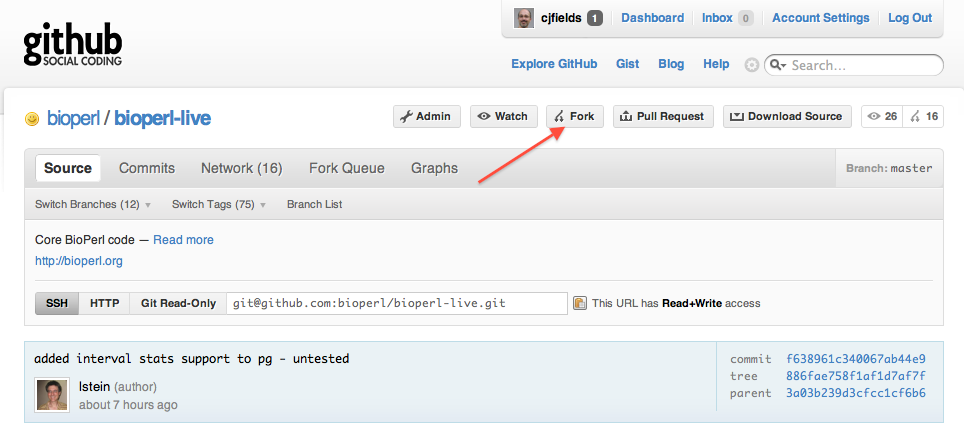

This page describes some basic Git commands for working with the BioPerl source code.

You need to have the `git` client installed. Here is [one set of instructions.](http://book.git-scm.com/2_installing_git.html) Mac OSX download and install is easier [here.](http://git-scm.com/download)

Git primer
----------

Before you begin, you may consider reading these excellent primers put together by the Parrot project, which also apply quite well to BioPerl.

-   [Git Terminology guide](http://github.com/parrot/parrot/blob/master/docs/project/git_terminology.pod) (80% generic, 20% parrot specific).
-   [Git Workflow guide](http://github.com/parrot/parrot/blob/master/docs/project/git_workflow.pod) (80% generic, 20% parrot specific).

Download BioPerl from GitHub
----------------------------

To checkout (or *clone*) the BioPerl *core* package (most people only want the core package) from GitHub, use:

`$ git clone git://github.com/bioperl/bioperl-live.git`

Alternatively, you can checkout (or *clone*) a specific BioPerl package such as *bioperl-db*:

`$ git clone git://github.com/bioperl/bioperl-db.git`


Bioperl GitHub Repositories
---------------------------

|--------+-----------|
|       Link        |  Description |
|--------------------------------------------------------------------|----|
| [bioperl-live](http://github.com/bioperl/bioperl-live)             | Core package including parsers and main objects |
| [bioperl-run](http://github.com/bioperl/bioperl-run)               | Wrapper package around key applications    |
| [bioperl-db](http://github.com/bioperl/bioperl-db)                 | BioPerl DB is the Perl API that accesses the [BioSQL](http://biosql.org) schema  |
| [bioperl-dev](http://github.com/bioperl/bioperl-dev)               | Bioperl-dev is a development repository for exploratory package       |
| [bioperl-ext](http://github.com/bioperl/bioperl-ext)               | Ext package has C extensions including alignment routines and link to [staden IO library](http://staden.sourceforge.net/) for sequence trace reads.       |
| [bioperl-network](http://github.com/bioperl/bioperl-network)       | Network package can be used to read and analyze protein-protein interaction networks  |
| [bioperl-pedigree](http://github.com/bioperl/bioperl-pedigree)     | Pedigree package has objects for Pedigrees, Individuals, Markers, & Genotypes  |
| [bioperl-gui](http://github.com/bioperl/bioperl-gui)               | GUI package which for Perl-[Tk](http://www.tcl.tk/) objects for a *G*raphical *U*ser *I*nterface. Serves as the basis for [Genquire](http://www.bioinformatics.org/Genquire/) |
| [bioperl-microarray](http://github.com/bioperl/bioperl-microarray) | Microarray package  has preliminary objects for microarray data    |
|--------+-----------|

Table 1. BioPerl packages

### Release tags and branches

By default, after 'cloning' (above), your checkout is on the BioPerl 'master' development branch. Git makes it easy to switch to a release tag or branch. For more information on these version control concepts see the [repositories and branches section](http://www.kernel.org/pub/software/scm/git/docs/user-manual.html#repositories-and-branches) of the Git user's manual.

To list tags and branches, use:

`$ git tag -l`

`$ git branch -r `

To checkout a release tag or branch (for example), use:

`$ git checkout bioperl-release-1-6-1 # tag`

`$ git checkout origin/release-1-6-2 # branch`

Keeping up to date
------------------

To *pull* all the latest updates into your local repository, hit:

`$ git pull`

It is recommended to run this command every time you start to work on code (or if you know there has been a bug fix).

Forking and Pull Requests
-------------------------

The preferred procedure for most developers to contribute changes to BioPerl is to fork the project on GitHub, make changes, and then send a pull request on GitHub to the main BioPerl project describing the changes.

GitHub itself has excellent documentation on forking and pull requests, see:

-   [Forking a repository](http://help.github.com/fork-a-repo/)
-   [Sending a pull request](http://help.github.com/send-pull-requests/)


Developing BioPerl
------------------

### Checking out with a collaborator account

If you have a GitHub account, have git set up locally on your machine, and been added as a developer or collaborator to our GitHub repository, you can check out the repository and push commits back to it.

`% git clone git@github.com:bioperl/bioperl-live.git`

The above checks out the master branch of bioperl-live (the core modules) into the 'bioperl-live' directory in the current working folder. Similarly, to check out bioperl-db:

`% git clone git@github.com:bioperl/bioperl-db.git`

### Creating a Fork

If you have a GitHub account, you can also create a fork of the repository. This essentially creates a local copy of the repository in your account for you to hack on. The advantage of this is that anyone can fork BioPerl; you do not need direct commit access. The disadvantage: you can't simply use `git pull` or variations thereof to update from the repository. This makes sense, as you essentially have created a local copy of the repository in your account with the intent of making your own changes to the code. However, there are ways to work around that (see below)

The main [GitHub](http://help.github.com/forking/) page of forking repositories gives more specific directions on how to set one up. In general, this is the preferred route of creating and hacking on your own copy of BioPerl, primarily because this doesn't create a full copy of the repository in your local account (e.g. saves lots of space) and also makes it easier to submit your changes to the core developers to be incorporated into BioPerl.

#### Create a fork of the BioPerl repository



Log in to your account, go to the main BioPerl repository page, and click on the 'Fork' button (red arrow above). This will create the fork in your account.

#### Check out your fork

You will need to clone the repository from your forked code on your account.

From here, you can make changes to the code, make local commits, then push the code back up to GitHub. Note this makes changes only on your fork, not on the main BioPerl repository.

### Developing on Branches

With git, everything is a branch, including 'master'. So, learning to develop on a branch and merge changes over from one branch to another is critical. Luckily, git makes this very easy. See [1](http://www.kernel.org/pub/software/scm/git/docs/user-manual.html#examining-remote-branches).

#### Making a branch

To create a local branch:

`$ git checkout -b my_new_branch`

This switches you automatically to that branch:

```
$ git branch
   master
 * my_new_branch
```

#### Checking out an existing remote branch

For a branch that is not yet in your local repository, makes a new local branch with the same name and sets it up to track the remote branch of the same name.

`$ git checkout -t origin/branch_name`

One can also checkout a remote branch into a local branch with a different name. The following pulls down the remote branch `branch_name` into the local branch *foo*:

`$ git checkout --track -b foo origin/branch_name`

For a branch that is already in your local repository, just:

`$ git checkout branch_name`

#### Making commits to a branch

After you have made some changes to the code (and of course tested the changes by running `./Build test`), you will want to commit your changes, and then send the commits to the BioPerl repository. When making commits, try to make each commit self-contained (that is, the commit makes sense and works in and of itself), and write concise, descriptive commit messages. If you have a lot of changes that are unrelated to each other, they should be developed on separate branches.

With git, you make a commit by first this can be done by:

1.  first *staging* files with `git add`,
2.  making a commit out of them with `git commit`.

Since git is a distributed version control system, your commits all occur locally and are not sent anywhere until you *push* them back to the remote repository with `git push`. This also means that network connectivity is not required to work and make commits, only for sending with `git push`.

#### Basic workflow

*Note* These are general suggestions for workflows, but they have been demonstrated to work very well in other projects.

1.  Hack, hack, hack on *Foo.pm*
2.  `git add Foo.pm`
3.  `git commit -m "Foo system now correctly handles FooBar situation"`

You can then follow this up with multiple commits as needed until you are ready to send (*push*) them to the specific remote repository. If you have a standard master branch checkout from github, you can do this by:

`$ git push origin <branch_name>`

where branch_name is the name of the branch you are working on.

For convenience, there is also a shorthand form of `git commit` that stages all working copy changes, and then commits them in one command:

`$ git commit -am "Changes to handle FooBar situation"`

Be careful with that command, be sure that you know what you are changing. Use `git diff` and `git status`.

#### Resolving conflicts

With git, merges are just a special kind of commit. Usually, the merge is completed and the commit is made automatically. But when there are conflicts that `git` cannot resolve by itself, it puts your repository in a special state indicating that you are in the middle of resolving a conflicted merge (or rebase, for more advanced users) and drops you back to the command prompt. Usually, conflicts are resolved by editing the conflicted files to fix the conflicts, then adding and committing them with `git add` and `git commit`, which completes the merge.

For more on the science of resolving conflicts, see the `HOW TO RESOLVE CONFLICTS` section in `git help merge`.

See [Resolving a merge](http://www.kernel.org/pub/software/scm/git/docs/user-manual.html#resolving-a-merge) in the Git User's Manual.

#### Merging changes between branches

Usually, you want to merge changes from some other branch into the local branch you are currently working on. This is done by simply:

`$ git merge branch_name`

#### Troubleshooting

Did you get an error? Something like this?

```
! [rejected]        master -> master (non-fast-forward)
error: failed to push some refs to 'git@github.com:bioperl/bioperl-live.git' 
To prevent you from losing history, non-fast-forward updates were rejected
Merge the remote changes before pushing again.  See the 'Note about
fast-forwards' section of 'git push --help' for details.
```

Most likely someone else has committed and pushed to the same remote branch in the meantime and now your local copy is out of date. You then have a set of choices, depending on what you want to do.

1a) Try doing

`$ git fetch`

to bring down any changes that have occurred in the remote repository. Rebase the branch commits to those fetched from the remote repo to replay all your commits over the top of the ones you just pulled down:

`$ git rebase origin/master`

Of course, you should replace `'origin/master'` with whatever remote repo you are using.

1b) You can do all of the above in one set:

`$ git pull --rebase origin/master`

1c) Or you can simply merge the commits to your local branch:

`$ git pull`

The last version, though less verbose, is also a bit dirtier in that you see a merge message as well as replay the commit messages.

2) To catch everything up

`$ git push`

#### Sending a new branch to GitHub

`$ git push origin my_funky_branch`

will send the local 'my_funky_branch' to the repository on GitHub.

#### Deleting a remote branch

To delete the remote branch 'branch_to_delete', you push * (nothing) with it as the push target.

`git push origin :branch_to_delete`

#### Backing out prior commits

To revert the prior commit on the branch you are on:

`git revert HEAD`

To revert a specific commit, where the commit has `<SHA>`:

`git revert <SHA>`

More elaborate reversions are [also allowed](http://www.kernel.org/pub/software/scm/git/docs/git-rev-parse.html) (look under 'Specifying Revisions').

### Split a module from bioperl-live

When starting a new repository for a subset of the modules that are currently part of the monolithic bioperl-live repository, it is good to retain the commit history of those files. Keeping history is good! It allows to understand why the code has been written that way (we need history for and ). The basic idea is to start with a clone of the bioperl-live repository and rewrite its history with . It is actually quite easy to do.

We start with a fresh clone of the bioperl-live repository in a directory already named for those set of modules. To avoid accidentally pushing the rewritten history into github, we will use the read-only url for the clone and remove it from the remotes.

```
git clone git://github.com/bioperl/bioperl-live.git bioperl-tmp
cd bioperl-tmp
git remote rm origin
```

Rewriting the history is done with the [](http://git-scm.com/docs/git-filter-branch) command. We will go through *all* the commits ever made and remove the files we are not interested from those commits. Commits that only change those files will be empty and removed. Commits that change both, will be edited to only keep the files we are interested.

There's two filters useful for our case: with , and with . The first will act on the tree removing the files from the tree before the commit; the second works on the index (staging area) removing the files from there before the commit. with is faster and it's what we will use.

#### Prepare list of files to be removed

The first thing to do is create a list of the files that should be removed from the history (don't forget the tests, examples and scripts. And also don't forget the files needed by the tests in t/data/) files needed by the tests in t/data/, the examples in examples/, and the scripts in. We create a list of all files that existed throughout the whole history of the repository. This can be obtained with .

`git rev-list --objects --do-walk HEAD | cut -c 42- | grep -v '^$' | LC_ALL=C sort -u > ../all_files_ever`

*Note* On some systems, the list of files needs to be quoted in order to work as input matches for grep (see below). In this case, pipe through `sed` to add quotes:

`git rev-list --objects --do-walk HEAD | cut -c 42- | grep -v '^$' | LC_ALL=C sort -u | sed "s/^.*$/"&"/" > ../all_files_ever`

From this file, we need to remove the ones whose history *should be kept*. The easiest way is to create a separate file, with the filenames that should be kept and use it filter them out of the files_to_remove. There's two important points when creating a list of files to keep:

-   *file renames* if we want to keep the history of file X, but that file was once named Y, then we should also try to keep Y. To identify renames, the following can be used:

`git log --stat --follow filepath | grep "=>"`

There may be only a problem here. If the commit that renamed a file also changed its contents, won't mark it as a rename (that's why edit and rename should be always made in separate commits). To work around this, one can either inspect the oldest commit of each file manually, or try to make a guess with

-   *parent directories* directories are also files. What this means is that parent directories of files to be kept, should also be kept. For example, to keep the history of only the file "Bio/SeqIO.pm", then both "Bio" and "Bio/SeqIO.pm" need to be kept.

Once you have the filenames whose history you want to keep, one per line, you can get the set complement with . We also place the quotes around each line so that filenames with whitespace behave well later on (if you remove the call to and check the diff between the clean and original list of files).

`grep -Fxv -f ../files_to_keep ../all_files_ever | sed "s/^.*$/"&"/" > ../files_to_remove`

*Note* if you added quotes in the original `git rev-list` run, don't add them here again:

`grep -Fxv -f ../files_to_keep ../all_files_ever > ../files_to_remove`

#### Filter branch

With a list of targets (the files to be removed), we can start filtering the history of the project. The bioperl-live repository is quite large and this command might take a long time (leave it running on the background or overnight). Basically, the list of files is passed to for each commit ever done (argument of ). The option will make it ignore any empty commits generated by our filter.

`git filter-branch -f --prune-empty --index-filter 'xargs git rm -r --cached --ignore-unmatch < /filepath/to/files_to_remove' HEAD`

After this command, some files from the list may still appear on the history. It may take a few runs of {{inlinecode|filter-branch}} until we have removed them completely. However, only the first run of {{inlinecode|filter-branch}} will take a long time. As the repository shrinks and empty commits are removed, there's less history to go through. So, we get a new list of all files in history, re-filter the file list, re-filter the history, and repeat until {{inlinecode|filter-branch}} no longer changes anything.

```
git rev-list --objects --do-walk HEAD | cut -c 42- | grep -v '^$' | LC_ALL=C sort -u > ../all_files_ever
grep -Fxv -f ../files_to_keep ../all_files_ever | sed "s/^.*$/"&"/" > ../files_to_remove
git filter-branch -f --prune-empty --index-filter 'xargs git rm -r --cached --ignore-unmatch < /filepath/to/files_to_remove' HEAD
```

*Note* Again, on some systems you will need to quote output files as input for grep (as in the original {{inlinecode|rev-list}} step above):

```
git rev-list --objects --do-walk HEAD | cut -c 42- | grep -v '^$' | LC_ALL=C sort -u | sed "s/^.*$/"&"/" > ../all_files_ever
grep -Fxv -f ../files_to_keep ../all_files_ever > ../files_to_remove
git filter-branch -f --prune-empty --index-filter 'xargs git rm -r --cached --ignore-unmatch < /filepath/to/files_to_remove' HEAD
```

### Cleaning up 

`git` holds on to objects even after they are filtered; it generally cleans them up only when asked. However, cloning does not carry over removed objects, thus it acts as a quick cleaning step. The fastest way to clean up everything is then to simply create a clean clone:

    cd ../
    git clone bioperl-tmp Bio-yoursplitmodule

The final part is to change to the newly cloned, clean repo, add a new clean remote repository (from github or wherever), and push the code there.

```
 # add repo on github
 git remote rm origin
 git remote add origin git@github.com:bioperl/Bio-yoursplitmodule.git
 git push
```

#### Start new repository 

```
 mkdir lib
 git mv Bio lib/Bio
 git commit -am "maint: move Bio::modulesXXX into lib/ after split from bioperl-live"
```
#### Notes 

For better or worse, `git` is a terribly complex tool. There are many ways to accomplish this task. But as long as you get a list of files to be removed, and you use it to filter through the history, you should get the same results.

## How BioPerl's GitHub repository is configured 

### Archived Branches 

At the time of BioPerl's conversion to Git (May 2010), branches in Subversion dating from 2007 or before were archived in *refs/archives/*.These branches are not visible in the normal workflow.  To list them:

`$ git ls-remote origin refs/archives/*`

To inspect one of them:

```
$ git fetch origin refs/archives/branches/branch_to_inspect
$ git log FETCH_HEAD
$ git show FETCH_HEAD
# and so on using the FETCH_HEAD as a convenient temporary handle on the branch
```

To move one of them into the current set of branches:

```
$ git fetch origin refs/archives/heads/branch_to_resurrect
$ git push origin FETCH_HEAD:refs/heads/new_name_for_this_branch  :refs/archives/heads/branch_to_resurrect
```

### The Fork Queue

On Github, BioPerl collaborators will see a "Fork Queue". For example, [here](http://github.com/bioperl/bioperl-live/forkqueue) is the bioperl-live fork queue.

Note that commits from anyone's fork of a BioPerl repository will appear there and *may not be ready to be committed* to master ([details here](http://github.com/blog/270-the-fork-queue)).

### Submitting a Pull Request

One can (when chosen, hopefully after testing) submit a 'pull request' from GitHub. GitHub has some [very good instructions](http://github.com/guides/pull-requests) for doing so.

For the BioPerl project, we suggest *NOT* sending a pull request notice to all the collaborators for the project, just to the user *bioperl*. This will send a notice to the main developer list indicating that a pull request has been submitted; otherwise, every collaborator will end up getting two copies of pull requests. This is an issue that is being fixed by the GitHub developers.

### Processing a Pull Request

For minor additions such as documentation fixes and small bug fixes, a developer who is a collaborator can [use the fork queue](http://github.com/guides/pull-requests) to merge in the forked code.

For all other changes, after a decent code review (does it break the API? do all tests still pass?), one can do the following. From the command line:

-   Add the forked repository as a new remote:

`git remote add <fork_name> git://github.com/<github_user>/bioperl-live.git`

From this point on, there are two ways you can merge in commits. The first method is considered cleaner (nothing goes to the 'master' branch until tests pass) and is preferred.

#### *Fetch/Rebase/Merge/Push*

1) Fetch the remote changes:

`git fetch <fork_name>`

2) Create a local branch based on the remote one:

`git checkout -b merge-fork <fork_name> /master`

3) Run tests on the new branch to make sure everything passes. Don't forget to add any necessary changes to the 'Changes' file, and commit that:

```
# edit Changes
git add Changes
git commit -m 'update Changes'
```

4) Rebase against the local master branch (*MAKE SURE THIS IS CLEAN*):

`git rebase master`

5) Checkout master branch:

`git checkout master`

6) Merge changes from the fork branch and push upstream (the `-s` is recommended, it indicates who signed off on the commit):

```
git merge merge-fork
git push origin master
```

#### *Pull/Push*

This second version simply merges changes in, akin to a SVN-like 'merge'. With git, however, this is considered a bit 'dirtier' for a couple of reasons:

-   First, you are merging changes directly into the master branch from the remote fork, so you may have to revert if said changes don't pass tests. You can work around this by creating a new branch from your local 'master' branch and merging in that.
-   Second, merges without a prior rebase from the fork branch may repeat the commits made on the local branch, which clutters the commit history.

With both reasons above one could work around them (create a branch from 'master' and merge into that, or use a rebase), but if you are considering this you might as well use the cleaner version above.

1) Change to the branch you wish to merge into (here, the 'master' branch):

`git checkout master`

2) Merge from the proper remote branch to the one you are currently on, adding a commit message:

`git merge <fork_name>/master`

*Note* If you are worried about the changes and don't want to commit them in right away, you can add a `--no-commit` flag:

`git merge --no-commit <local name for fork>/master`

3) Test the changes:

```
perl Build.PL
./Build
./Build test
```

Don't forget to add any necessary changes to the 'Changes' file, and commit that:

```
# edit Changes
git add Changes
git commit -m 'update Changes'
```

4) Push merged changes and additional commits back to origin:

`git push origin master`

A few standard development workflows
------------------------------------

### Documentation fixes

If there are some small documentation glitches that can be fixed very quickly, one can make these locally on the 'master' branch and commit them in.

```
$ git checkout master
$ git pull
# ...add doc fixes...
$ git add Foo.pm
$ git commit -m 'misspelling'
$ git push
```

Larger scale doc fixes (such as global changes to fix POD errors) should be done on a branch (see below).

### Bug fixes

Bug fixes should be done on a 'topic' branch. These can be labeled however you want, but it's generally a good idea to reference any bug report (if there is one).

```
$ git checkout -b topic/bug_1234
 ...patch patch patch...
 ...intermittent commits to the branch on remote...
$ git push origin topic/bug_1234
 ...test commit test commit...
 ...merge fixes...
$ git checkout master
$ git merge topic/bug_1234
$ git push origin master
```

After testing by others, this branch can be safely deleted locally using `git branch -d` (which only deletes if the code has been merged):

`$ git branch -d topic/bug_1234`

Don't forget to delete the remote branch as well.

`$ git push origin :topic/bug_1234`

### New or modified features

These would follow the same pattern as a bug fix, with the exception that the branch name would be something short and descriptive about the work being done.

For instance, recent Bio::FeatureIO work was:

`$ git checkout -b topic/featureio_refactor`

The rest would follow a similar pattern to the above. One critical piece would be, if development on the branch is expected to take a while, to ensure you are routinely syncing your feature branch with the master branch:

```
 ...on your branch...
$ git merge master
```

### Release branches

To list branches, do:

`git branch -r`

To checkout a release branch, do (for example):

`git checkout origin/release-1-6-2`
